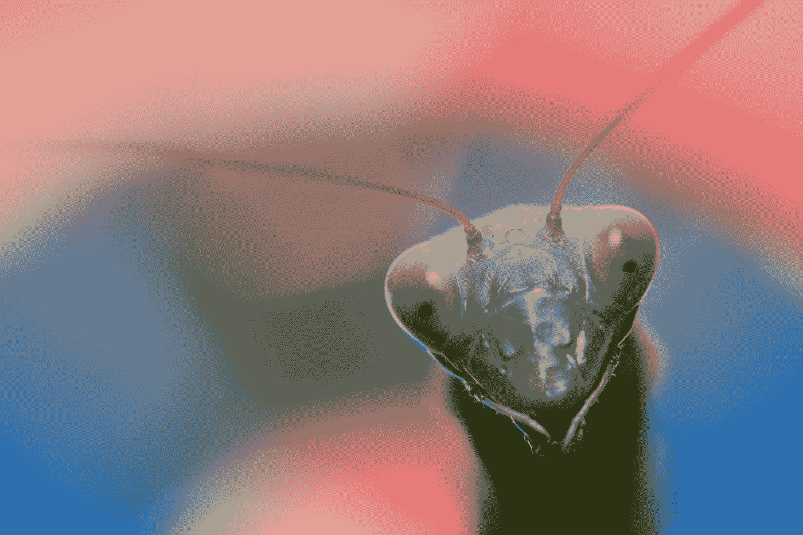

# 对达尔文进化论的两个常见误解。

> 原文：<https://medium.com/nerd-for-tech/two-common-misconceptions-about-darwins-theory-of-evolution-3287e708ccf6?source=collection_archive---------6----------------------->

第一种是老生常谈(没有双关语的意思)，非常普遍。其他人指出这是一种误解，但它仍然很普遍。第二种可能更常见，但不太清楚，我可能站不住脚，因为我前几天刚刚提出来。事实上，这可能不是一种误解，尽管我认为它是。

## 第一个误区:“物竞天择，适者生存。”

第一个误解是自然选择仅仅是个体有机体的“适者生存”。达尔文自己造成了这个错误。其实就是*适者繁殖*。

人们只需要考虑雄性螳螂，众所周知，它们在交配期间和/或交配后会被雌性吃掉。即使在他的头被雌性咬掉后，雄性仍然能够继续交配，使用尾巴上第二个更小的大脑来控制他的交配，但不知道如何让雄性在没有头的情况下进食。

公螳螂快死了，所以不是“存活”的案例。他在繁衍后代，因此他是“适者”之一。当然，他必须存活足够长的时间来繁殖后代，但是存活下来而不繁殖后代就意味着他不适合。

严格地说，这是“物种基因库中最适者的基因频率增加”，这可以说与最适者繁殖不完全是一回事，因为正如理查德·道金斯在他著名的达尔文理论普及版“自私的基因”中雄辩地解释的那样，如果你让你的血亲(特别是最亲近的)繁殖，你就会让你的基因副本在基因库中频率增加，这是一样好的，因为所有的基因最终都是副本。

达尔文为什么不说“适者繁殖”或者“适者繁殖”？我怀疑它与生殖有关，唤起人们对有性生殖的记忆，因此也是对性的记忆，达尔文是维多利亚时代的人。听起来像是他在提倡性乱交。生存当然已经被认为是人类和动物的一个有价值的目标。

“适者生存，足够长的时间来繁殖”，会比“适者生存”更准确，但它更复杂，仍然提到了在达尔文的时代不可提及的。它显然恳求被缩短为“适者繁殖”。

值得注意的是，即使是最长寿的生物，适者生存的时间也很短(在进化的竞赛中)。所以“生存”在这里没有太大的意义，反正。

## 第二个误解:“你的目标是你基因的目标。"

很多人说，为了你自己的利益，你应该繁衍后代，就好像你通过繁衍后代而变得不朽。按照同样的逻辑，戴绿帽是值得同情的。这个观点认为，绿帽子把 T2 的资源浪费在了另一只雄性的后代身上。

当你谈论动物时，可以说它们没有自己的目标，将有机体基因的“目标”与有机体的“目标”混为一谈可能是有意义的。我知道严格来说，基因没有目标，但它们的行为好像它们的目标是增加基因库中的频率，所以这里没有问题，只要你要么认为有机体缺乏目标，要么知道这是“为了论证”的假设。

但是很多人以同样的方式谈论人类男性，把男人的目标和利益与其基因的目标(和“利益”)混为一谈是完全错误的。一个男人想要快乐，想要被尊重(和爱)，想要长寿，想要学到很多，等等。他的基因并不特别希望他这样。他的基因想要增加频率。通过设计他的身体，使他/它(他/他的身体)在做爱时想找乐子并得到乐趣(或至少认为他/它得到了乐趣)，他的基因增加了他们的频率(平均来说——有时男人仍然不繁殖，例如可能会自然流产)。

如果痛苦增加了他基因的频率，那么痛苦男性的基因就会激增，越来越多的男性会变得痛苦。我们的基因并不关心我们，它们的行为也不像是关心我们。

我们是基因增加频率(或者至少保持频率不变)的一种手段。既然他们不关心我们，我们也不应该关心他们，或者至少不关心他们的“目标”。也许我们的目标应该是挑战我们的基因。

“他的基因”这个术语可能会引起误解。也许“基因的有机体”会更好。我们的基因制造并“拥有”我们(T3)，而不是反过来，有人可能会说，或者至少曾经是这样。我们理解基因是什么的能力，在未来也许会改变它们。

所以绿帽子是不应该被同情的，必然的，只有他的基因应该被同情，而且，就像我前面说的，基因只是像他们有目标一样*行动，并不能真正受益，因为他们没有经验，只有行为。此外，即使我们的基因可以被怜悯，我们也不应该怜悯它们，因为它们不会怜悯我们。*

我说我不确定这是否真的是一种误解，因为很难定义“利益”是什么，不仅对动物，对人也是如此。

具有讽刺意味的是，对基因的比喻性“好处”是什么是非常清楚的——只是频率的增加。对机体有什么好处？就细菌而言，这个问题似乎没有意义，因为它没有经验。人们也可以说，对细菌有利的就是对其基因有利的东西。如果你愿意，这是一种方便的比喻，一种速记形式。

把人想象成一种动物，会让我们对人类的利益做出同样的分析，但这将是在一种陌生的意义上使用“利益”。这将意味着当一个婴儿流产时，如果它的三个兄弟姐妹能够存活(并最终繁殖)，这个婴儿就受益了。这不是我们在谈论人类时所指的“利益”。我们说婴儿的基因受益了。我们不说宝宝受益了。

但是当我们说戴绿帽的人没有受益，或者受到了伤害时，我们谈论的好像戴绿帽的人的利益和戴绿帽的人的基因的利益是一回事，这意味着我们把他当成了一种动物。但是当人们同情绿帽子的时候，他们并不想把他当成一种动物来思考和谈论。

问题，“什么是最好的生活？”是一个古老的问题，也许会有一个答案，如果一个人能找出什么是真正的人类利益的话。如果有的话，相对于作为另一个男性孩子的(非生物)父亲来照顾假想的*生物*后代对他的基因的伤害，戴绿帽子对他自己到底有什么伤害？

因为我们的基因设计了我们，从某种意义上说，我们的目标也是由基因设计的。我们就像由我们的基因编程或硬连线的计算机，只希望增加频率。如果我们的基因可以“想出一种方法”让我们对因拒绝投资而被戴绿帽子做出反应，我想它们会的。实现这一点的一个方法是让戴绿帽子的男人不高兴，但基因是否成功地让男人变成那样是另一回事。

无论如何，一个男人*不应该为不能生育而难过。他的基因受损。他没有(不一定)。如果这个问题有任何意义的话，这完全取决于什么真正有利于一个人。*

斯塔曼先生在 [Unsplash](https://unsplash.com?utm_source=medium&utm_medium=referral) 上拍摄的[照片](https://unsplash.com/@lucas_starman?utm_source=medium&utm_medium=referral)