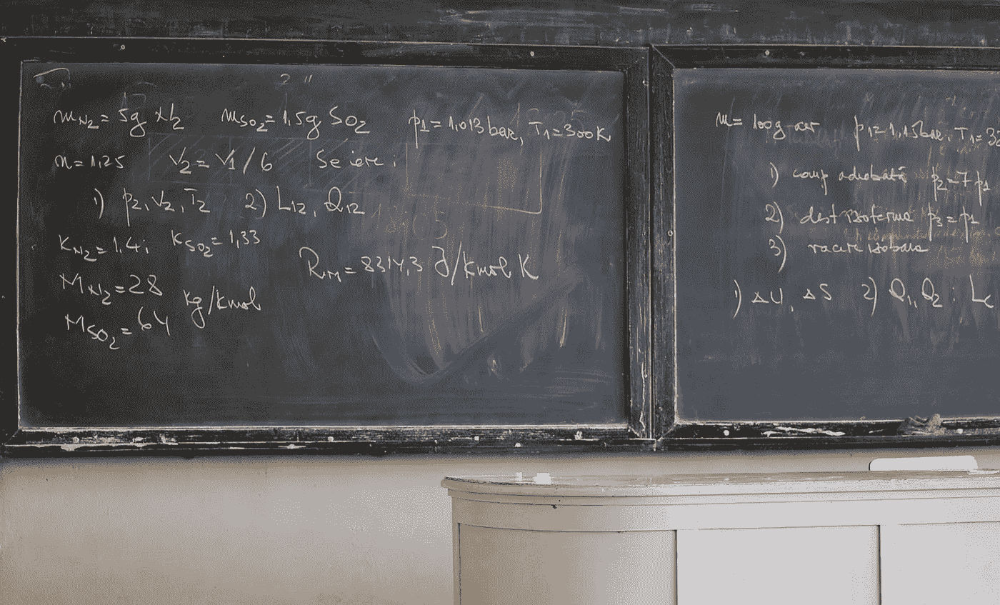

# 学习数学的两件好事和一个坏习惯

> 原文：<https://medium.com/nerd-for-tech/two-good-things-and-one-bad-habit-from-studying-mathematics-863b01ee0119?source=collection_archive---------19----------------------->

照片由阿里格里/4freephotos.com 拍摄

在我生活的不同阶段和不同背景下，人们会问“数学学位有什么价值？”。

通常会有一些关于“学会如何逻辑思考”和“数学学位打开了许多大门”的模糊答案。以我个人的经验，我同意这些答案吗？当然可以。随便啦。

在过去的几年里，我意识到，由于我的数学训练，我学会了两件好事和一个坏习惯。

**好事:提高绘画技巧**

我不是一个非常好的艺术家。无论是作为孩子还是成年人，我从未真正喜欢过绘画。但是在学习了线性代数和多元微积分的优秀课程后，我对画二维和三维的图形很有信心。由于接触了足够多的圆锥曲线和积分技术，我的绘画技巧肯定有所提高。这可能是一个练习的问题，或者是学习数学的背景(这是我擅长的，也是我喜欢的)。不管发生了什么，我现在是个更好的艺术家了。

**好事:提前定义术语**

在正式的数学写作中，很常见的一点是尽早清晰地定义新的术语或概念。许多证明遵循“定义、定理、证明”的格式，在这种格式中，概念被精确地定义，定理被陈述(这是基于定义的概念的陈述)，然后定理被证明。我真的很喜欢遵循这种格式的数学教科书，因为它们很流畅。

在技术写作中，甚至在技术写作之外，经常讨论概念或术语而没有真正清楚地定义它们。这种情况经常发生在首字母缩略词上，尤其是 tla(三个字母的首字母缩略词)，作者简单地假设首字母缩略词为读者所知。虽然这可能会使文章简洁，但也可能导致混乱，甚至与文章脱节。" T4 这个词实际上是什么意思？"“我应该知道吗？”，甚至“我不认为这篇文章实际上是写给我的”可能会悄悄进入读者的脑海。此外，它会导致人们一开始就对文章产生错误的想法。

我喜欢事情被预先定义，即使它们没有完全定义好。它为一篇文章和一个想法创造了一个共同的起点。在书面案例和讨论中，数学很好地做到了这一点。我把这个当作好的练习。

**坏习惯:使用短语“我不在乎那个”**

在任何像样的数学程序中，最终学生都会看到一些相对复杂的证明。在这种情况下，从证明的开始到结束有几个步骤，每个步骤都要讨论和演示。通常在这些步骤中的某一步，演示者会说类似“现在我不在乎这个值是负的还是正的”或者“我们真的不在乎这个函数在点 *x* 是否连续”。这句话的意思是，证明步骤的某个方面与如何进行下一步或手头的问题无关。然而，这种说法有时表现为“我，一个人，并不真正关心这件事”。

我有时会在非数学的背景下这么说。当我说“我不关心那个话题”时，我通常的意思是“我对这个话题*在这个特定的语境*中没有兴趣”。然而，这种措辞也可以解释为“我对这个话题*一点兴趣都没有*”。

这里有一个例子:一个同事可能会问我“我下一步应该处理哪张票？”，我可能会说“*我不在乎*你拿哪个，只要它与项目 X 或 Y 有关”。

我的意思是“只要与项目 X 或 Y 相关，你决定拿哪张票与我无关”，但这可能被解释为“我实际上对你做什么工作或你的决策过程根本不感兴趣”。这是语言上的微妙差异，但它可能会对人们如何解读我的动机产生重大影响。

在数学中，这种语言完全有意义。如果要乘以零，那么 x 是正还是负有关系吗？不。通常这是过程中的一个步骤。真正感兴趣的是最终的结果。当然，人类可能非常关心决策是如何做出的，或者人们对他们的决策有什么感觉。

我从我的数学学位中学到了其他东西吗？绝对的。这两件好事和一个坏习惯是我得到的一些更有趣的教训。