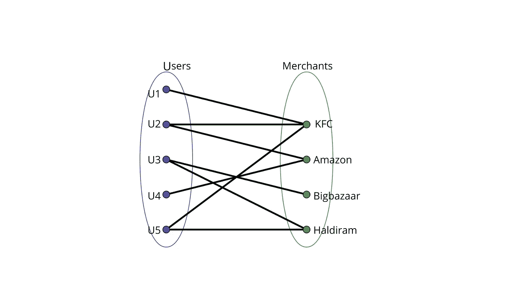
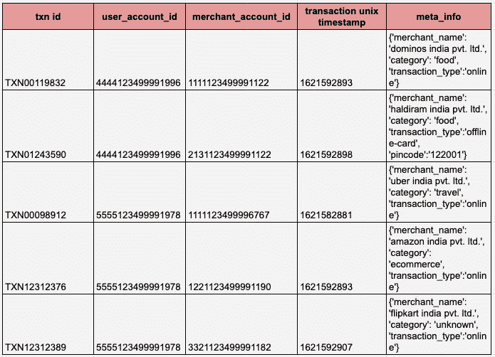
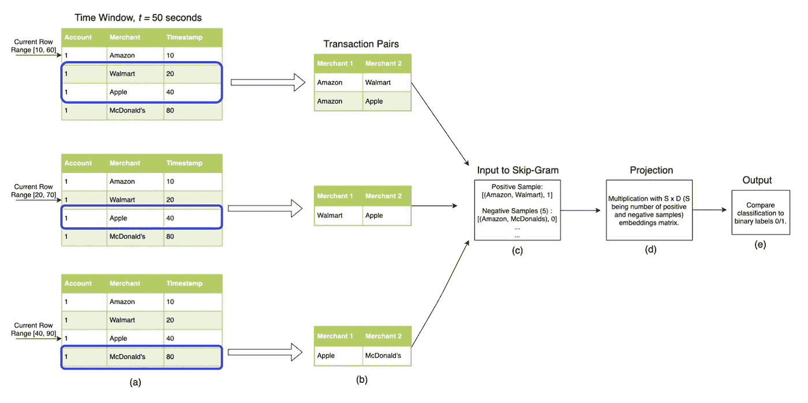
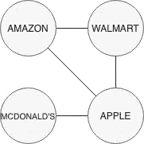
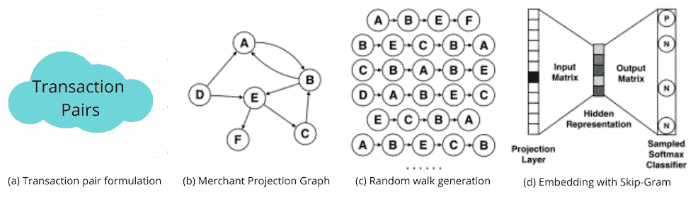
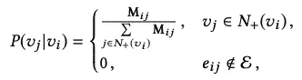
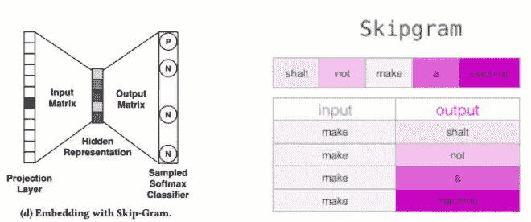
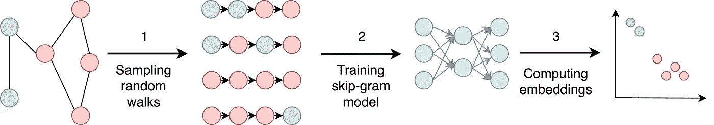
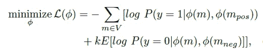

# TXN:使用深度(行走)Trax 进行交易分类:嵌入金融交易图表—第一部分

> 原文：<https://medium.com/nerd-for-tech/txn-transaction-categorisation-with-deep-walk-trax-embedding-graphs-of-financial-transactions-a49dec8d9677?source=collection_archive---------7----------------------->

> 很多人在钱的问题上都是一片黑暗，我要开灯了。

弗雷德·燧石族(接收者)和巴尼·粗石族(发送者)之间的交易

> **背景**:据我所知，DeepTrax 论文中提出的方法(见下文)是图嵌入在金融交易中的首次应用。它共享一种方法来构建用户和商家在财务图上的嵌入，进一步使用这些嵌入，可以执行其他下游任务，如商家奖励推荐(google pay 商家奖励刮刮卡)、相似商家分组、具有分组聚类上的元信息的交易分类、欺诈用例等。

 [## LinkedIn 上的 shau rya Uppal:deep trax:嵌入金融交易图表

### 一周前，我看到了一篇超级惊人的研究论文《DeepTrax:嵌入金融交易图表》。它…

www.linkedin.com](https://www.linkedin.com/posts/shaurya-uppal_deeptrax-embedding-graphs-of-financial-transaction-activity-6802816719187525632-NOkd) 

## 摘要

金融交易可以被认为是发送货币的实体和接收货币的实体之间的异构图中的边。
这个图可能会非常大，有数百万个节点(实体)和数十亿条边(事务)，而且连接也很稀疏。将机器学习应用于如此大且稀疏的图变得具有挑战性。为了简化我们的用例并仅捕获商户嵌入，我们选择信用卡 txns 数据，其中用户是花钱的实体，而商户是收钱的实体(在大多数情况下)，因此这个网络是一个二分图。在这个二分图中，图嵌入技术:DeepWalk 被应用于捕获由链接预测 AUC 和 F1 分数量化的商家嵌入。此外，得到的实体向量保留了通过可视化和其他定性分析探索的直观语义相似性。然后，我们使用这些商家嵌入来执行下游任务，如商家(交易)分类。

博客的结构如下——第二部分讨论了二分图及其投影。配对交易的预处理将在第三节讨论。在第四节中详细讨论了在处理过的图上的深走技术。第五节讨论损失函数。第六节介绍了一些有趣的实验知识，第七节介绍了将商户嵌入应用于下游任务(如交易分类)的方法。第八节提供了实验的详细结果和最后的结论。

## 二。二部图及其投影

信用卡交易图是账户和商家之间的二分图，交易形成一条边。二部图(或称二部图)是这样一个图，它的顶点可以分成两个不相交的独立的集合，在我们的例子中是用户集合和商家集合，使得每条边连接用户集合中的一个顶点和商家集合中的一个顶点。(见图 1)

图 1 信用卡交易的二分图

在交易数据库中(见图 2)，上述二分图的元路径存储为**{账户，商家，账户}** ，给定该模式，我们将只考虑遵循这种三元组的图遍历:将账户识别为相似，因为它们在同一商家购物(反之亦然)。

**我们可以将这个二分图分成两个*同质*投影:
i)一个用户账户图
ii)一个商家图**
对于我们的用例，我们将只关注创建一个商家图。我们可以在商家图的这个**齐次投影上应用随机行走技术，即 deepwalk 来得到商家嵌入。**

图 2 交易数据库

## 三。预处理阶段:将图建模为成对的事务

在上面讨论的商家的投影图中，两个商家顶点之间的边表示在指定的时间窗口(我们将其设置为 50 秒，参见图 3 (a)和(b))内在两个商家处进行交易的至少一个账户的存在。

图 3 模型管道，从数据预处理到用 Skip-gram 训练。使用严格的时间窗口和事务对对(示例时间窗口， *t* = 50 秒)允许在具有数百万唯一实体的图上创建有意义的嵌入。

在交易对公式化之后，我们现在有了一个加权的商家预测图(参见图 4，基于上述交易对的预测商家图)，其中权重是基于一个账户在固定时间窗口内在相同的两个商家购物的频率来计算的。

图 4(图 3)的商户预测图

## 四。商人投影图上的 Deepwalk(图嵌入技术)

图 5 分步实施的图示

首先，我们将特定时间(我们的案例 T =秒)窗口内的交易配对，然后我们映射这些交易，创建一个商家图(b)的投影。

为了对抗非同质性，我们使用马尔可夫链方法，该方法仅依赖于当前状态来生成下一个状态。

我们使用唯一的交易对出现计数来计算商家之间的转移概率。

从商人 I 到 j. M 的概率是唯一的转变。如果没有交易从商户 I 导航到 j(在我们指定的时间窗口 T 中)，则为 0。

然后，我们使用转移概率在图(b)上应用随机行走，生成多个商家序列(c)，然后应用 skip-gram 负采样技术(d)(参见图 5)来找到商家嵌入(如果我们想要生成用户嵌入，则使用类似的方法)。

图 5 单词令牌上的负采样(图片来源 jay alammar 博客)

在图 5 的例子中，我们将使用商家帐户 id 作为跳格模型的令牌，而不是单词令牌。(这是我为我的用例所做的修改，在纸面上，他们使用原始的商家名称或品牌名称作为商家令牌)。

图 6 深度行走的阶段

## **V .损失函数**

优化问题和损失函数由下式给出

图 7 损失函数

其中 m ∈ V 表示从一组唯一的商户实体中选择的商户，v，映射函数φ: m ∈ V 􏰀→ Rd 检索任何给定商户的嵌入表示，m_pos 表示给定商户的正样本商户，m_neg 表示从 v 中选择的负样本，k 是负样本的数量。

我们现在正在研究和执行事务分类任务。

接下来，我们将讨论:

*   第六部分:一些有趣的实验学习
*   第七部分:将商户嵌入应用于交易分类等下游任务的方法
*   第八部分:提供了所执行实验的详细结果、指标和最后的结论。

我希望你喜欢这个博客，并学到了一些东西！我很快会带着第二部分回来。[ **未完待续……**]

 [## [第二部分]商户嵌入使用 Deep(walk)Trax 方法进行交易分类，商户…

### 没有比不遵守诺言更大的欺诈了。—斯蒂芬·哈珀

medium.com](/nerd-for-tech/merchant-embeddings-using-deep-walk-trax-methodology-for-transaction-categorisation-merchant-bfe783c89a44) 

## 我希望你能从这个博客中学到一些新的东西。如果你喜欢，点击👏并分享这篇文章。敬请期待下一期！

 [## Shaurya Uppal -数据科学家- epiFi | LinkedIn

### 连接/关注一些有趣的数据科学更新…

www.linkedin.com](https://www.linkedin.com/in/shaurya-uppal/) 

参考文件: [Khazane，a .，Rider，j .，Serpe，m .，Gogoglou，a .，Hines，k .，Bruss，C. B .，& Serpe，R. (2019，12 月)。金融交易的嵌入图。在 *2019 年第 18 届 IEEE 机器学习与应用国际会议(ICMLA)* (第 126–133 页)。IEEE。](https://www.linkedin.com/posts/shaurya-uppal_deeptrax-embedding-graphs-of-financial-transaction-activity-6802816719187525632-NOkd)