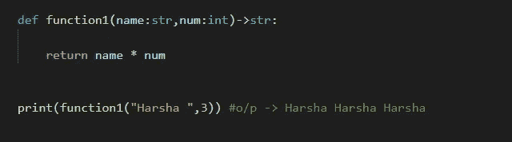
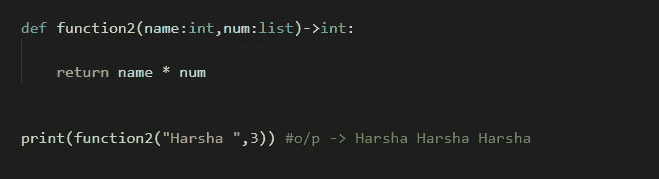
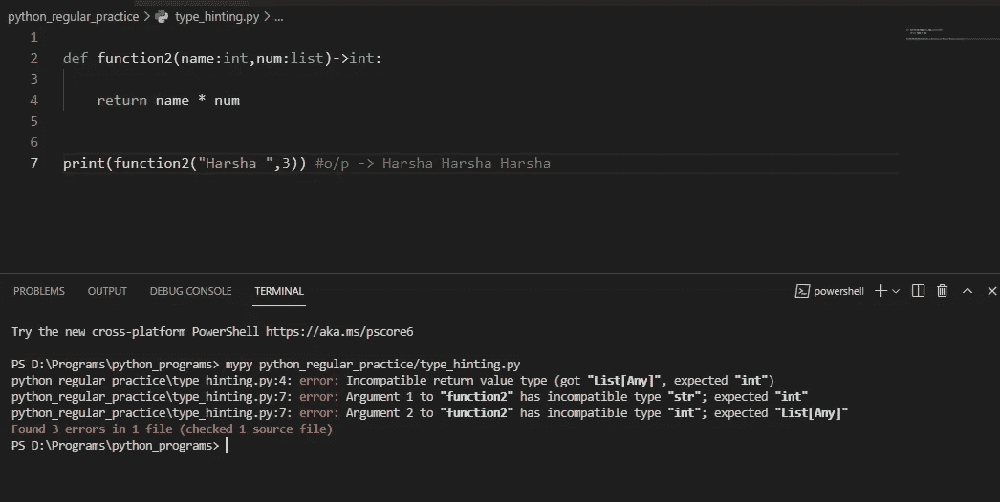
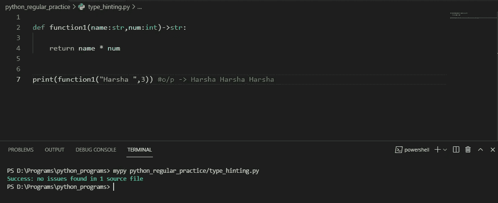

# Python 中的类型提示

> 原文：<https://medium.com/nerd-for-tech/type-hinting-in-python-db042425ba16?source=collection_archive---------17----------------------->

你有没有想过，在 python 中有一个类似的选项会很好？在那里我们能够提供友好的建议，让用户了解什么类型的数据可以作为参数，或者什么应该是函数的返回类型？

在这篇文章中，我们将从视觉上感知我们是如何发明它的。

类型提示是一种正式的解决方案，用于静态指示 Python 代码中值的类型。在 [PEP 484](https://www.python.org/dev/peps/pep-0484/) 中指定，在 [Python 3.5](https://docs.python.org/3.5/whatsnew/3.5.html) 中引入。

下面是一个将类型信息集成到函数中的例子。您可以注释参数和返回值:

这里，我们定义了一个简单的函数，它有两个参数 name 和 num 类型提示为 string 和 integer，后者返回，name 累计 num 次，后者类型提示为 string。在这里，类型提示是输入特定数据类型值的一种建议方式。但是，输入的不是铆接数据类型值。为了清晰的理解，回顾下面的例子。

这里，我们用变量类型提示定义了与上面相同的函数，结果是一样的。为了按照给定的类型提示评估程序，我们可以使用如下的独特语法。注意，需要安装一个特定的包' [mypy-lang](https://pypi.org/project/mypy-lang/) '来 gizmo 它。

执行文件时，在可执行文件的路径前加上前缀“mypy”。这是在编译代码，该代码评估用静态类型提示给定的值的类型。

看一下下面的无错误代码:

在[风格](https://realpython.com/python-pep8/)方面， [PEP 8](https://www.python.org/dev/peps/pep-0008/#other-recommendations) 推荐如下:

*   对冒号使用常规规则，即冒号前没有空格，冒号后有一个空格(`text: str`)。
*   将参数注释与默认值(`align: bool = True`)组合时，请在`=`符号周围使用空格。
*   在`->`箭头周围使用空格(`def headline(...) -> str`)。

希望你喜欢阅读这篇文章！

如果您有任何疑问，请在下面的**评论**部分发帖。在 [LinkedIn](https://www.linkedin.com/in/harshith-raj-uppula-541196181/) 上与我联系。另外，如果你想看看我开发的项目，别忘了查看我的 [GitHub](https://github.com/harsha954) 。

话虽如此，感谢您阅读我的文章，并*快乐编码！*

别忘了**关注**和**订阅**更多此类文章。