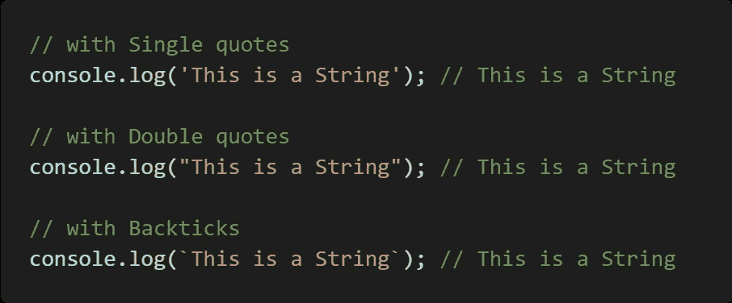
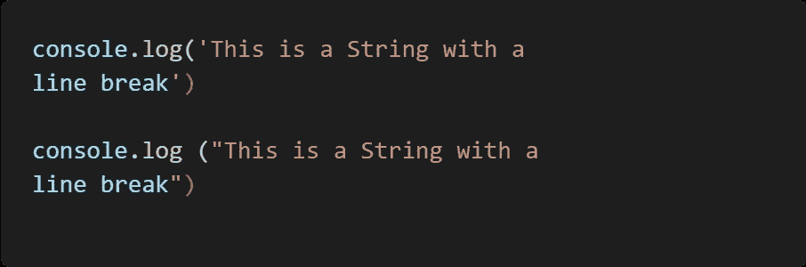
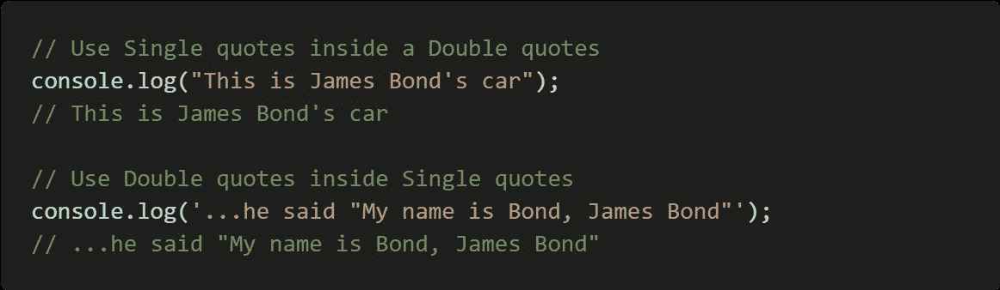
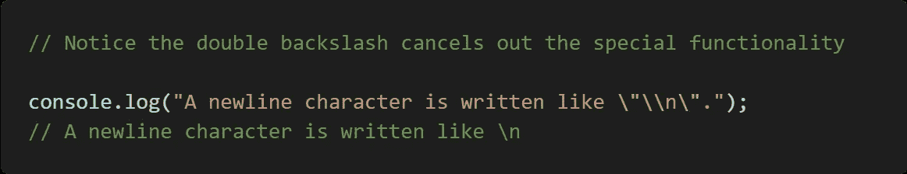
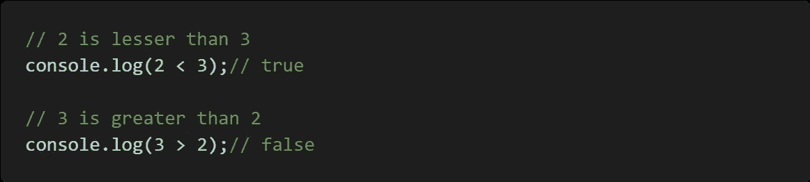
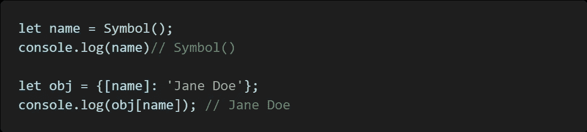
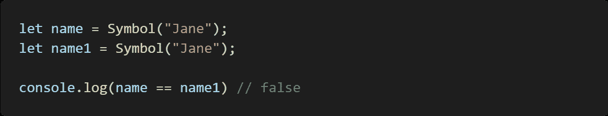
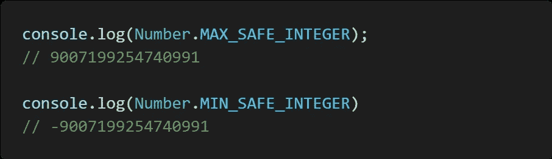
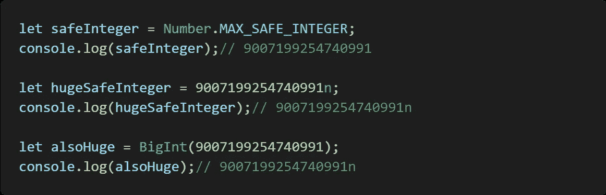

# JavaScript 中的类型

> 原文：<https://medium.com/nerd-for-tech/types-in-javascript-8aef9384d1bd?source=collection_archive---------8----------------------->

马库斯·斯皮斯克在 [Unsplash](https://unsplash.com?utm_source=medium&utm_medium=referral) 上的照片

JavaScript 就像任何编程语言一样有**类型**，这是用来限定值是什么类型的数据。这本身在编程时就很有用，有时你想知道一个值在一个动作执行前是什么类型，否则就不知道。如果你感到困惑，这就像在人类的世界里，有像家具、衣服这样的物品分类。您可以将类型作为值的类别，但是值本身就像一个项目

在编写时，JavaScript 中有 **7** 种原始类型，它们包括:

*   数字
*   线
*   布尔代数学体系的
*   空
*   不明确的
*   标志
*   BigInt

**注** : ***符号*** 和 ***BigInt*** 是最近新增的原始数据类型。

## 数字

JavaScript 和它的特性不能被夸大，如果你使用过其他编程语言，你会注意到它有 int(整数)和 floating point(或者我们知道的 decimal)。JavaScript 没有这样，整数和浮点都在数字类型中处理。

JavaScript 用 64 位表示每种数字类型，换句话说，JavaScript 能表示的数字是有限的，计算机使用二进制系统，所以 2 **⁶⁴** 将给出超过 18 万亿(18 个零或 180 亿)准确地说 **18，446，744，073，709，551，616** 这是 JavaScript 能在一个数字中表示的很多值， 理论上，JavaScript 可以表示的最大单个数是 2 **⁶⁴** (0 — 18，446，744，073，709，551，615)不要对最后一位数字的变化感到困惑，2 **⁶⁴** 导致的是可能的值而不是实际值，并且计算机也从零开始计数。 如果你不处理天文数字，你是安全的。

并非所有小于 18 万亿分之一数字都可以用 JavaScript 表示。实际上，JavaScript 只能存储 9 万亿(15 零或 900 万亿)范围内的整数，准确地说是 9，007，199，254，740，991，因为其他值需要表示，如小数点和负号的位置，这需要占用一些位。

## 特刊

这些是技术上的数字，但它们不是整数或非整数。**无穷大**和**-无穷大**就属于这一类。如果你编过一段时间的代码，你一定看过**【南】**(大家的最爱)，那也是一个**数字**，搞笑吧。你一定注意到了，当 **NaN** 抬起头的时候，它的头大部分是数字运算，不会产生有意义的结果。比如无限-无限，0/0，0/5 这些都让**南**从它的黑洞里走出来。

## 线

计算机如何识别文本？用单引号(')、双引号("")、反斜线(`)将它括起来。这就是计算机表示文本的方式，这使得计算机不会把它误认为关键字或变量。几乎任何字符都可以用引号括起来，JavaScript 会把它变成一个字符串。

来自作者

当用单引号或双引号括起文本时，它将转义任何换行符。这意味着当你在文本编辑器中输入时，你可能想要换行，或者通过按回车键来开始一个段落或一个句子。神圣风格的 JavaScript 不会被你请求换行符的人性化方式所困扰。

来自作者

JavaScript 以其无限的智慧创造了一种请求换行符的方式。它给了我们什么？ **\n** ' *，*将此字符放在字符串中任何字符之后，您将看到您的换行符。

不要被字母“n”弄糊涂了，赋予它超能力的是反冲(\)，它赋予某些角色意义，从而赋予他们所拥有的超能力。所以“n”只是一个没有反斜杠的字母，但是有了反斜杠，它就有了不同的功能。

反斜杠(\)除了赋予字母“n”超级能力之外，还有其他用途。它也用来降低一些人物的超能力。以单引号(')和双引号("")为例，JavaScript 知道当它看到单引号(')或双引号("")时，它需要一个字符串，但如果您只想将单词放在引号中，比如引用某人或表示撇号，这是不可能的。是吗？反斜杠来拯救它，所以不是给它超能力，而是把它拿走，所以单引号(“”)和双引号(“”)可以做引号在人类世界中做的事情，做一个简单的引号。

来自作者

单引号和双引号也可以用在不带反斜杠的字符串中。

来自作者

## 布尔型:

当一个值有两种可能结果是或否，开或关时，这很有用。

JavaScript 通过布尔类型为您提供了满足这种结果的能力，布尔类型有两个值，“是”或“否”或“开”和“关”，并以此表示。

JavaScript 有一个 Boolean 类型，它有两个值，true 和 false，写为那些单词

来自作者

## 标志

ECMASCRIPT 2015 中引入了符号。它在被调用时创建一个唯一的标识符，该标识符仅供内部使用。创建后剩下的只是符号引用。使用符号的一个用例是将其用作对象中的一个键，因为它返回一个唯一的标识符。这个键被认为是唯一的，因此不能被访问该对象的另一个脚本覆盖。

来自作者

可以用名字来称呼。每次调用 symbol 函数时，它都会创建一个新的唯一值，尽管有相同的符号名称。点击了解更多关于符号[的信息](https://developer.mozilla.org/en-US/docs/Web/JavaScript/Reference/Global_Objects/Symbol)

## BigInt

BigInt 是一种特殊的数字类型，它支持任意长度的整数。

我在数字部分写道，JavaScript 用 64 位表示一个数字。这给了 JavaScript 表示 18 万亿个整数的能力，但是我们有负数和十进制数，这些都需要占用比特。因此，JavaScript 可以可靠地用超过 9 万亿次(15 个零或 900 万亿)的整数中的数字原语来表示。

900 亿的精确值是 **9007199254740991** ，所以 JavaScript 可以安全地表示一个整数的值。这可以通过**号得到。MAX_SAFE_INTEGER** 常量。

如果你想做精确的计算或者在大数字是标准的地方，这是有用的。这可能不是你每天都会用到的东西，但是当你需要的时候它就在那里。

可以通过将 **n** 加到一个数字(整数)或调用 BigInt()函数来创建 BigInt。

来自作者

来自作者

也可以让小数字成为 ***BigInt。***

来自作者

# 结论

这些是 JavaScript 的原始数据类型，现在有些可能对你没用了。记住，当你需要他们的时候，他们就在那里。JavaScript 是一种特殊的编程语言，它有一些古怪和酷的因素。请记住，沿途可以看到一些怪异之处。

编码快乐！！！