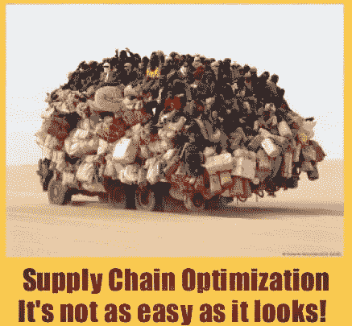
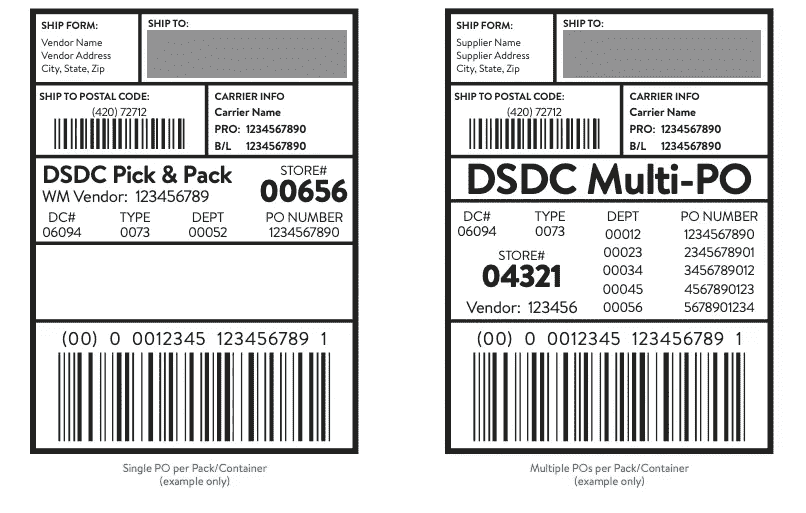
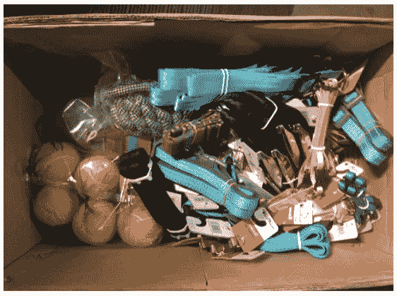
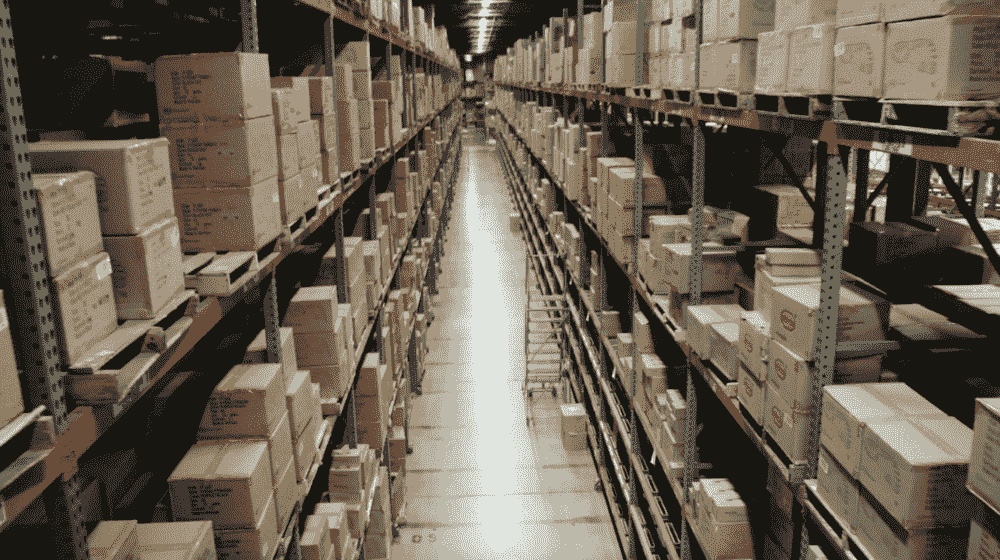
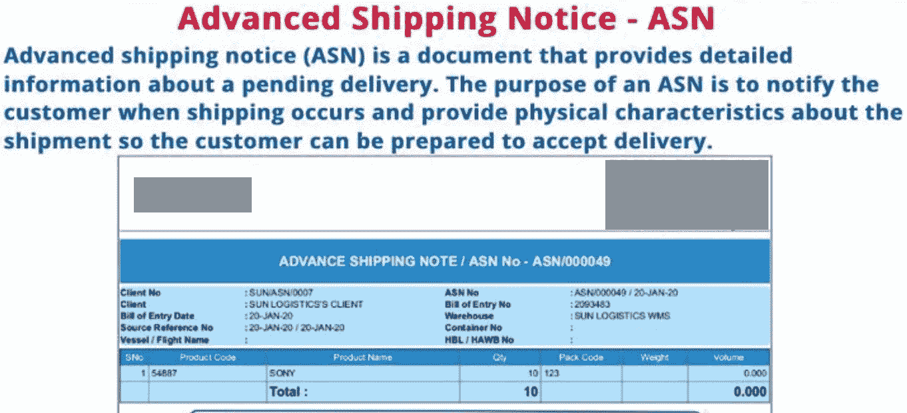
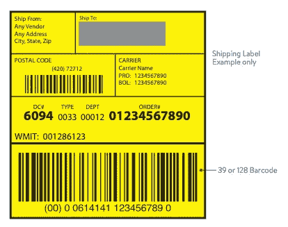

# 供应链技术中的货运类型

> 原文：<https://medium.com/nerd-for-tech/types-of-freight-in-supply-chain-af75bc504df8?source=collection_archive---------5----------------------->

我不断听到供应链中使用这些不同的术语来描述来自供应商的不同种类的货物。这真的很令人困惑，所以我想我会写一篇小文章来帮助大家。这肯定不是一个详尽的列表，但我会继续更新它。继续读。

[链接](https://in.pinterest.com/pin/491807221777482671/)

> **直营店配送整合— DSDC**

DSDC 是一种通过运输到商店而不是个体零售店来合并货物的方式。由于供应商不再需要多次将货物运送到该地区的各个角落，因此效率和成本效益都很高。

DSDC 是所有关于少箱订单，这意味着供应商可以包装松散的项目到一个集装箱，更紧凑的运输。

[链接](https://corporate.walmart.com/media-library/document/supply-chain-packaging-guide/_proxyDocument?id=00000173-a1ca-d3c5-a7fb-edcbf2400000)

[链接](https://corporate.walmart.com/media-library/document/supply-chain-packaging-guide/_proxyDocument?id=00000173-a1ca-d3c5-a7fb-edcbf2400000)

这些优势中有几个是:

*   降低供应商运输成本
*   更高的库存准确性
*   降低处理成本
*   更少的丢失货物
*   更精确的预算

> **PO CON =采购订单合并**

如果一份采购订单(PO)上有多项货物，并且所有货物都将运往同一个目的地，我们可以将它们捆绑在同一个货盘上，而不是为每一项货物制作多个部分货盘。这有助于提高运输到地区配送中心(RDC)的空间效率。

**好处**

*   这将**降低每月成本**，因为现在您有能力将来自几个不同部门的小额采购联系在一起，然后向您的常规供应商提交更少的采购订单。
*   这会让你的生意更有效率。
*   这让备货变得容易多了。

> **订书钉库存/仓储— SSTK**

这些货物暂时存放在区域配送中心(RDC ),只要商店需要，就可以发放。这些物品也可能包括季节性物品，这些物品可能在一年中的大部分时间都要存放，但在旺季可能会有大量需求。

[链接](https://www.google.com/url?sa=i&url=https%3A%2F%2Fwww.barrettdistribution.com%2Fshared-and-dedicated-warehousing&psig=AOvVaw019vUGdRYdJLDlTy4rKrh6&ust=1641509791956000&source=images&cd=vfe&ved=0CAsQjRxqFwoTCJj80NPam_UCFQAAAAAdAAAAABAR)

接收这种货物包括诸如接收库存、然后将每个 SKU 放入单独的专用存储位置(例如，在货架、箱柜、槽中或在货盘上)并将产品发送到其下一个目的地的功能。

**好处**:

*   成本低
*   按时接收和装运库存
*   员工生产力
*   手头有足够数量的产品
*   低于容量的空间
*   存储优化，过道畅通
*   有效使用设备
*   顾客满意

> **跨码头货运— DA**

这是应该进出而不是储存的货物。这通常是由商店订购的适量快速移动货物。跨站台解决方案使公司能够加快向客户发货，这意味着客户通常可以在需要时得到他们想要的东西，这是优化供应链的目标。

**好处:**

*   劳动力成本降低，因为产品不再需要在仓库中挑选和存放
*   缩短从生产到交付给客户的时间，这有助于提高客户满意度
*   减少对仓库空间的需求，因为不需要储存产品

下面的列表显示了一些更适合跨站台的物料类型。

*   需要立即装运的易腐物品
*   **收货时不需要质检的优质品**
*   预先标记(条形码、RFID)、预先出票并准备出售的产品
*   **促销商品**和正在推出的商品
*   具有恒定需求或低需求差异的主要零售产品
*   来自另一个生产工厂或仓库的预先挑选、预先包装的客户订单

这些也可能是季节性商品，在一年中的其他时间是主要库存，但在一年中的某些时间会快速流动，例如圣诞节或感恩节。

> **提前装运通知— ASN**

ASN 是电子数据交换(EDI 856)通知，用于在交货前通知买方货物内容。

[链接](https://www.google.com/url?sa=i&url=https%3A%2F%2Fin.pinterest.com%2Fpin%2F436075176427254590%2F&psig=AOvVaw0SioU5UOoiOB8K3WSUjXUp&ust=1641511389856000&source=images&cd=vfe&ved=0CAsQjRxqFwoTCOD-0Mzgm_UCFQAAAAAdAAAAABAD)

**提前装运通知福利**

`***For the Buyer***`

*   更好的劳动力计划，提前了解进货情况。
*   提高收货效率，减少需要协调的货运问题。
*   更好的库存管理。
*   减少人工处理。
*   召回产品的来源可追溯性。

`***For the Supplier***`

*   减少人工处理和文书工作。
*   提高发票准确性，加快付款速度，从而加快拖车周转。
*   自动采购订单更新—减少审查/处理的手动采购订单更改表单，更快地重新订购短缺商品以增加库存。

**注意**—*要求*ASN 包含单个案例内容。项目数量*要求*以每件和仓库包装的倍数传输。

> G **非转售商品— GNFR**

[链接](https://www.lumatrak.com/understanding-gnfr/)

不得转售的商品包括固定装置、展示品、标牌和其他设备，不得出售给我们商场内的顾客。简而言之，GNFR 指的是公司运营中不可或缺的各种商品和服务。这些货物可能不计入制造产品的直接成本*或购买成品用于转售的直接成本*，因此它们被视为间接成本*。*

*根据独特的黄色标签，运送到配送中心或商店的 GNFR 物品应易于被员工识别。*

**

*[链接](https://corporate.walmart.com/media-library/document/supply-chain-packaging-guide/_proxyDocument?id=00000173-a1ca-d3c5-a7fb-edcbf2400000)*

*现在，如果你想了解供应链中使用的各种条形码和标签，你可以在这里阅读它们*

* [## 什么是刚果爱国者联盟/EAN/GTIN/SSCC/ASN 等等？

### 在我的职业生涯中，我在供应链工作时遇到过很多次这种情况。每次在那里…

medium.com](/nerd-for-tech/what-is-a-upc-ean-gtin-and-others-ce0fa56e3b54)*