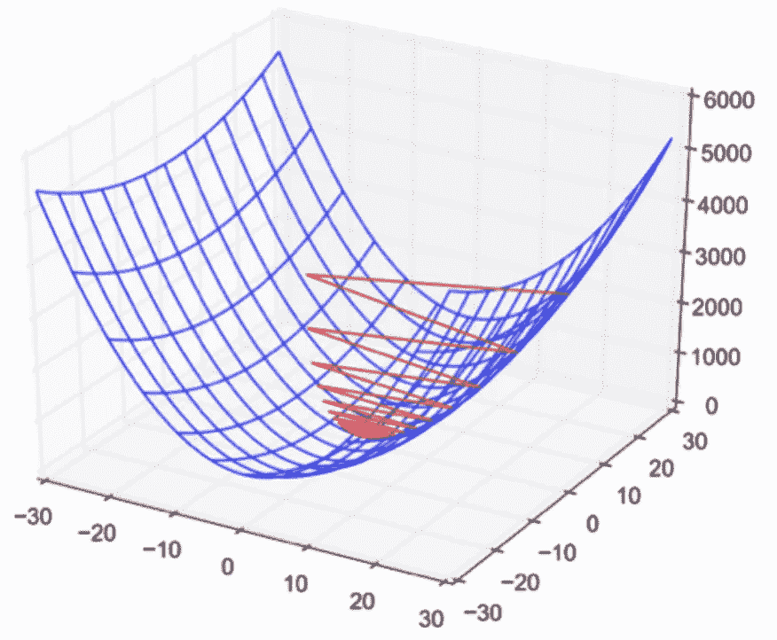

# 用于训练神经网络的优化算法类型。

> 原文：<https://medium.com/nerd-for-tech/types-of-optimization-algorithm-used-to-train-neural-network-ea3becc2222a?source=collection_archive---------17----------------------->

优化器是一种算法或方法，用于改变神经网络的属性，如权重和学习速率，以减少损失。

图 1:达到全局最小值。

你应该如何改变你的神经网络的权重或学习速率来减少损失是由你使用的优化器定义的。优化算法或策略负责减少损失，并尽可能提供最准确的结果。

我们将了解不同类型的优化器及其优势:

## 梯度下降:

*   梯度下降是最常用的算法，它相当常用于线性和逻辑回归技术。
*   也被称为万尼拉梯度下降。
*   梯度下降是一阶导数，其中它在神经网络中反向传播，以通过优化权重(w)和偏差(b)来最小化损失。

算法: **θ=θ−α⋅∇J(θ)**

**优势:**

*   非常容易实现
*   简单易懂的方法

**缺点**:

*   需要整个数据集来获得全局最小值，这需要大量的计算能力和耗时的过程。
*   它可能在达到全局最小值之前就陷入局部最小值。

**随机梯度下降:**

*   它优化了训练数据集中每一行的权重和损失。如果数据有 1000 行，它将在一个周期内改变为每 1000 行计算的权重和偏差，而梯度下降需要整个数据，因此它需要较少的计算能力，但消耗更多的运行时间。

**θ=θ−α⋅∇j(θ；x(一)；y(i))，其中{x(i)，y(i)}是训练示例**

**优势:**

*   它需要更少的计算能力。

**缺点**:

*   因为它是对每一行进行优化，所以需要更多的时间来收敛到全局最小值。
*   它可能会达到局部最小值。
*   它在达到全局最小值时有更多的噪声。

## 小批量梯度下降:

*   它是所有梯度下降算法中最好的。这是对 SGD 和标准梯度下降的改进。它会在每次批处理后更新模型参数。因此，数据集被分成不同的批次，在每一批次之后，参数被更新。

**θ=θ−α⋅∇j(θ；B(i))，其中{B(i)}为训练样本的批次**。

**优点**:

*   SGD 达到全局极小值所需的时间更少。
*   它需要中等的计算能力。

**缺点**:

*   虽然它消耗的时间比 SGD 少，但通常它需要更多的时间来优化参数。
*   它有更多的噪音。

## **气势如虹的新币:**

*   具有动量的 SGD 是帮助在正确的方向上加速梯度向量的方法，从而导致更快的收敛。
*   SGD 和小批量 SGD 的主要缺点是噪声，因为它是以批量方式计算的，所以波动较大，所以我们转向动量 SGD。
*   它使用指数加权移动平均来避免计算梯度下降时的噪声。

**优点**:

*   减少参数的振荡和高方差。
*   在所有 GD 算法中，它消耗的时间较少。

**所有类型的梯度下降都有一些挑战:**

1.  选择学习率的最佳值。如果学习率太小，梯度下降可能需要很长时间才能收敛。
2.  对所有参数都有一个恒定的学习率。可能有些参数我们不想以同样的速度改变。
3.  可能会陷入局部最小值。

## **AdaGrad(自适应渐变):**

*   所有梯度优化算法的主要缺点之一是定义学习率，该学习率对于每个周期是恒定的。
*   AdaGrad 的关键思想是为每个权重设定一个自适应的学习速率。
*   权重的学习速率将随着迭代次数而降低。

给定参数在给定时间 t 的损失函数的导数。

为给定输入 I 和在时间/迭代 t 更新参数

**优点**:

*   它在每次迭代中自适应地更新学习率，我们不需要提及参数。
*   它适用于稀疏数据。

**缺点**:

*   当迭代次数变得非常大时，学习率降低到非常小的数值，这导致收敛缓慢。
*   计算昂贵的过程，因为它涉及大量的数学计算

## Adadelta:

*   它是 AdaGrad 的扩展，旨在消除 AdaGrad 的学习率衰减问题。 ***Adadelta*** 将累积的过去梯度的窗口限制为某个固定大小 **w** ，而不是累积所有先前平方的梯度。在此，使用指数移动平均值，而不是所有梯度的总和。

**E[g ](t)=γ。e[g](t1)+(1γ)。克(特)**

**优势**:

*   现在学习速度不衰减，训练不停止。

**缺点**:

*   计算开销很大。

Adadelta 和 Rmsprop 彼此相似，在 Adam 加入之前工作得很好。

## 亚当:

*   自适应矩估计(Adam)适用于一阶和二阶动量。
*   Adam 背后的直觉是，我们不希望滚动得太快，因为我们可以跳过最小值，我们希望稍微降低速度，以便仔细搜索。
*   除了存储像 **AdaDelta** 、**、 *Adam* 、**、*、*这样的过去平方梯度的指数衰减平均值之外，还保存过去梯度的指数衰减平均值 **M(t)。**

优化公式

**优点**:

*   快速收敛，克服了 AdaGrad 的缺点
*   纠正消失学习率，高方差。

**缺点**:

*   计算成本高。

## 各种优化器之间的比较:

不同优化算法的比较

## 结论:

→亚当是最好的优化者。如果一个人想在更短的时间内比亚当更有效地训练神经网络，那么他就是优化者。

→它是最好的、广泛使用的优化器

我希望你们喜欢这篇文章，并且能够对不同优化算法的不同行为有一个很好的直觉。