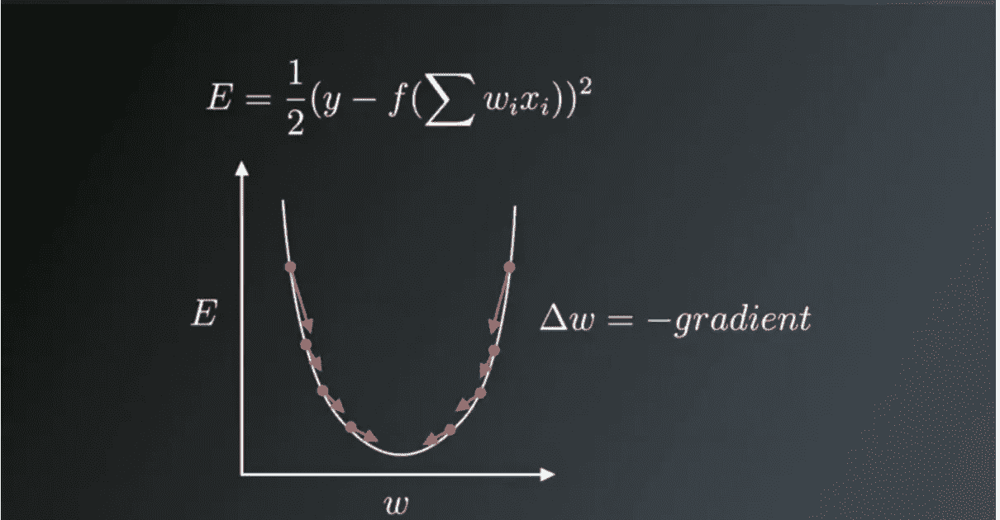
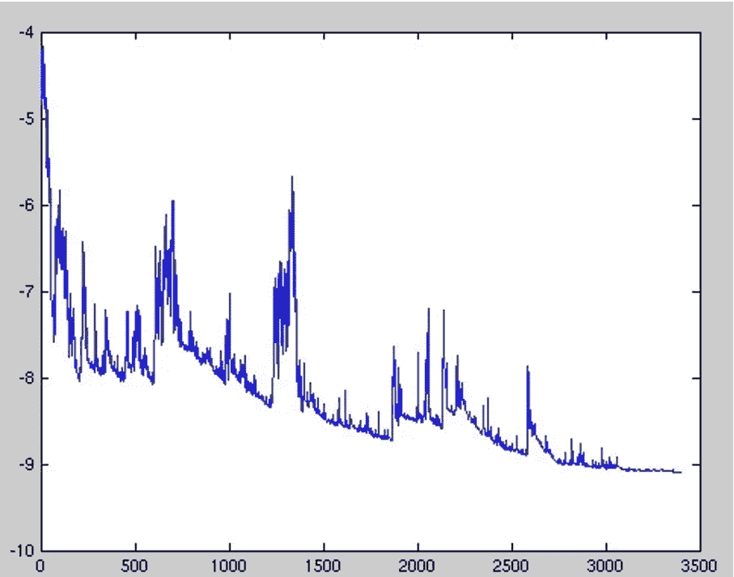
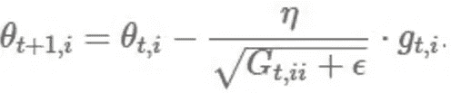
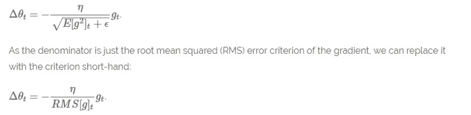
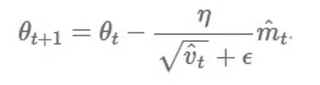

# 神经网络中使用的优化算法类型和优化梯度下降的方法

> 原文：<https://medium.com/nerd-for-tech/types-of-optimization-algorithms-used-in-neural-networks-and-ways-to-optimize-gradient-descent-1e32cdcbcf6c?source=collection_archive---------1----------------------->

您是否曾经想过，通过更新模型参数，如**权重**和**偏差**值，为您的神经网络模型使用哪种优化算法来产生稍好且更快的结果？我们应该使用**梯度下降**还是**随机**梯度下降还是 **Adam？**

在写这篇文章之前，我也不知道这些不同类型的优化策略之间的主要区别，以及哪一种优于另一种。

**注:**

*拥有良好的理论知识是惊人的，但在实时深度学习项目中用代码实现它们是完全不同的事情。基于不同的问题和数据集，您可能会得到不同的意外结果。因此，作为奖励，我还添加了各种课程的链接，这些课程在我学习数据科学和 ML 的过程中帮助了我很多，实验并比较了不同的优化策略，这促使我写了这篇关于在实施深度学习和比较不同优化策略时不同优化器之间的比较的文章。以下是一些帮助我成为今天的我的资源。我个人是*[**data camp**](https://datacamp.pxf.io/x9NMDy)*的粉丝，我就是从它开始的，现在还在通过*[**data camp**](https://datacamp.pxf.io/x9NMDy)*学习，不断做新的课程。他们真的有一些令人兴奋的课程。一定要去看看。*[**data camp**](https://datacamp.pxf.io/x9NMDy)*课程库中有一些令人惊艳的新课程，一定要去看看。*

从今天起至 12 月 3 日美国东部时间晚上 8 点，ataCamp 将提供首月订阅，仅售 1 美元。此外，他们有一个黑色星期五销售，年度订阅有 75 %的折扣。这是他们第一次进行这样的销售。所以一定要去看看 [**数据营**](https://datacamp.pxf.io/x9NMDy) **。另外，**[***dat camp cheat sheets***](https://datacamp.pxf.io/x9N7JA)**是我经常使用的一个非常方便、非常有用的工具。**

因此，这将是获取一些年度订阅(我有)的最佳时间，基本上可以无限制地访问 [**数据营**](https://datacamp.pxf.io/x9NMDy) ***上的所有课程和其他内容，并在这个疫情期间卓有成效地利用你坐在家里的时间。*所以，加油吧，伙计们，快乐学习，充分利用这段隔离时间，让疫情变得更强大、更熟练。**

*1)这是 DataCamp 上的课程链接* [***深度学习在 python 中使用******Keras***](https://datacamp.pxf.io/3PdGkK)*包* *或者绝对可以从**[***开始使用 Keras* 构建 CNN 进行图像处理** *如果理解* ***深度学习和 AI*** *基础知识是你现在想要的，那么* *以上两门课程是最好的深度学习课程，你可以在那里找到，学习深度学习的基础知识，并在 python* ***中实现。这些是我的第一个深度学习课程，对我正确理解基础知识帮助很大。***](https://datacamp.pxf.io/YgyQVq)*

**2)这些关于在 Python 中* [**构建聊天机器人的课程**](https://datacamp.pxf.io/do7myM) 和[**NLP 基础在 Python 中使用 NLTK**](https://datacamp.pxf.io/NK6rG7)****也推荐给对学习 AI 和深度学习更感兴趣的人。所以基于你的兴趣去尝试一下吧。*****

******3)*[***Python 中的机器学习使用 Scikit-learn***](https://datacamp.pxf.io/5b79kD)**-***本课程将教你如何用 Python 实现不同数据集的监督学习算法。******

******4)* [***数据角力和操纵数据帧使用熊猫***](https://datacamp.pxf.io/e4A6nr)***:****这个神奇的课程将帮助你在 python 中进行数据角力和数据预处理。而一个数据科学家大部分时间都在做预处理和数据角力。所以这门课对初学者来说可能会很方便。******

******5)* 本课程教你中级*[**Python for Data Science**](https://datacamp.pxf.io/x9N1Ay)**如果你想开始你的数据科学家职业生涯，并使用 Python **学习当今业界所需的所有基础知识，那么本基础课程[**数据科学家与 python**](https://datacamp.pxf.io/x9N1Ay) 是最佳选择。** *6)最近*[**data camp**](https://datacamp.pxf.io/x9N1Ay)*开始了一项新的计划，他们在课程中提供各种真实世界的* [***项目***](https://datacamp.pxf.io/x9N1Ay) *和问题陈述，帮助数据爱好者建立强大的实用数据科学基础。所以试试这些* [**项目中的任何一个**](https://datacamp.pxf.io/x9N1Ay) *出来。这肯定非常令人兴奋，会帮助你学得更快更好。最近我完成了一个关于* [**的项目，探索 Linux**](https://datacamp.pxf.io/MXNran) 的进化，这是一次令人惊异的经历**。**********

****R 用户，不要担心，我也有一些精心挑选的最佳 R 课程供你开始构建数据科学和机器学习基础，并同时使用这个令人惊叹的 [**数据科学和 R**](https://datacamp.pxf.io/QO6kV6) 课程，它将教你完整的基础知识。相信我，这个值得你花费时间和精力。 *8)这个课程也是理解 R 中机器学习基础知识最好的课程之一，叫做* [**机器学习工具箱*。***](https://datacamp.pxf.io/QO6kV6)****

*****9)* *所有的数据科学项目都是从探索数据开始的，对数据科学家来说最重要的任务之一就是彻底了解数据集，所以这个关于* [***探索性数据分析的可爱课程使用 R***](https://datacamp.pxf.io/0Jd40N) ***是*** *启动任何数据分析和数据科学项目* ***。*** *同样，本课程对 R**[***中的统计建模***](https://datacamp.pxf.io/P0651R)**会对所有像我一样有抱负的数据科学家有用。统计学是数据科学的基础。*******

*****10)* [***机器学习任务的数据预处理***](https://datacamp.pxf.io/a1W0NW)**是* *针对深度学习和 ML 爱好者的另一个方便的课程，因为它是您为任何数据科学项目执行的最重要和首要的任务之一。******

****我仍然在使用****数据营，并在空闲时间继续上课。实际上，我坚持认为，读者可以根据自己的兴趣尝试上述任何课程，以便开始学习机器学习和数据科学，并为其打下良好的基础。DataCamp** **提供的这些课程最棒的一点是，他们以一种非常优雅和不同的方式解释它，平衡地关注实践和概念知识，最后总是有一个案例研究。这是我最喜欢他们的一点。这些课程确实值得你花费时间和金钱。这些课程肯定会帮助你更好地理解和实现******、机器学习，并在**[**Python**](https://datacamp.pxf.io/x9N1Ay)**或** [**R**](https://datacamp.pxf.io/x9N1Ay) **中实现。我他妈的肯定你会喜欢它，我是从我个人的观点和经验来说的。**********

******回到主题-******

# ********什么是优化算法********

******优化算法帮助我们将***目标**函数(****误差*** *函数* ) **E(x)** 最小化(或最大化)**目标**函数(*的另一个名称)它只是一个数学函数，依赖于模型的内部**可学习的** **参数**，这些参数用于计算目标值(例如，我们将神经网络的**权值(W)** 和**偏差(b)** 值称为其内部可学习的*参数*，这些参数用于计算输出值，并通过网络的训练过程朝着最优解的方向学习和更新，即最小化**损失**，并且在 ***训练*** 中也起主要作用*********

********模型的内部参数对于高效、有效地训练模型并产生准确的结果起着非常重要的作用。这就是为什么我们使用各种优化策略和算法来更新和计算这种模型参数的适当和最佳值，这些参数影响我们的模型的学习过程和模型的输出。*** **优化算法类型**？*****

*****优化算法分为两大类*****

*****1.**一阶优化算法** —这些算法使用损失函数 **E(x)** 相对于参数的*梯度值来最小化或最大化该损失函数。最广泛使用的一阶优化算法是**梯度下降法。**一阶导数告诉我们函数在某一点是减少还是增加。一阶导数基本上给我们一条**线**，它与误差面上的一点**相切。********

*********什么是函数的梯度？*****梯度**就是一个向量，它是一个 ***导数*** ( **dy/dx** )的多变量推广，它是****y 相对于 x 的瞬时变化率*** *不同的是，要计算一个依赖于一个以上变量或多个变量的函数的导数，一个* **并且使用偏导数计算梯度。*****和一个***的另一个主要区别是，一个* ***渐变*** *的函数产生一个* ***矢量场*** *。***********

******一个**梯度**用一个 ***雅可比*** 矩阵来表示——它就是一个简单的由 ***一阶偏导数(梯度)*** 组成的矩阵。******

******因此，综上所述，导数是简单地为依赖于单个变量的函数定义的，而梯度是为依赖于多个变量的函数定义的。现在我们不要再深入微积分和物理了。******

********2。二阶优化算法** —二阶方法使用**二阶导数**，也称为**海森**来最小化或最大化******

********损失**功能。 **Hessian** 是 ***二阶偏导数*** 的矩阵。 ***由于二阶导数计算成本高，所以二阶用得不多*** 。二阶导数告诉我们 ***一阶导数*** 是增加还是减少，这暗示了函数的曲率。二阶导数为我们提供了一个与**误差面**的曲率相接触的**二次面**。******

# ******二阶优化优于一阶优化的一些优势—******

******虽然二阶导数的查找和计算可能有点费钱，但是一个 ***二阶*** 的优点******

*********优化*** *的技巧在于不忽视或忽略* ***曲面的曲率*** *。其次，就步进式性能而言，它们更好。*******

******你可以在这里搜索更多关于二阶优化算法的信息【https://web.stanford.edu/class/msande311/lecture13.pdf T42******

# ********那么使用哪种订单优化策略呢？********

******1.现在**一阶优化**技术易于计算，耗时更少，在大型数据集上收敛相当快。******

******2.**二阶技术**只有在**二阶导数**已知的情况下才更快，否则，这些方法在计算时间和内存方面总是较慢且成本较高。******

*******虽然有时* ***牛顿二阶优化*** *技术有时能胜过* ***一阶梯度下降*** *技术因为二阶技术不会卡在围绕* ***鞍点*** *的缓慢收敛的路径上而* ***梯度下降*********

******想知道哪个收敛快，最好的方法就是自己去尝试。******

# ********现在，神经网络中使用的优化算法有哪些不同类型？********

# ******梯度下降******

*********梯度下降*** 是最重要的技术，也是我们如何训练和优化 ***智能系统的基础。*** 什么是***——*********

> ******“哦，梯度下降—找到最小值，控制方差，然后更新模型参数，最终引导我们收敛”******

********θ=θ-η**⋅∇**j(θ)**—是参数更新的公式，其中' **η'** 是学习率,'∇ **J(θ)'** 是 ***的**梯度**损失函数*(**θ**)***w . r . t*参数-【θ********

****它是用于优化神经网络的最流行的优化算法。现在梯度下降主要用于在神经网络模型中进行**权重更新**，即在一个方向上更新和调整模型的参数，以便我们可以最小化**损失函数**。现在，我们都知道神经网络通过一种著名的技术训练，称为**反向传播，**其中，我们首先向前传播计算输入信号及其相应权重的点积，然后将 ***激活函数*** 应用于这些乘积的总和，这将输入信号转换为输出信号，并且对复杂的非线性函数建模也很重要，并且将**非线性**引入到模型中，使模型能够学习几乎任何*任意函数映射。*之后，我们在网络中向后传播****

******携带**误差**项并使用*梯度下降更新**权重**值，其中我们计算* ***误差(E)函数*** *相对于* ***权重****(****W****)或参数的梯度*******

************

******权重在梯度的相反方向更新-Source-Google.com******

*******上图显示了在误差 w.r.t 的梯度向量与网络权重的相反方向上的权重更新过程。* ***U 形*** *曲线就是坡度(斜率)。可以注意到，如果权重* ***(W)*** *值太小或太大，那么我们会有大的误差，所以想要更新和优化权重，使得它既不太小也不太大，所以我们与梯度相反地向下下降，直到我们找到局部最小值。*******

# ******梯度下降的变体-******

******传统的*批量梯度下降*将计算整个数据集的梯度，但是*将仅执行* ***一次更新，因此对于非常非常大并且不适合存储器*** *的数据集来说，它可能非常慢并且难以控制。*更新的大小由学习率决定- **η、**和保证对于凸误差曲面收敛到 ***全局最小值*** ，对于非凸误差曲面收敛到*。使用标准批量梯度下降的另一个好处是，它可以计算大型数据集的冗余更新。*******

*******标准梯度下降的上述问题在随机梯度下降中得到纠正。*******

# *******1.随机梯度下降*******

*******另一方面，随机梯度下降(SGD)为每个训练示例执行**的参数更新。这通常是一种更快的技术。它一次执行一次更新。*********

*********θ=θη**⋅∇**j(θ；x(一)；y(i))，其中{x(i)，y(i)}为训练示例**。*现在由于这些* ***频繁更新*** *，参数更新有* ***高方差*** *并导致* ***损失函数波动到不同强度*** *。这实际上是一件好事，因为它帮助我们* ***发现新的和可能更好的局部最小值*** *，而标准梯度下降只会收敛到如上所述的盆地的最小值。********

******但是 SGD 的问题是，由于频繁的更新和波动，它最终会使收敛复杂化到精确的最小值，并且会由于频繁的波动而保持超调。******

******尽管已经表明，当我们缓慢降低学习速率- **η** 时，SGD 显示出与标准梯度下降相同的收敛模式。******

************

******每个训练示例的高方差参数更新导致损失函数剧烈波动，由于这种原因，我们可能无法获得给出最小损失值的参数的最小值。******

********高方差参数更新和不稳定收敛的问题可以在另一种称为*小批量梯度下降*的变体中得到纠正。********

# ******2.小批量梯度下降******

******为了避免 SGD 和标准梯度下降的所有问题和缺点，一种改进是使用**小型批量梯度下降**，因为它采用了两种技术的最佳技术，并在每批中使用 n 个训练样本对每批进行更新。******

# ******使用小批量梯度下降的优点是—******

******1.它减少了参数更新中的方差，这最终可以使我们更好、更稳定地收敛。******

******2.可以利用最先进的深度学习库中常见的高度优化的矩阵优化，使计算梯度 w.r.t. a 小批量非常高效。******

******3.通常小批量的大小范围从 50 到 256，但可以根据应用和要解决的问题而变化。******

******4.如今，当训练神经网络时，小批量梯度下降是典型的算法选择******

********P . S——实际上，当使用小批量梯度下降时，也使用术语 SGD。********

# ******使用梯度下降及其变体时面临的挑战—******

******1.选择一个合适的学习速度可能很困难。学习率过小会导致收敛*缓慢，即*会导致**过小**逐步找到最佳参数值，使损失最小化，并找到直接影响整体训练时间的谷值，该谷值会变得过大。而过大的学习率会阻碍收敛，并导致损失函数在最小值附近波动，甚至发散。******

******2.此外，相同的学习率适用于所有参数更新。如果我们的数据很稀疏，并且我们的要素具有非常不同的频率，我们可能不希望将所有要素更新到相同的程度，而是对很少出现的要素执行更大的更新。******

******3.最小化神经网络常见的高度非凸误差函数的另一个关键挑战是避免陷入其众多的 ***次优局部最小值*** 。实际上，困难实际上不是来自局部极小值，而是来自 ***鞍点*** ，即*点，其中一个维度向上倾斜，另一个维度向下倾斜*。这些鞍点通常被相同误差的平台所包围，这使得******

******SGD 逃逸，因为梯度在所有维度上都接近于零。******

# ******优化梯度下降******

******现在我们将讨论用于进一步优化梯度下降的各种算法。******

# ******动力******

*******SGD 中的高方差振荡使得难以达到收敛*，因此发明了一种称为 ***动量*** 的技术，其中 ***通过沿着相关方向导航来加速*** **SGD** 并软化不相关的振荡******

******方向。换句话说，它所做的只是将过去步骤的更新向量的一部分' **γ** '加到当前更新向量上。******

********V(t)=γV(t1)+η********

********J(θ)** 。******

******最后，我们通过**θ=θV(t)更新参数。********

******动量项 **γ** 通常设定为 0.9 或类似的值。*这里的* ***动量*** *与经典物理学中的动量相同，当我们把球扔下山时，它聚集动量，其速度不断增加。*******

******同样的事情也发生在我们的参数更新上—******

******1.它导致更快和更稳定的收敛。******

******2.减少振荡******

******对于梯度指向相同方向的维度，**动量**项 **γ** 增加，对于梯度改变方向的维度，*减少更新*。*这意味着它仅对相关示例进行参数更新。这减少了不必要的参数更新，从而导致更快和稳定的收敛，并减少振荡*。******

# ******内斯特罗夫加速梯度******

******一位名叫尤里·内斯特罗夫的研究员发现了动量的问题******

******然而，一个滚下山坡的球，盲目地顺着斜坡，是极不令人满意的。我们希望有一个更聪明的球，一个知道自己要去哪里的球，这样它就知道在山坡再次向上倾斜之前减速。******

******实际发生的情况是，当我们到达最小值，即曲线上的最低点时，**动量**相当高，并且它不知道在那个点上***缓慢*** *下降*，因为高动量*可能导致它完全错过最小值并继续向上移动。这个问题被*内斯特罗夫**尤里注意到了。********

******他在 1983 年发表了一篇研究论文，解决了这个动量问题，我们现在称这个策略为 ***内斯特罗夫加速梯度。*********

******在该方法中，他建议我们首先在先前动量的基础上进行一次大的跳跃，然后计算梯度，然后进行修正，导致参数更新。现在，这种预期更新防止我们走得太快，不会错过最小值，并使它对变化更敏感。******

*********【内斯特罗夫加速渐变(NAG)*** 是一种给我们动量术语的这种先见之明。我们知道，我们将使用动量项**γV(t1)**来移动参数 **θ** 。因此，计算**θγV(t1)**为我们提供了参数 *的下一个位置的*近似值，这为我们提供了参数将达到*的* *粗略概念。**我们现在可以有效地向前看，不是通过计算相对于我们当前参数θ的梯度，而是相对于我们参数的近似未来位置的梯度:*********

*******V(t)=γV(t1)+η*******

*******J(θγV(t 1))**然后使用**θ=θV(t)更新参数。*******

******可以参考更多关于* ***的唠叨*** 这里[http://cs231n.github.io/neuralnetworks-3/.](http://cs231n.github.io/neuralnetworks-3/.)*****

*****既然我们能够使我们的更新适应我们的误差函数的斜率，并依次加速 SGD，我们*还想使我们的更新适应每个单独的参数，以根据它们的重要性执行更大或更小的更新。******

# *****阿达格拉德*****

*****它只是允许学习率- **η** 根据参数来**调整**。所以它对不频繁的参数进行大的更新，对频繁的参数进行小的更新。因此，它非常适合处理稀疏数据。*****

********它对每个参数*** ***θ使用不同的学习率，时间步长基于为该参数计算的过去梯度。********

*****之前，我们一次对所有参数 **θ** 进行更新，因为每个参数 **θ(i)** 使用相同的学习速率 **η** 。由于 ***Adagrad*** 在每个时间步 **t** 对每个参数 **θ(i)** 使用不同的学习率，我们首先显示 Adagrad 的每个参数更新，然后我们将其矢量化。为简洁起见，我们将 **g(t，i)** 设为损失函数 w.r.t 的 ***梯度。********

*****到时间步 **t .** 的参数 **θ(i)*******

**********

*****参数更新的公式(来源:谷歌)*****

********Adagrad* 基于已经为θ(i)计算的过去梯度，在每个时间步长 t 为每个参数θ(i)修改总学习率η。*******

*********Adagrad****的主要好处是我们不需要手动调学习速率。* *大多数实现使用默认值 0.01，并保持不变。*******

# ******劣势—******

******1.它的主要弱点是它的学习率- **η** 总是在递减和衰减。******

******这是由于分母中每个平方梯度的累积，因为每个增加的项都是正的。积累的总和在训练中不断增长。这进而导致*学习率收缩，最终变得如此之小，* **以至于模型完全停止学习，停止获取新的额外知识。因为我们知道，随着学习速率变得越来越小，模型快速学习的能力下降，这使得收敛非常慢，并且需要很长时间来训练和学习，即学习速度下降。**这个**学习率**衰减的问题在另一个叫做 **AdaDelta 的算法中得到纠正。********

# ******阿达德尔塔******

******它是 AdaGrad 的扩展，旨在消除 AdaGrad 的学习率衰减问题。 ***Adadelta*** 将累积的过去梯度的窗口限制为某个固定大小 **w** ，而不是累积所有先前平方的梯度。******

******不是低效地存储 **w** 先前的平方梯度，梯度的和被递归地定义为所有过去的平方梯度的*衰减* ***平均值*** 。时间步长 **t** 处的移动平均值**E【g】(t)**然后仅取决于(作为分数 **γ** 类似于动量项)*先前的平均值和当前的梯度。*******

********E[g ](t)=γ。e[g](t1)+(1γ)。g (t)，**我们将 **γ** 设为与动量项相似的值，约为 0.9。******

******δθ(t)=-η******

******g(t，I)。θ(t+1)=θ(t)+δθ(t)。******

************

********参数更新的最终公式(来源:谷歌)********

********AdaDelta 的另一个优点是我们甚至不需要设置默认的学习速率********

# ******到目前为止，我们做了哪些改进******

******1.我们正在为每个参数计算*不同的学习率*。******

******2.我们也在计算*动量*。******

******3.防止**学习率消失(衰减)**。******

******我们还能做哪些改进？******

******既然我们正在为每个参数计算单独的 ***学习率*** ，为什么不为每个参数计算单独的**动量**变化并分别存储它们。这就是一种被称为 **Adam 的新改良技术和改进发挥作用的地方。********

# ******圣经》和《古兰经》传统中）亚当（人类第一人的名字******

******Adam 代表**自适应矩估计。**自适应矩估计(Adam)是另一种计算每个参数的自适应学习率的方法。除了存储像 **AdaDelta** 、 ***Adam*** *这样的过去平方梯度的指数衰减平均值之外，还保存过去梯度 M****(t)****的指数衰减平均值，类似于动量*:******

********M(t)和 V(t)** 分别是*梯度*的 ***均值*** 和 ***无中心方差*** 的一阶矩值。******

************

********梯度的一阶矩(均值)和二阶矩(方差)的公式********

******那么参数更新的最终公式是:******

************

******β1 的值是 0.9，β2 的值是 0.999，而 **ϵ** 的值是(10 x exp(-8))。******

# ********结论********

********我们应该使用哪种优化器？********

********问题是为我们的神经网络模型选择最佳的优化器，以便快速收敛并适当地学习和调整内部参数，从而最小化损失函数。********

**********亚当** *在实践中表现良好，优于其他自适应技术。*********

******如果你的输入数据是稀疏的，那么像 **SGD、NAG 和 momentum** 这样的方法是次等的，并且表现很差。**对于稀疏数据集，应使用*自适应学习率*方法**中的一种。一个额外的好处是，我们不需要调整学习率，但可能会达到默认值的最佳结果。******

******如果想要快速收敛并训练深度神经网络模型或高度复杂的神经网络，那么应该使用 **Adam 或任何其他自适应学习速率技术**，因为它们优于所有其他优化算法。******

******我希望你们喜欢这篇文章，并且能够对不同优化算法的不同行为有一个很好的直觉。******

# ******参考文献—******

******1.优化梯度下降-【http://sebastianruder.com/optimizing-gradient-descent/ ******

******2.Dean，j .，Corrado，G. S .，Monga，r .，Chen k .，Devin，m .，Le，q .******

******… Ng，A. Y. (2012)。大规模分布式深度网络。******

******NIPS 2012:神经信息处理******

******系统。【http://doi.org/10.1109/ICDAR.2011.95 ******

******3.约夫，s .，&塞格迪，C. (2015)。批量标准化:通过减少内部协变量转移加速深度网络训练。arXiv 预印本 arXiv:1502.03167v3。******

******4.钱嫩(1999)。梯度下降学习算法中的动量项。神经网络:美国神经科学学会官方杂志******

******国际神经网络学会，12(1)，145-******

******151.[http://doi . org/10.1016/s 0893-6080(98)00116-6](http://doi.org/10.1016/S0893-6080(98)00116-6)******

******5.金马博士，&巴，法学博士(2015)。亚当:一种方法******

******随机优化。学习表征国际会议******

******6.Zaremba，w .，& Sutskever，I. (2014 年)。学习执行，1–******

******25.从 http://arxiv.org/abs/1410.4615[取回](http://arxiv.org/abs/1410.4615)******

******7.张，s，乔洛曼斯卡，a，&乐村，y******

******(2015).弹性平均 SGD 深度学习。神经的******

******信息处理系统会议******

******2015).从 http://arxiv.org/abs/1412.6651[取回](http://arxiv.org/abs/1412.6651)******

******8.达肯，c，常，j .，&穆迪，J. (1992)。快速随机梯度搜索的学习速率表。信号处理的神经网络 II 1992 年 IEEE 会议录，******

******(九月)。[http://doi.org/10.1109/NNSP.1992.253713](http://doi.org/10.1109/NNSP.1992.253713)******