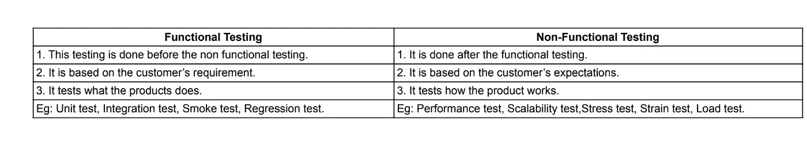
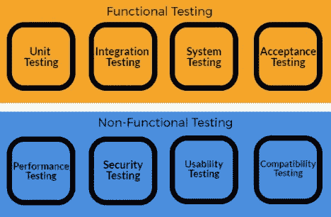
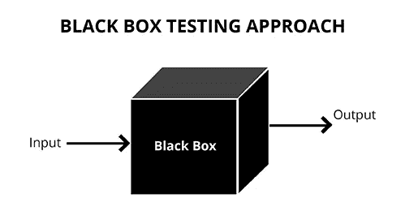
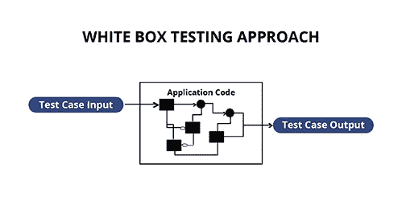
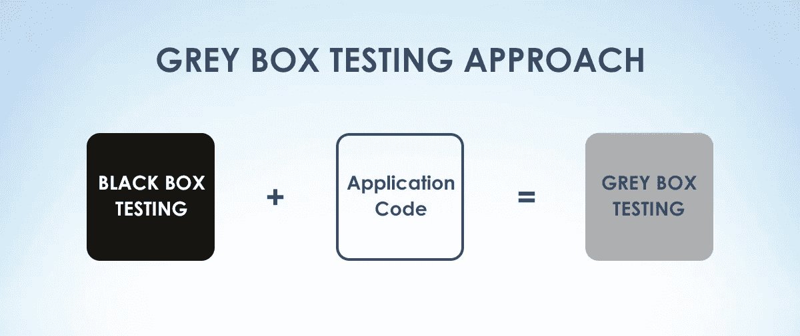

# 软件测试和技术的类型。

> 原文：<https://medium.com/nerd-for-tech/types-of-software-testing-techniques-729b319ba982?source=collection_archive---------9----------------------->

有 3 种类型的测试，即:

1.  功能测试
2.  非功能测试
3.  回归/维护测试

***功能测试*** 验证软件的每个功能，而 ***非功能测试*** 验证软件的非功能方面，如可靠性、安全性和性能。 ***另一方面，回归测试*** 是在我们对代码进行修改之后进行的，以检查修改后的/新的代码不会影响产品的现有功能，并且运行良好，更新不会带来新的错误或威胁。

表:功能测试和非功能测试的区别

学分:知识学院

我们将在下一篇文章中深入讨论单独的测试。在此之前，让我们简单了解一下测试技术。

> **软件测试技术**

有 3 种测试技术，即:

1.  黑盒测试
2.  白盒测试
3.  灰箱测试

> **黑盒测试:**

也被称为行为测试。测试产品功能的是高级测试。这里测试人员不知道软件/产品的内部结构或者它的源代码。现在，你一定想知道测试人员将如何测试产品？答案是:测试人员被告知对产品的期望是什么，以及它应该如何工作。基于这些信息，测试人员通过提供所需的输入来测试产品。简单来说，这是关于用户体验的。

学分:Invesis

比方说，一个对网站内部结构一无所知的测试人员将要测试它的工作情况。测试人员将向网站提供输入(此处为点击、击键),并根据预期结果验证输出。

> **白盒测试:**

也称为透明测试/玻璃测试/开放测试/透明测试。在这里，测试人员知道产品的内部结构、源代码和实现。大多数时候测试人员也是产品的开发者。通过他的编程知识和研究产品的实现，测试人员准备了一组输入来遍历源代码的不同路径，并确定其预期的输出。

学分:Invesis

假设测试人员准备了一组有效和无效的输入，将它的结果与预期的结果进行比较。

白盒测试就像医生的工作，他必须检查病人，了解病人的病情，并据此治疗。

> **灰箱测试:**

也称为半透明测试。这是部分白盒测试和部分黑盒测试的结合。在这里，测试人员对代码和产品的内部结构、实现的了解是有限的。其主要目标是发现由于产品的不正确内部结构/不正确使用而出现的问题，并提高产品质量。

演职员表:Pintrest

让我们举个例子，假设一个测试人员正在测试一个网站，点击任何链接或按钮都会出错，现在灰盒测试人员可以分析、研究代码并做出必要的修改，以确保得到预期的结果。

希望你了解软件测试的类型和技术:)。务必让我知道你的观点。

*作者:*R·P·帕维他。