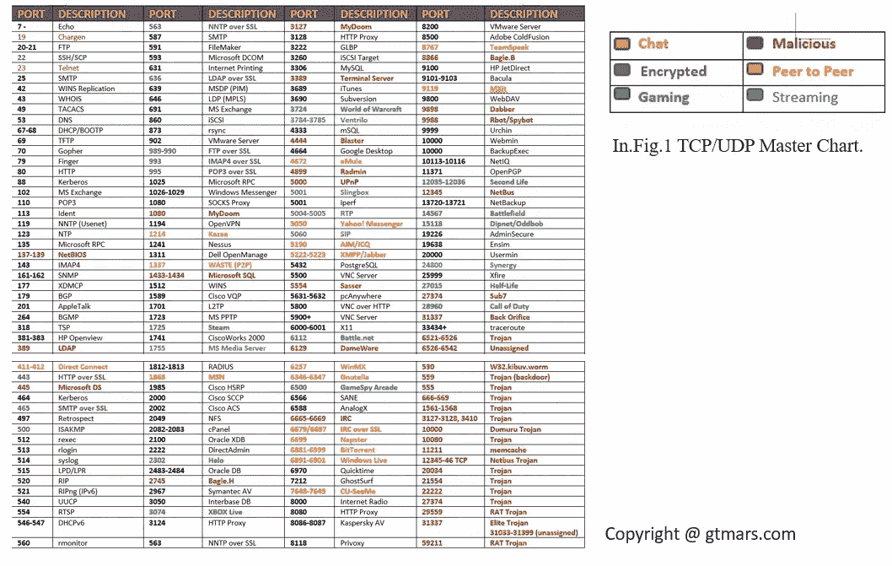
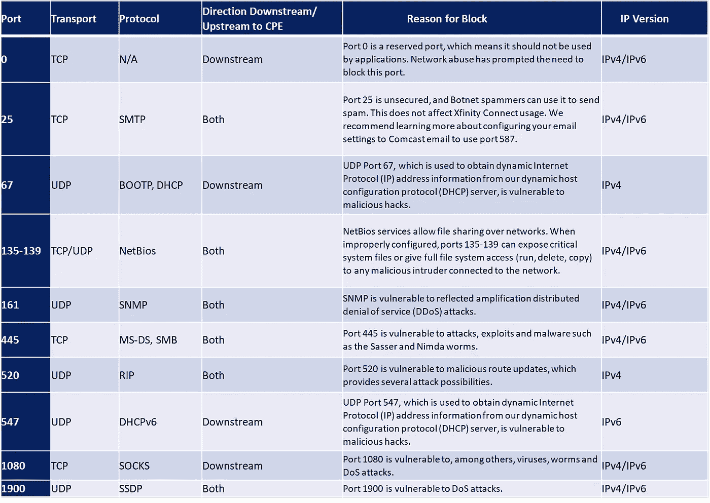
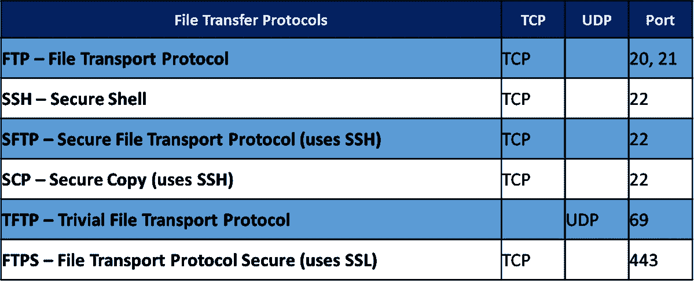
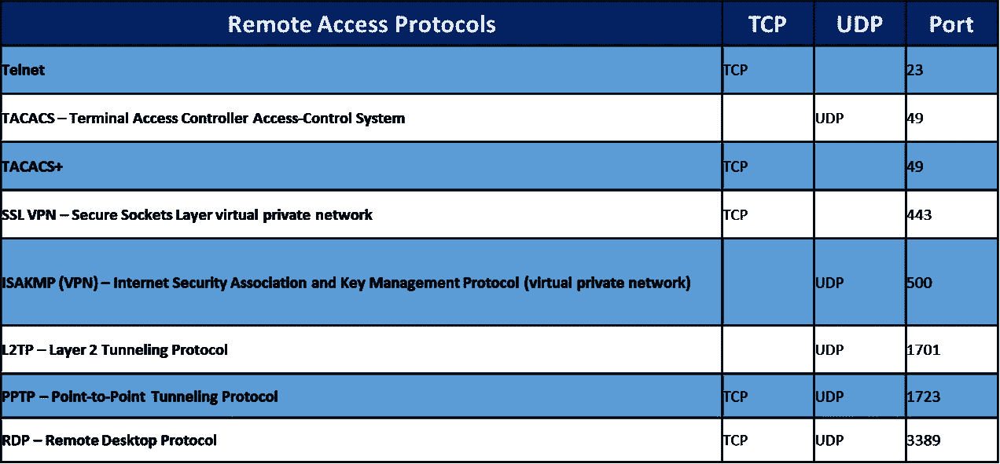
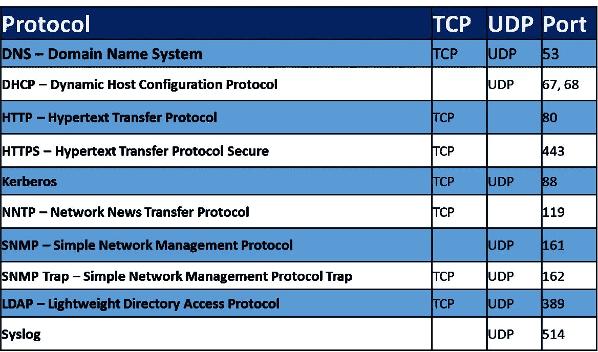

# 5 分钟掌握 TCP/UDP 协议，以及服务器防火墙操作指南

> 原文：<https://medium.com/nerd-for-tech/types-of-tcp-udp-protocol-services-protocol-master-chart-and-windows-linux-ubuntu-centos-server-429b6597a1fa?source=collection_archive---------0----------------------->

本文提供了网络漏洞和防御方法，重点介绍了所有的 TCP 和 UDP 端口、端口漏洞，并了解了更多关于 Windows、Linux 服务器的操作指南。

★每个组织的网络在其系统中都有安全弱点，入侵者会利用工具和技术对其进行探测。

★在讨论了与 TCP/UDP 端口相关的风险后，我们将在本文中介绍网络的防御措施，从阻止对端口的访问到在网络突破端口后保护网络。提供稳定的网络环境，阻止您的云服务器/园区网络/办公室网络上的某些类别的安全漏洞。求你了。遵循指南在您的服务器上实现标准防火墙系统。
★漏洞保护为您的云/物理服务器/电脑提供高级服务器安全。它保护企业应用程序和数据免受违规和业务中断的影响，而无需针对不确定性进行紧急修补。

★这些广泛的措施将帮助您维护 Linux 服务器，并帮助您毫不费力地简化整体安全操作。

★在计算机世界里，我们用一个网口作为两个端点之间的通信线路。在软件级别，在操作系统中，端口是一个逻辑构造点，用于选择特定的进程或网络服务。我们使用 16 位无符号数字(通常称为端口号)来标识每个协议和地址组合的端口。我们日常生活中最常用的协议是 TCP 和 UDP。

★我们用主机的 IP 地址和用于通信的协议来标识网络端口号。[完成报文的目的地或始发网络地址。IANA 保留了特定的端口号来标识特定的服务，以便将到达的数据包转发给正在运行的服务。](https://en.wikipedia.org/wiki/Port_(computer_networking))这个过程就是众所周知的绑定，使流程能够通过网络正确地发送和接收数据到始发地和目的地。

**互联网数字地址分配机构(IANA)职能:**

## ㈠域名

管理 DNS 根区域(分配 ccTLDs 和 gTLDs)以及其他功能，例如。int 和。arpa 区域。

*   [根区域管理](https://www.iana.org/domains/root)
*   [顶级域名数据库](https://www.iana.org/domains/root/db)
*   [。int 注册表](https://www.iana.org/domains/int)
*   [。arpa 注册处](https://www.iana.org/domains/arpa)
*   [IDN 实践资源库](https://www.iana.org/domains/idn-tables)

## ㈡数字资源

协调全球 IP 和 AS 号码空间，例如分配给地区互联网注册管理机构。

*   [IP 地址&为数字](https://www.iana.org/numbers)
*   [网络滥用信息](https://www.iana.org/abuse)

## [(三)协议分配](https://www.iana.org/protocols)

许多 Internet 协议中使用的协议名称和号码注册中心的存储库。

*   [协议注册中心](https://www.iana.org/protocols)
*   [申请分配](https://www.iana.org/protocols/apply)
*   [时区数据库](https://www.iana.org/time-zones)

★IANA 负责互联网协议资源的全球协调，如 DNS 根、IP 寻址、知名互联网服务常用端口号的注册等。它将端口号分为三个区域:

1.已知端口:0 到 1023
2。注册端口:1024 到 49151
3。动态(专用端口):49152 到 65535

★众所周知和注册我们不应该使用港口没有 IANA 注册。
注册一个端口和服务。请参考此网页链接了解更多信息。

★此[服务名和传输协议端口号注册表](https://www.iana.org/assignments/service-names-port-numbers)用于在 IANA 委员会中注册用户特定的端口号和服务名。要了解更多关于如何填写此表格的详细说明，请阅读程序文件 [(RFC 6335)](https://www.iana.org/go/rfc6335) 。

**———TCP/UDP 端口主图表— —**

★我设计了一个 TCP/UDP 端口的主图表，有几种分类，可以有效地识别端口。



**————熟知端口号及其漏洞— —**



**文件传输端口:**此表中的端口用于传输文件的协议。



**电子邮件端口:**此表中的端口用于电子邮件相关协议。


**远程访问端口:**此表中的端口与用于连接远程计算机的各种目的的协议相关联。



**其他端口:**此表中的端口不完全符合任何其他类别，但仍然相关。



————**防火墙操作指南**

遵循指南在您的服务器上实现标准防火墙系统。

**如何关闭未使用的开放端口:TCP 和 UDP 端口:**

开放端口允许黑客:

**关闭未使用的服务:**未使用的服务往往采用默认配置，这些配置并不总是安全的，或者可能使用默认密码，从而导致攻击。

**利用旧版本**:未使用的服务往往会被遗忘，这意味着它们不会得到更新。旧版本的软件往往充满了已知的漏洞。

**获取访问权限:**一些服务让攻击者能够轻松访问某些信息，他们可以在操作系统上执行多种技术。

**如何识别保持端口开放的进程？**

**视窗操作系统:2010 年 7 月 8 日**

对于 Windows 操作系统，您可以使用 netstat 命令，该命令默认包含在操作系统中。

1.  打开命令提示符。
2.  运行命令:netstat -ano。这将列出机器上正在运行、正在监听、已建立的所有网络连接。最后一列指示特定网络连接的进程的进程 id。
3.  使用“查找”命令来筛选。
4.  例如:如果您只想列出端口 5555 上的网络连接，请使用:
    **类型:netstat-ano | find】:5555 "**

现在，您已经确定了响应特定端口或任何未发送端口上的请求的进程和服务，您需要确认该服务不是必需的或正在使用中。如果您继续将应用程序配置为停止侦听，或者从 Windows 服务停止服务，并将该服务标记为禁用。

下面给出的截屏显示了该示例的信息。

**Linux 操作系统:Red Hat Linux、CentOS、Fedora、openSUSE、Mandrake Linux 等..，**

1.  打开终端。
2.  运行命令:netstat -tulpn。这将列出机器上正在运行、正在监听、已建立的所有网络连接。最后一列指示特定网络连接的进程的进程 id。
3.  使用“查找”命令来筛选。

例如:如果您只想列出端口 **3306** 上的网络连接，请使用:
**类型:netstat -tulpn | grep :"3306"**

**注意:**根据熟悉程度，你可以使用这些命令中的任何一个(top，ps，pidof，pgrep)来达到这个目的。

现在，您已经确定了响应特定端口或任何未发送端口上的请求的进程和服务，您需要确认该服务不是必需的或正在使用中。如果您继续将应用程序配置为停止侦听，或者从 Linux 服务中停止服务，并将该服务标记为禁用。

下面给出的截屏显示了该示例的信息。

为了停止 Debian 风格的 Linux 发行版中的守护进程，使用下面的命令来停止服务器上的任何守护进程。

Ubuntu:

服务 mysqld 停止

或者

```
/etc/init.d/mysqld stop
```

或者

使用 fork 命令终止特定的进程。找到(并且**杀死**所有**进程**监听一个**端口**。当您只想终止一个特定的进程时，按进程 ID 终止非常有用。另一方面，当您想要终止某个特定程序的所有正在运行的实例时，按进程名终止是很有用的。了解更多关于 kill singal 进程的信息。请参考[http://manpages.ubuntu.com/manpages/xenial/man2/kill.2.html](http://manpages.ubuntu.com/manpages/xenial/man2/kill.2.html)

```
pkill - INT process-name
```

sudo kill -9 PID

**Centos:** 使用`**systemctl stop**`命令停止服务。

```
systemctl stop httpd
```

您还可以使用命令`-o`和`-y` 标志终止服务器上已经运行了一段时间的特定进程。所以，如果你想杀死一个已经运行了 30 分钟以上，30 分钟以下的进程。

超过 30 分钟:Killall -o 30m<process-name></process-name>

例如:killall -o 30m mysql

不到 30 分钟:Killall -y 30m<process-name></process-name>

例如:killall -y 30m mysql

缩写:时间段

秒

m 分钟

小时

登陆日

w 周

m 个月

y 年

**— — — —防火墙操作:Centos 6/7———**

防火墙操作:**列出服务**

**1。列出当前服务:**

您可以通过在命令中指定“— list-services”选项来检查当前正在运行的服务。

```
firewall-cmd --list-services  --zone = publicdhcpv6 -client https
```

防火墙操作:**添加服务**

## 2.添加服务:

通过指定“— add-service”选项来添加服务。

```
firewall-cmd --add-service = https --zone = public --permanent
```

**3。删除服务:**

```
firewall-cmd --add-service = https --zone = public --permanent
```

防火墙操作:**列出端口**

**1。列出端口:**

您可以通过在命令中指定“--list-ports”选项来检查当前运行的端口。

```
firewall-cmd --list-ports  --zone = public
```

防火墙操作:**添加端口号**

**2。添加端口号:**

```
firewall-cmd --add-port = 5555 / tcp --zone = public
```

防火墙操作:**添加端口号**

**3。删除端口号:**

```
firewall-cmd --remove-port = 5555 / tcp --zone = public
```

或者

`firewall-cmd --zone=public --permanent --remove-port=5555/tcp`


**————————————**[**防火墙操作:Ubuntu**](https://linuxize.com/post/how-to-setup-a-firewall-with-ufw-on-ubuntu-18-04/)**————————————**

1.防火墙操作:**列出服务**

Sudo ufw 状态

防火墙操作:**添加服务**

## 2.添加服务:

通过指定“— add-service”选项来添加服务。

sudo ufw 允许 http

防火墙操作:**添加端口号**

sudo ufw 允许 80/tcp

有两种不同的方法**删除 UFW 规则，一种是通过规则编号，另一种是通过指定实际的规则代码。**

**方法一:**

sudo ufw 状态编号

要删除特定的规则号，请指定允许连接端口使用 45009 的规则号，即#119。使用以下命令一起删除端口/服务。

sudo ufw 删除 119

**方法二:**通过指定实际的规则代码来删除规则。

sudo ufw 删除允许 45009

## 禁用防火墙:

如果出于任何原因，你想停止 UFW 和停用所有规则，你可以使用:

sudo ufw 禁用

## 启用防火墙:

sudo ufw 使能

**重置防火墙:**(恢复默认设置)

请注意，重置 UFW 将禁用 UFW，也删除所有活动的规则。

sudo ufw 复位

— — — — — — — —结尾— — —

**今日行情:**

“**每个人的生活中都少不了下雨”——英语谚语**

**解释:**

英语谚语*我们都希望只有美好的日子，但是要欣赏* ***美好的日子，我们还需要更艰难的日子。糟糕的时光给了我们教训，帮助我们成长，并且如前所述，给了我们对美好时光的感激之情。永远记住* ***雨确实会停*** *而* ***太阳确实会重新照耀*** *。***

感谢阅读！祝你有愉快的一天！

> **流行和趋势:查看次数最多的媒体文章:**

## [如何在您的组织中创建漏洞管理安全团队、角色&职责？](/faun/how-to-create-a-vulnerability-management-team-work-flow-chart-process-roles-and-be3eb1bad0d3)

## 如何永久关闭或禁用导致高 CPU 使用率的 Microsoft 兼容性遥测服务？

## [软件开发人员 14 大 OWASP 安全编码实践](/faun/top-14-owasp-secure-coding-practices-for-software-developers-5daef14734eb)

## [国土安全部(DHS)如何收集、使用、保护美国公民的 PII 数据&合法居民&访客？](https://gtmars.medium.com/how-the-department-of-homeland-security-dhs-collect-use-protect-the-pii-data-of-u-s-7776e99e2611)

[澳大利亚的 CovidSafe App 关于隐私、安全、合规性的报告&数据主权信息和关于澳大利亚公民/合法居民的问题？](https://gtmars.medium.com/how-to-identify-the-security-privacy-and-data-sovereignty-information-of-australias-covidsafe-19-75902ff4b796)

[什么是密码学中的 HMAC 消息认证系统？如何在 cryptool2.1 开源软件上部署？](/faun/what-is-hmac-message-authentication-system-in-cryptography-f385d1480642)

[风险管理概述&将风险管理整合到 SDLC 中](/@gtmars/risk-management-overview-integration-of-risk-management-into-sdlc-ae48de24b743)

[员工终端安全内部调查-模板](/@gtmars/employees-endpoint-security-internal-survey-template-61a16480a08)