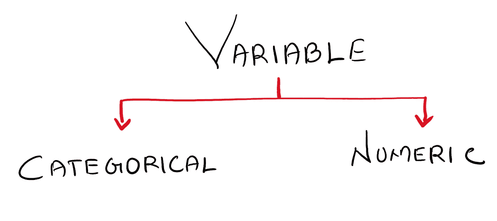
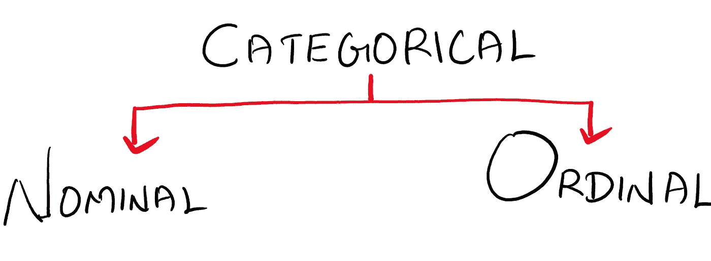
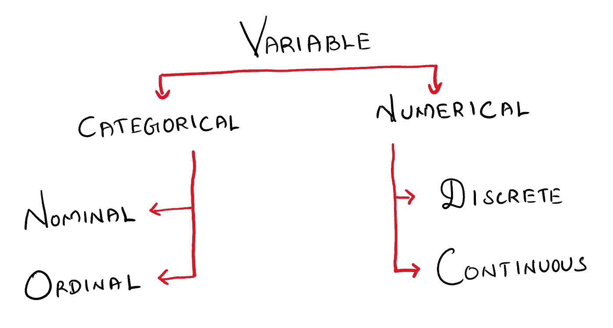
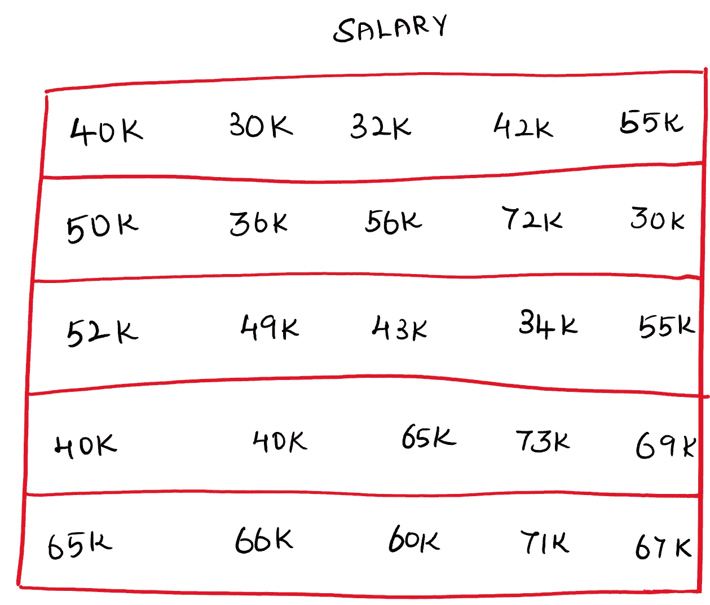
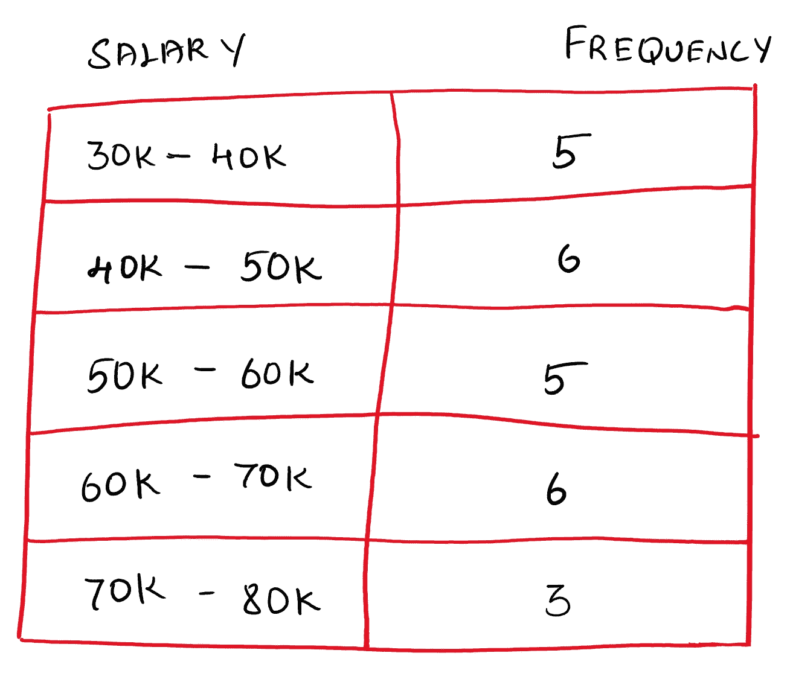

# 变量的类型

> 原文：<https://medium.com/nerd-for-tech/types-of-variables-cc44a85507c1?source=collection_archive---------9----------------------->

每当我们构建一个 Ml 模型时，我们需要了解数据集中的变量，以决定使用哪个 ML 模型。既然要和变量打交道，那就先了解一下变量的类型。

变量有两种主要类型，一种是分类变量，另一种是数字变量。

# 分类变量:

分类或定性数据被分为类别或组。它是“类型”的度量，可以用名称或符号来表示

**示例:**性别、教育程度、动物名称、品牌名称等，..

类别变量进一步分为两种类型:

## 名义变量:

它只是一个标签化范畴的变量，没有任何量化价值。

**例:1。** **性别** —男，女 **2。发色** —黑色、棕色、金色

## 序数变量:

在这些变量中，值的顺序是重要的，但是这些值之间的差异是未知的。

**举例:1。满意度** —低、中、高 **2。员工级别** —一、二、三级

# 数字变量:

数字或定量数据是可以测量的，数值或计数的测量值用数字表示。

例如:年龄、薪水、任期等，..

数字数据进一步分为两种类型，

## 离散变量:

离散数据只能取某些值。

**举例:**一个班的学生人数会是 52 这样的整数，不会有 51.5。我们不能有半个学生。

## 连续变量:

连续数据可以取任何值(在一个范围内)。

**例:体重**—61.5 公斤，**一场比赛时间**—5.05 分钟(5 分 5 秒)

总的来说，我们有以下变量或数据的分类层次:

除此之外还有两种类型，

1.  分组数据和
2.  未归类数据

## 未分组的数据:

我们从实验/研究中收集的原始数据没有被分类或归类。它只是一个数字列表。

**分组数据:**

分组数据是按类别捆绑在一起的数据。

希望这个博客对变量或数据的类型有一个清晰的理解。

谢谢你！:-)