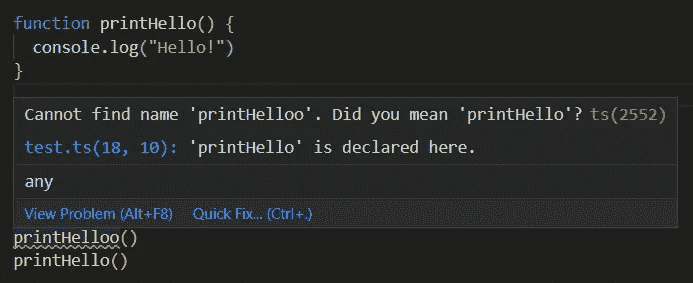
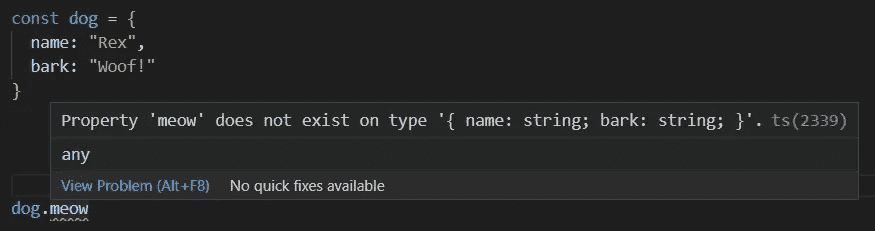
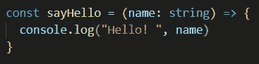
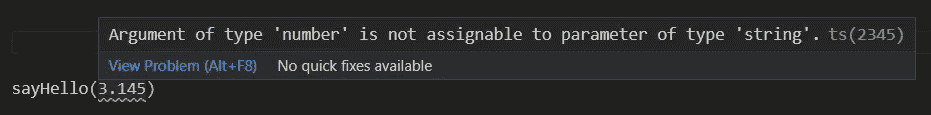
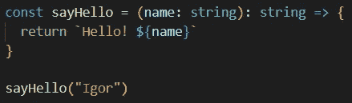
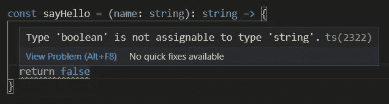
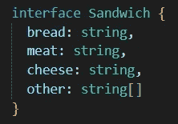
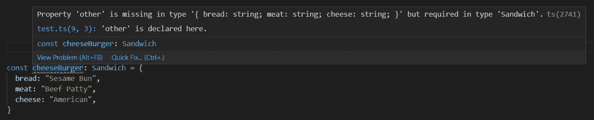
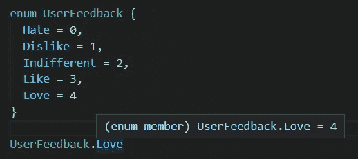

# 打字稿:驱虫剂

> 原文：<https://medium.com/nerd-for-tech/typescript-bug-repellant-5e5f74528014?source=collection_archive---------15----------------------->

TypeScript 是 JavaScript 开发人员的强大工具。人们经常把它描述为 JavaScript 的超集。这意味着它是构建在 JavaScript 之上的代码层，目的是在开发过程中扩展功能。使用 TypeScript 的最有力的理由之一是，它将使您能够在试图运行代码之前就发现错误。

# 静态与动态语言

你有多少次试图运行一个程序或更新一个应用程序却发现一个类型错误？拼错函数名或试图修改无法更改的变量是我经常做的事情。我得说，在像 JavaScript 这样的动态类型语言中，大多数人都会犯这些错误。它们在代码运行时检查类型错误。

另一方面，TypeScript 是一种静态类型语言，所以它会在代码编译时检查这些更容易修复的类型错误。因此，如果你在 VS 代码中试图调用一个函数，并且碰巧拼写错误，你会被通知有问题。

在大型生产应用程序中，这种错误可能会被忽略，最终代价非常高。TypeScript 的目标是在这些 bug 投入生产之前帮助找到并修复它们。

这不仅适用于函数调用，这种行为也适用于对象！

# 显式类型

另一个对抗 TypeScript 使用的错误的强大功能是显式类型。这样你就可以告诉编译器你的函数期望什么样的输入和输出。

## 输入

您可以通过转到函数声明，在输入后添加一个冒号(:)，然后指定一个类型来为您的输入实现这一点。

现在，当你调用函数而没有传入正确的类型时，你会收到一个错误！

## 输出

您也可以通过预期的输出来实现这一点。只需在函数调用后添加一个冒号(:)，如下所示:

现在我们有了一个字符串的集合返回类型。如果我们碰巧对函数做了一些更改，比如将返回类型更改为布尔值，我们会收到一个错误。在下面的例子中，错误甚至告诉我们它需要一个字符串。

# 创建类型

TypeScript 不仅限于 JavaScript 提供的相同类型。它允许您轻松定义自己的类型。通过预先定义你的类型将来会是什么样子，你可以在你的代码库中建立验证和容易访问的文档。

## 接口

创建接口就像创建常规的 JavaScript 对象一样

现在，当您在代码中创建该类型时，您就拥有了内置的验证！

## 枚举

枚举允许您创建常量值。为什么要在常规常量上使用枚举？当正确设置后，它会为你的代码提供文档和上下文。看看下面的例子:

# 了解更多信息

这只是一个简短的介绍，老实说，还有很多需要打字稿。如果您想了解更多信息，我建议您查看以下免费资源:

[正式文件](https://www.typescriptlang.org/)