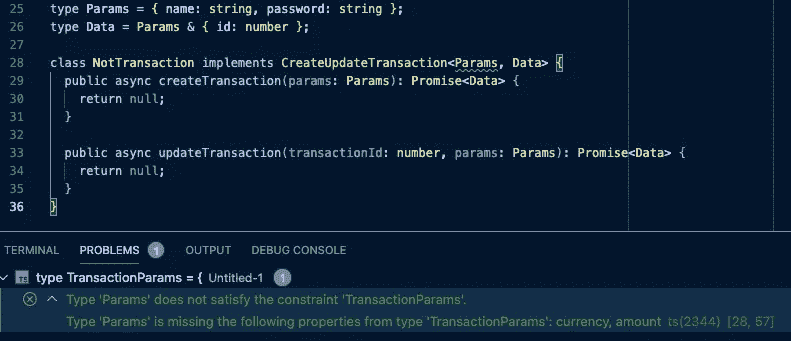
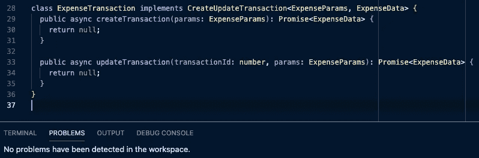

# 带有一些验证的类型脚本泛型

> 原文：<https://medium.com/nerd-for-tech/typescript-generic-with-some-validation-17a54cb3d6a9?source=collection_archive---------5----------------------->

自从了解之后，我一直觉得泛型很牛逼。但现在我知道，它可以更棒！

使用泛型，单个类型可以与各种其他类型一起重用。想想`Promise`，它可以解决任何事情。例如，在一种情况下，它将解析一个字符串，而在另一种情况下，它将解析一个布尔值。由于`Promise`类型是一个泛型，我们可以通过将类型传递给它的泛型来断言解析的值，就像`Promise<string>`或`Promise<boolean>`一样。

好了，基本够了。如果你想要一个只能接受某种类型或接口的泛型，该怎么办？

为了回答这个问题，让我们想象我们正在构建一个非常简单的簿记员应用程序来记录交易。一笔交易可以是一笔费用，也可以是一笔收入。您甚至可以添加转账作为另一种交易形式，但现在让我们保持简单。

费用和收入有很多共同点，前者意味着现金流出，而后者意味着现金流入。因为两者的用例非常相似，所以这是对泛型的正确使用。在这种情况下，我们将创建一个接口来实现创建和更新事务的业务用例。

# 具有联合的类属

让我们首先看看如何使用 union 类型来创建它。

通过提供联合类型，泛型可能会在实现接口时验证传入的类型。但是这是不正确的，因为联合类型只是默认的。使用时，泛型类型使用传入的类型，就像我们的例子中的`Promise`。

因此，下面的类工作起来没有任何问题，这不是我们想要的，因为我们希望泛型只接受特定类型。

# 带扩展的通用

我们应该使用`extends`来确保 TypeScript 验证该泛型的使用，而不是提供默认类型。

通过使用`extends`，我们告诉 TypeScript 这个泛型应该只接收实现某种类型的类型，或者从它扩展的类型。因此，以前的实现现在不能工作了，因为它不符合所需的类型。

因此，我们可以确信实现这个接口的用户将会遵守我们已经定义的基本类型。

通过这样做，我们可以保证两件事。

首先，任何实现契约的客户机都将使用我们定义的类型的约束。这意味着依赖于该契约的另一个类可以放心，方法的参数和结果将是预期的。即，费用交易的依赖性将接受费用参数并解析费用数据，等等。

第二，对事务形状本身的任何改变都会提醒具体的类，因为它们必须更新它们的实现以遵循新的契约。因此，如果我们要求一个事务也记录它发生的位置，现在所有具体的类都必须遵守这个新的类型。虽然在这个例子中，它可能会更好地引入一些向后兼容性，或者作为一个新的契约。

干杯！