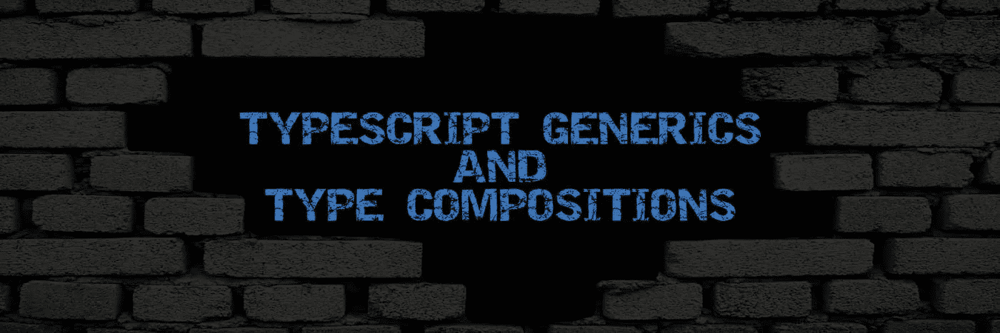

# 类型脚本泛型和类型组合

> 原文：<https://medium.com/nerd-for-tech/typescript-generics-and-dynamic-type-composition-8f055151711f?source=collection_archive---------18----------------------->

TypeScript 泛型类型非常强大，它们允许我们进行类型组合，这是一种可以在每个 TS 项目中使用的惊人模式。



如何使用泛型？使用泛型真的很简单，我们只需要告诉 TS 我们的类型接受其他类型是“完整的”。
因此，如果我们有一些类型 ***A*** 和一些动态属性“ *dynamicObj* ”基于使用地点，很难静态地定义所有属性类型，因为我们需要为“ *dynamicObj* ”指定所有可能的类型。

```
type B = {
  keyA: string;
  keyB: string;
}type C = {
  keyT: number;
  keyV: boolean;
}
```

现在有一个简单且完全不安全的解决方案: ***“就说 dynamicObject 是 any 类型的”*** *当然，你永远不应该使用这个，在你的代码中有任何类型都是“代码味”的一个巨大标志。此外，我们可以用未知的，然后做定型。*

```
*type A* = {
  prop: *string*;
  dynamicObject: unknown;
};const aWithB: A = {
  prop: 'ok',
  dynamicObject: {
    keyA: 'test',
    keyB: 'ok'
  }
}console.log((aWithB.dynamicObject as B).keyA) // NOT SO GOOD 😓 
```

我们可以在 dynamicObject 属性上用 **UnionType** 更进一步。

```
*type A* = {
  prop: *string*;
  dynamicObject: B | C;
};const aWithB: A = {
  prop: 'ok',
  dynamicObject: {
    keyA: 'test',
    keyB: 'ok'
  }
}console.log(
  (aWithB.dynamicObject as B).keyA // We still need to cast type 😞 
)
```

**所以让我们看看如何用泛型解决这个问题**

如果我们将类型 A 指定为具有某些属性(如 prop 和 dynamicObj)的类型，我们知道 dynamicObj 依赖于使用位置。然后，我们可以将类型 A 定义为接受另一个类型的类型，该类型将是属性 dynamicObject 的类型。听起来比实际更复杂。

```
*type A<DynamicObjectType>* = {
  prop: *string*;
  dynamicObject: *DynamicObjectType*;
};const aWithB: A<B> = {
  prop: 'ok',
  dynamicObject: {
    keyA: 'test',
    keyB: 'ok'
  }
}const aWithC: A<C> = {
  prop: 'ok',
  dynamicObject: {
    keyT: 11,
    keyV: true
  }
}console.log(aWithB.dynamicObject.keyA);
console.log(aWithC.dynamicObject.keyV);// No warnings, no compilation error 🤩 
```

也就是说，现在我们的类型 A 是可伸缩的，可以扩展到任意数量的可以是 dynamicObject 属性的类型。甚至这也是一个有效的类型:

```
const foo: A<number> = {
  prop: "lol",
  dynamicObject: 11
}
```

这就是你如何在类型组合中收获泛型的力量，非常简单！

快乐的编码！