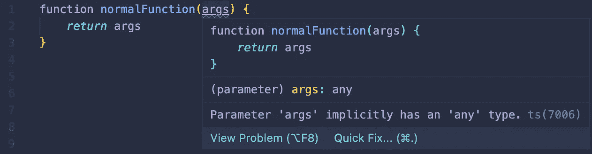
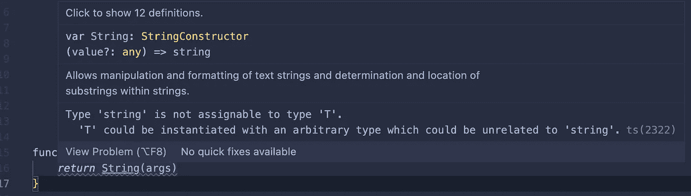
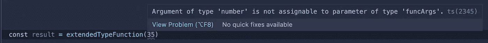
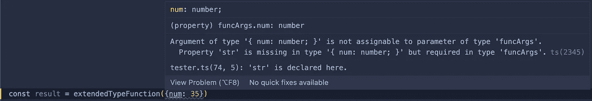

# Typescript 泛型:强大而灵活的类型

> 原文：<https://medium.com/nerd-for-tech/typescript-generics-strong-yet-flexible-types-27b33fdbe7eb?source=collection_archive---------3----------------------->

由[上的](https://unsplash.com?utm_source=medium&utm_medium=referral)[万用眼](https://unsplash.com/@universaleye?utm_source=medium&utm_medium=referral)拍照

Typescript 是 Javascript 的一个强大扩展，它允许我们利用强类型变量，并附带了一些有用的工具来创建灵活的、可重用的代码，这些代码仍然可以进行错误类型检查，即使类型可能因用途而异。

我将在 Typescript 中深入研究**泛型**。这些让我们把变量绑在一起，不管它们的初始类型。我假设您已经了解了 Typescript 的基础知识。如果没有，看看我之前的博文。

 [## 为什么你应该学习打字稿

### 我已经在编码生态系统中漫游了一段时间，我有一个我听说过的技术列表…

medium.com](/nerd-for-tech/why-you-should-learn-typescript-4808211c6cac) 

## 基本用法

让我们考虑一个非常基本的函数的几个版本。它接受一个未知类型的参数，并返回赋给该参数变量的值。在 JS 中，我们可以简单地声明函数:

Typescript 实际上对此并不满意，我们根本没有声明任何变量类型，所以我们得到一个错误:

正常功能误差

编译器想知道什么样的参数会被传入这个函数，因为我们不知道，我们可能倾向于添加`any`类型声明来简单地允许我们想要传入的任何东西。

好了，现在编译器高兴了，但是我们真的没有完成多少。我们没有利用 Typescript 带给我们的类型检查，只是创建了一个变通办法。如果我们的目标是确保如果传入一个`string`类型，那么将返回一个字符串，如果传入一个`number`类型，那么将返回一个数字，我们可能需要编写两个不同的类型安全函数:

现在，我们可以使用各自的功能来获得我们想要的结果，但是，如果你问我，这看起来不是很枯燥。函数的逻辑是重复的，我们需要重复我们的代码来适应我们可能的参数类型。这就是**仿制药**拯救世界的地方。泛型使用**类型参数**来声明“泛型”类型，这些类型可以跨函数使用，但要确保在代码的不同部分使用相同的类型。这是我们的函数，类型声明为泛型`T`或`<T>`。

这段代码在传入的参数和函数返回的变量类型之间创建了一个链接。传入的内容必须与返回的内容类型相同。

现在我们可以重用这个函数，它将正确地使用一个`number`或一个`string`作为参数。如果我们试图让我们的逻辑无论如何都返回一个字符串会怎么样？

铸造误差

这个错误是有道理的。如果我们将参数转换成函数逻辑中的字符串，那么我们就不能保持`T`泛型类型的确定性。如果我们传入一个数字，这个函数也不可能返回一个数字，因为它会被转换成一个字符串。Typescript 提前考虑，让我们知道这将是一个问题，然后才成为一个问题。

## 对多种类型使用泛型

我们可以使用相同的类型参数语法来声明要通过函数引用的多个类型。

这将返回`false`，一个用`V`泛型类型设置的布尔类型。

## 创建具有泛型类型的类

我们还可以创建利用这些灵活的泛型类型的类。让我们创建一个自定义的数组类，它可以用来创建一个我们稍后决定的任何类型的数组。

我们可以在后续的类函数中使用`T`类型声明来确保类型保持一致。

## 使用泛型扩展现有的类型定义

我们可能会遇到这样的情况，我们有一个现有的接口或类型定义，我们想使用它，但除此之外还要添加新的泛型定义。我们可以使用 extends 关键字来实现这一点。

我们可以尝试从`funcArgs`接口传入一个期望的类型，但是我们会得到一个错误。

funcArgs 错误

这很有意义，我们没有传入正确的参数类型。

funcArgs 错误 2

即使我们正确地传入了单个`num`参数，我们仍然没有满足 funcArgs 接口设置的要求，它需要一个`num`和一个`str`变量。

我们走吧。我们已经满足了接口的约束，但是添加一个 admin `argument`作为布尔值，会将`T`泛型类型设置为`funcArgs`类型加上一个布尔值，这可以在函数逻辑中一起引用。这通常会抛出一个错误，但是因为我们使用了`T extends`关键字，编译器很高兴。

# 结论

泛型在其他强类型语言中很常见，对其用法的充分理解为开发人员创建仍受益于强类型检查的可重用代码提供了许多可能性。感谢您的阅读和快乐编码！