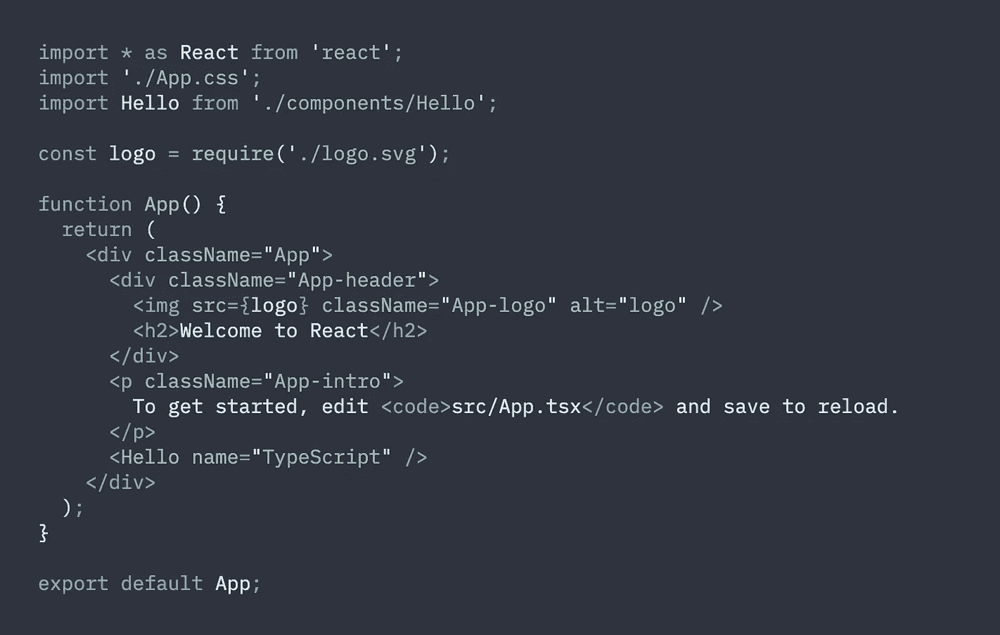
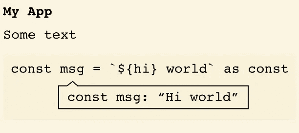
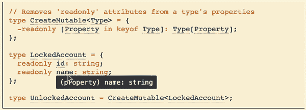

# 代码示例中的类型脚本提示

> 原文：<https://medium.com/nerd-for-tech/typescript-hints-in-your-code-samples-6a890ecf9b1f?source=collection_archive---------33----------------------->


卢卡·布拉沃在 [Unsplash](https://unsplash.com?utm_source=medium&utm_medium=referral) 上的照片

向您的网站添加代码示例是一个非常好的主意。它显示了代码应该是什么样子。没有代码示例，很难想象 npm 包文档。

当我们想要展示 JavaScript 代码示例时，现有的解决方案是很好的。但是，当我们想要显示 TypeScript 代码时，类型和代码在一起吗？

… [志贵双鞭](https://github.com/shikijs/twoslash)就是你要找的图书馆。

## 什么是志贵？

Shiki 是一个语法荧光笔。基于文本匹配语法。支持 [VS 代码](https://code.visualstudio.com/)语法突出显示的相同技术。



样本[志贵](https://shiki.matsu.io/)高亮显示

## 什么是二闪？

two slish 是一个 Shiki 插件。它添加了 TypeScript 编译器提示。和我们在 VS 代码中看到的一样。你可以检查哪个

可以用两种类型显示 typescript 提示。

**静态:**

```
```ts twoslashconst msg = "Hi world" as const;
//    ^?```
```



**动态:**

```
```ts twoslash
// Removes 'readonly' attributes from a type's properties
type CreateMutable<Type> = {
  -readonly [Property in keyof Type]: Type[Property];
};type LockedAccount = {
  readonly id: string;
  readonly name: string;
};type UnlockedAccount = CreateMutable<LockedAccount>;
```
```



注意:需要附加 JavaScript 代码才能有交互式代码提示。

## 还有更多

Shiki Twoslash 支持更多功能:

*   混合静态和动态模式
*   显示类型脚本错误
*   vs 代码主题

此外，我们还为最流行的工具提供插件:Eleventy、Docusaurus、Gatsby 等等。

你可以在 shiki twoslash 网站上阅读更多关于所有选项的信息。

要联系我，你可以在推特上找到我。