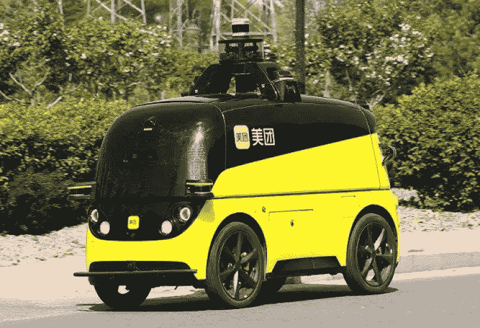

# 自动驾驶的典型应用场景

> 原文：<https://medium.com/nerd-for-tech/typical-application-scenarios-of-autonomous-driving-9b1642f2dab1?source=collection_archive---------1----------------------->

[www.chinatimes.net.cn](http://www.chinatimes.net.cn)

自动驾驶可以商业化的典型应用场景包括独立出租车场景、仓储、物流、港口、码头、固定路线区域连接、扫地机、矿区等。下面简单分析三个有代表性的落地场景。

## **应用场景 1: RoboTaxi(自动驾驶出租车)**

前段时间，百度、高德、Weride、AutoX、滴滴等中国公司争相在 RoboTaxi(自动驾驶出租车)领域传来捷报。可以说，通过 RoboTaxi 的落地，人类在自动驾驶行业翻开了新的一页。

从点到面，再到区域，从针对特定群体到更加大众化的群体，从免费测试到收费试用，RoboTaxi 正在向普通出行服务靠拢。

虽然 RoboTaxi 具有更贴近市场的优势，但自动驾驶系统的“感知-决策”过程更加困难。对面向场景的训练数据要求更高，面临痛点——缺乏面向场景的道路数据，数据质量差。公司需要高质量的基于场景的人工智能数据，这需要结构化的视频、图像、音频、文本、激光雷达数据。

## **应用场景二:无人送货**

作为疫情防控时期的“明星”，无人配送机器人已经挑战前台，在非接触式配送中发挥了重要作用。在疫情期间，消费者对智能、非接触式服务的需求大幅增加，行业已开始开发自动驾驶技术在无人驾驶交付领域的潜力。

当然，无人送货并不是什么新鲜事。疫情发生前，主要应用场景是物流园区、仓库、小区、写字楼等。可以看出，受限于技术难度，目前无人送餐车的目标仍然是解决最后一公里的配送问题。货运和固定旅游线路仍然是突出的特点。

## **应用场景 3:仓储物流**

物流配送分为长途干线运输和短途配送。

长途公路运输超载、疲劳驾驶、交通违法现象时有发生，然而高速公路速度快、无信号灯、无障碍物等特点有利于高效运动，非常适合自动驾驶。

短距离配送通常发生在相对封闭的场景中，例如仓库、工厂和住宅区。自动驾驶机器人可以准确、高效地承担低风险的分拣、仓储、出库、配送，节省人力成本，降低出错率。

以短途配送仓储物流为例，相比 Robotaxi，自动驾驶机器人更倾向于使用计算机视觉技术来实现功能。在保持数据准确性的前提下，应用对 AI 数据的要求相对统一。基于场景的 AI 数据训练，可以帮助自动驾驶机器人实现智能识别，对信息进行自动分类，实现自动分拣等。

## **自动驾驶场景的产业化重点:AI 数据**

**2D-3D 融合数据:**

例如，为了开发自动驾驶汽车的多模型机器学习算法，一些制造商需要融合两个不同维度的不同数据集。这个操作很重要，但是手动执行很有挑战性。

AI 公司甚至希望数据公司能够更好的了解算法技术和需求场景，参与算法的研发，给出数据采集的优化建议。创造有竞争力的优势也成为数据服务提供商关注的焦点。

**常见的数据标注类型有:**

*   2D 包围盒
*   [车道标线](https://tinyurl.com/u7u4me)
*   [视频跟踪标注](http://tinyurl.com/wmu4yfhh)
*   点标注
*   [语义分割](https://tinyurl.com/48w576p7)
*   三维物体识别
*   3D 分割
*   传感器融合:传感器融合长方体/传感器融合分割/传感器融合长方体跟踪

# 结束

将你的数据标注任务外包给[字节桥](https://tinyurl.com/5b9s9e5e)，你可以更便宜更快的获得高质量的 ML 训练数据集！

*   无需信用卡的免费试用:您可以快速获得样品结果，检查输出，并直接向我们的项目经理反馈。
*   100%人工验证
*   透明和标准定价:[有明确的定价](https://www.bytebridge.io/#/?module=price)(含人工成本)

为什么不试一试呢？

来源:https://baijiahao . Baidu . com/sid = 1673094480571846368 & wfr = spider & for = PC