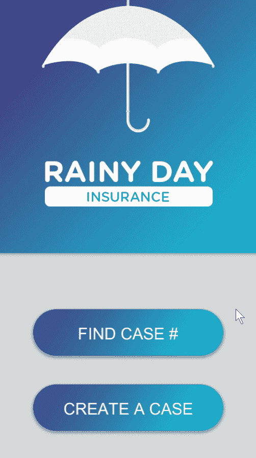
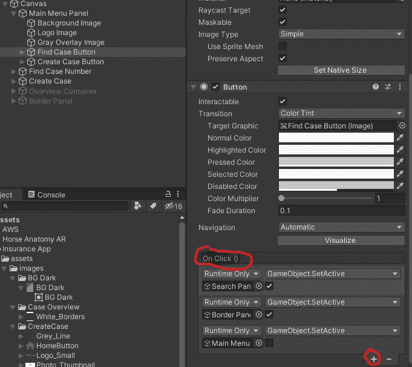
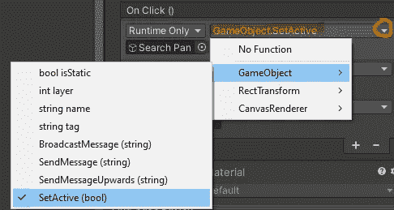
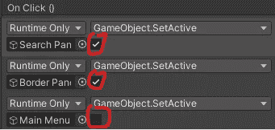

# 没有代码的 UI 按钮导航

> 原文：<https://medium.com/nerd-for-tech/ui-button-navigation-without-code-64037c9ec0f7?source=collection_archive---------11----------------------->

**目标:**无代码激活和停用 UI 元素。

我们的*按钮*组件在 Click () 上有一个*属性。我们可以使用这个属性在运行时启用和禁用其他对象。*

我们可以简单地点击 *+* 图标来添加我们需要的字段。

然后，我们将把想要操作的对象拖到一个字段中。从字段的下拉菜单中，我们将选择*game object→set active(bool)*。

如果我们希望该对象在按钮被点击时是活动的，我们就选中这个框，如果该对象应该被取消激活，我们就不选中它。

在本例中，当用户点击 *Find Case #* 按钮时，*搜索面板*和*边框面板*对象将被激活，*主菜单*对象将被停用。

