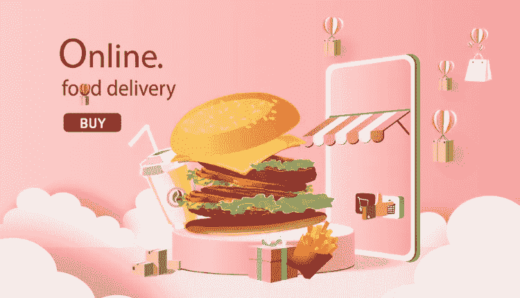
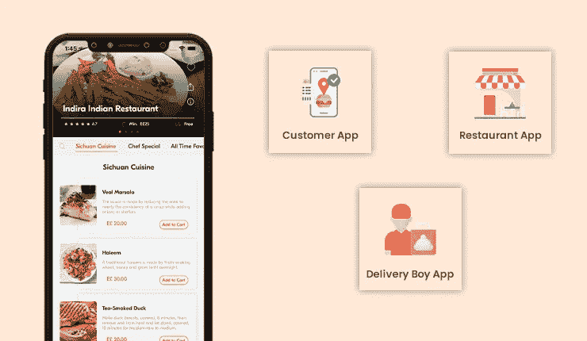

# 终极送餐应用开发指南 2023

> 原文：<https://medium.com/nerd-for-tech/ultimate-food-delivery-app-development-guide-2023-409db7f2af34?source=collection_archive---------3----------------------->

送餐应用:这种变相的福利简化了将食物送到顾客手中的方式。它帮助他们连接到附近的餐馆，并在他们希望的时间将饭菜送到他们家门口。

这些解决方案所提供的便利程度使得它们越来越受欢迎。它也是传统餐厅的灵感来源，鼓励他们利用应用程序的优势。这主要是为了让他们的服务得到急需的关注，并确保更多的用户继续使用他们的解决方案。

因此，如果一个人在当前的商业领域仍然在线下经营他们的食品业务，这篇文章就是为他们而写的。如果你也是其中之一，请阅读这篇文章。它将让您全面了解如何以简化的方式构建一个食品订购系统。这将确保你的收入通过你提供的食物而增加，同时你的知名度也会提高。

## 食品订购和配送服务的市场统计

数字阐明了有关解决方案受欢迎程度的大量信息。这是企业需要考虑和关注的事情。例如，如果你是一家线下餐馆，下面提供的市场统计数据将让你全面了解为什么你应该数字化你的运营。

*   预计到 2029 年，食品配送应用行业的市场规模将达到 3200 亿美元
*   该领域的当前收入为[0.77 万亿美元，2022 年](https://www.statista.com/outlook/dmo/online-food-delivery/worldwide?currency=usd#revenue)
*   从 2022 年到 2027 年，CAGR[的收入将增长 13.68%](https://www.statista.com/outlook/dmo/online-food-delivery/worldwide?currency=usd#revenue)
*   到 2027 年，市场规模将达到[1.45 万亿美元](https://www.statista.com/outlook/dmo/online-food-delivery/worldwide?currency=usd#revenue)
*   到 2027 年[用户数量将达到](https://www.statista.com/outlook/dmo/online-food-delivery/worldwide?currency=usd#revenue)26.442 亿

## App 运营

在线食品订购和交付服务平台有一些基本的操作，在下面列出。

*   顾客进入应用程序，并添加他们的位置信息，这样他们就能得到附近餐馆的列表。
*   选饭，他们要；他们一付款就下订单。
*   请求被发送到餐馆，餐馆接受请求并指派一名司机去取货
*   将同样的情况通知给客户。
*   司机现在到达餐馆，拿起订单。
*   顾客和送货专业人员可以灵活地实时跟踪对方，因此前者知道饭菜的预计到达时间。
*   饭菜端上来了，顾客根据用餐体验给出了自己的评价。

## 它包含的功能

该解决方案有三个主要部分——顾客、餐馆和送货司机。每个细分市场都有其独立的应用程序和独特的功能。请看看下面这些。

> ***客户 App***

1.  高级搜索过滤器使用餐搜索之旅成为一个无缝的过程。
2.  多种付款模式，让顾客可以轻松地为他们点的餐付款。
3.  位置实时监控，以了解他们可以得到他们的膳食的预期时间。
4.  定制膳食，以便顾客可以在他们点的膳食中添加新的配料。
5.  应用内聊天/通话，让司机和客户能够无缝连接，最大限度地保护隐私。

> ***餐厅 App***

1.  报告和分析，以了解他们的表现和最需要努力的领域。
2.  付款管理，以更新他们提供的餐饮的付款首选项。
3.  收入管理，了解他们每天、每周、每月等产生的收入。
4.  餐厅管理，以更新餐厅详情和其他相关信息。
5.  审查管理，检查顾客对他们所收到的饭菜的评论。

> ***发货驱动 App***

1.  了解他们通过交货获得的收入的收入历史。
2.  设置送货半径，以便他们只接收来自附近的订单提货请求。
3.  根据灵活性接受/拒绝交货请求。
4.  在送货结束时生成发票，让顾客了解餐费明细。
5.  在线/离线可用性，开始获取取餐请求。

## 收入模型

在线食品订购系统利用三个主要渠道来创收。

*   客户和送货司机的送货费用
*   餐馆在平台上注册的订阅费
*   餐馆促销和其他活动的广告费

你准备好通过应用程序进入竞争激烈的在线食品订购和配送服务世界了吗？请阅读下面几行，了解如何像专业人士一样完成这项工作。

## 2023 年如何进行送餐 App 开发？

想在 2023 年将你的餐厅设置数字化？在按需送餐应用程序开发服务期间，将这些指针放在手边，像专业人士一样完成这项工作。

> ***知道自己的目标***

了解你的网上订餐系统将帮助你实现什么目标是很重要的。一旦你对它有了初步的了解，研究竞争对手。接下来，研究你的目标市场。

**问这些问题:**

*   客户目前面临哪些问题？我的解决方案能够解决或解决这些问题吗？
*   我的竞争对手在做什么？这些活动推动了结果吗？什么事？没有吗？
*   如果没有，我如何在我的解决方案中解决这些问题？
*   我应该使用什么设计？

> ***得到送餐克隆人***

一旦你对自己的需求和要求有了初步的了解，用食品配送克隆应用来授权你的企业是一个好主意。联系在该领域拥有重要技能和专业知识的公司。

检查他们的投资组合，评估他们的客户评论。一旦你对这些有了一个初步的想法，检查一下他们过去开发的[流行的食品递送克隆应用](https://www.fooddeliveryclone.com/blog/food-delivery-clone-apps/)。观察他们的 USP。

一旦对这些领域有了一个好的想法，你就可以确信你的食品交付应用程序开发之旅从长远来看是成功的。现在让我们了解一下成本领域。

## 2023 年送餐 App 开发费用多少？

计划在 2023 年为您的餐厅建立一个在线订餐系统？做这件事的时候，控制你的预算是很重要的。这将确保您的食品交付应用程序开发之旅是愉快的。

因此，如果我们无论如何都要提供这方面的估计，您在这方面需要分配的预算将在 3 万至 9 万美元之间。

*但是，如果出现这两种情况，这些数字可能会上升:*

1.  如果应用程序设计很复杂
2.  UI/UX 对用户不太友好
3.  如果特征不相关
4.  根据位置

因此，建议您尽可能保持应用程序的简单性。确保你只包括相关的特征。最重要的是，确保外包按需送餐应用开发服务。通过这些步骤，您的食品订购和配送服务解决方案将会取得成功。它将帮助你从一开始就获得最大的回报和利润！

## 结束了！

按需送餐应用预计将帮助食品配送市场在 2027 年达到 1.45 万亿美元。他们有一个有利可图的未来，如果它被采用，将会被证明是奇迹。如果你在 2023 年寻求这样做，不要再等了。

从专门的合作伙伴那里获得[食品配送克隆应用](https://fooddeliveryclone.com/)。分享你的要求和目标。看到您的食品交付应用程序构想成形，并开始获得投资回报和收入。