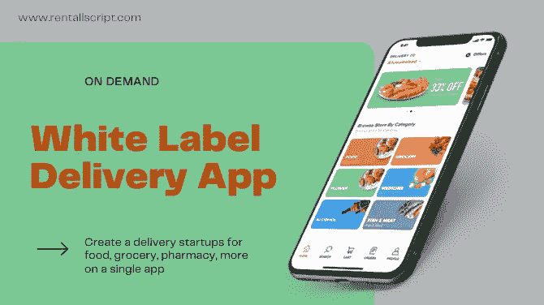

# 面向您企业的超现代白标交付应用

> 原文：<https://medium.com/nerd-for-tech/ultra-modern-white-label-delivery-app-for-your-business-d3ba997ea0ec?source=collection_archive---------5----------------------->

白色标签交付应用程序

近年来，人们已经变得如此纵容上门送货，他们现在几乎对任何业务都期望快速送货。当然，用户是任何业务的预测者，对吗？因此，拥有在线业务和送货服务具有历史意义。

# 什么是白标投递 app？

一款 [**白标交付应用**](https://www.rentallscript.com/multi-delivery-super-app/) 是一款预建的按需交付应用解决方案，允许客户从他们的移动设备订购任何服务，并让服务送货上门。该解决方案可以定制为食品订购、杂货订购、肉类配送、药房配送等，以满足任何希望为客户提供多种配送服务的配送业务。

# 白标按需交付应用的主要特性

以下是白标按需交付应用的重要特性，有助于成功开展按需交付应用业务。

**分类产品列表:**将过多的送货服务添加到不同的类别中，以产品、价格和描述吸引全球观众。快速一瞥，一项服务就预定好了！这么简单谁不想要呢？

**高级搜索过滤器选项:**多种服务和更好的过滤器，根据客户的需求为其匹配服务。在这种情况下，价格范围、产品类型和评级是规则的组成部分。

**计划交付:**通过为用户提供计划交付他们选择的任何物品的选项，减少白标交付应用程序中的不便。

**支付网关集成:**拥有多种支付网关，可以重新定义重复可能性的在线支付规范。即时、安全和可靠是按需交付应用解决方案支付的合适属性。

**推送通知:**快捷软件，通知他们最新更新、订单状态、产品确认、现场惊人优惠！

# 按需交付应用程序包

*   Android 和 iOS 用户应用程序
*   Android 和 iOS 的交付合作伙伴应用程序
*   商店网页面板
*   管理 web 面板

# 为什么你的初创公司要用白标递送应用

**业务发展:**利用旨在帮助您拓展和繁荣按需交付业务的数字解决方案进行营销，同时扩展您的业务运营。

**开发定制应用程序:**根据您的业务需求，在几天内开发一个用于多种交付服务的定制应用程序。

**结果驱动的解决方案:**毫无疑问，按需交付业务是一项正在增长到新高度的创收业务。

## 一锤定音

一个现代的白标递送应用程序和网站，用于食品、杂货、药房或任何业务。现在是时候为您的企业进行个性化定制了！