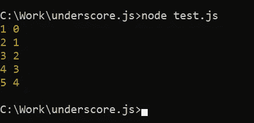
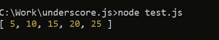
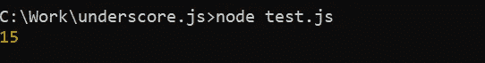
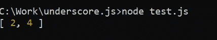
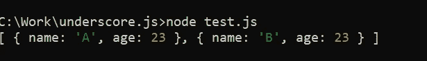
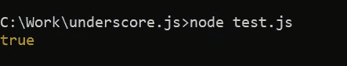
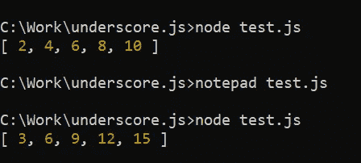
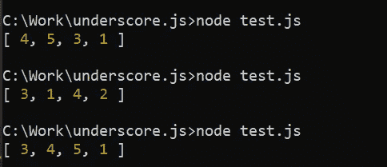
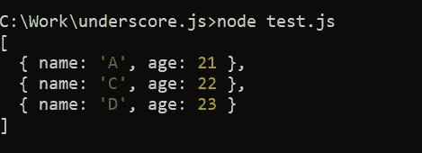
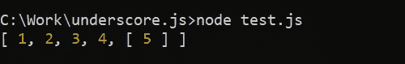

# 下划线. js | 10 大有用函数及示例

> 原文：<https://medium.com/nerd-for-tech/underscore-js-top-10-most-useful-functions-with-examples-24b822a3e0b1?source=collection_archive---------3----------------------->


Underscore.js |了解 JavaScript 最有用的库

Javascript 支持几个库，只是为了使任务更容易、更快。Underscore.js 就是这样一个 javascript 库，它提供了一组有用的 javascript 函数，可以让开发人员的工作变得更加轻松。js 库包括我们的日常函数和专用函数，我们将在接下来的章节中了解这些函数。所以让我们从下划线. js 库提供的特性集开始吧。

# 下划线. js -特征

js 是一个轻量级的、肤浅的 JavaScript 库，它不是一个完整的框架，但在我们常见的编程工作中，它为各种情况下的实用函数提供了便利。下划线. js 包含的实用程序可以大致分为:

1.  处理阵列上的变更。
2.  处理对象上的变更。
3.  处理功能上的变更。

为了获得更好的性能，下划线. js 还支持链接实用程序。因此，通过使用下划线. js，开发人员可以根据用途提取、操作、排序和过滤数据。

# 下划线. js - Setup

现在，在进入下划线. js 的工作部分之前，我们需要访问下划线. js 库。你既可以在浏览器中使用它，包括来自[官方网站](https://underscorejs.org/)的相应脚本，也可以将其安装在你的机器上。下面简要介绍了这两种方法。

## 在浏览器中使用下划线. js 的脚本

为此，您需要访问官方的[下划线. js](https://underscorejs.org/) 网站，并进入下载部分，在那里您可以获得可用的依赖项，并可以根据您的使用情况保存它们。

发布这篇文章后，你可以把这个脚本标签添加到你的 HTML 头中，然后开始使用下划线。

```
<script type = "text/JavaScript" src = "https://underscorejs.org/underscore-min.js"></script>
```

## 使用安装程序获取下划线. js 的依赖项

另一种使用方法是，通过 NPM 安装程序安装下划线. js 依赖项。对于这种访问库的方式，请确保您的机器上已经安装了 node.js 和 npm。您可以使用下面的命令通过 node.js 本身安装 Underscore.js。

```
npm install underscore
```

成功执行该命令后，您可以使用下面的命令将它包含在 node.js 脚本中，并开始使用下划线. js 库。

```
var _ = require('underscore');
```

注意:由于库名的原因，_ 被用作变量名，但是您可以在自己工作时使用任何其他合适的名称。_ 只是被广泛用于与库一起工作，因此示例也将包含相同的内容。

# 下划线. js -有用的函数和示例

我们已经在系统中包含了这个库，现在我们将看看如何通过使用下划线. js 库来充分利用它。本节包括最有用的函数，以及它们的用法、语法和示例，以便更好地理解。所以，让我们开始吧！

注意:假设相关的脚本和库依赖项已经包含在内，因此没有在代码片段中指定。

## _.每个()

这是 Undescore.js 库函数，它允许您迭代您的集合，并且在每次迭代中，您可以自由地对该值做任何您想做的事情。以下是使用该功能的方法。

```
var numbers = [1, 2, 3, 4, 5];
_.each(numbers, function(value, index){
console.log(value, index);
});
```

根据代码片段，*每个*函数都有两个参数，集合和需要在每次迭代中为每个值执行的函数。这个函数在每次迭代中得到两件事，迭代的值和集合中值的索引。您可以根据用途以任何可能和合适的方式实现此功能。

对于这个示例片段，以下是输出:



下划线. js |每个函数

js 库的 *each* 函数可以类似地作用于任何 javascript 对象。例如，如果您有以下数据，您可以使用此函数迭代数据中存在的所有属性。在每次迭代中，您都可以访问集合中的键/索引和值。

```
var data = {name: “Tom”, age: 18, gender: “male”};
_.each(data, function(value, key){
console.log(key, value);
});
```

## _.地图()

这是 Undescore.js 库函数，它允许您迭代您的集合或任何 javascript 对象，并且在每次迭代中，允许您操作这些值。以下是使用该功能的方法。

```
var numbers = [10, 20, 30, 40, 50];
var halfNumbers = _.map(numbers, function(value, index, items){
return value / 2;
});
console.log(halfNumbers);
```

根据这个片段，您将拥有一个新的收藏，其价值只有原来收藏的一半。另外，*映射*函数接受两个东西，集合/对象和一个函数。该函数使迭代的值、集合中值的索引以及原始集合在每次迭代中都可用。下面是上面代码片段的输出。



下划线. js |映射函数

您也可以改变原始数组，而不是采用新数组。为此，您的代码片段如下所示:

```
var numbers = [10, 20, 30, 40, 50];
_.map(numbers, function(value, index, items){
items[index] = items[index] / 2;
});
console.log(numbers);
```

## _.减少()和 _。reduceRight()

这是 Undescore.js 库函数，它允许您迭代您的集合，并将它们缩减为一个值。例如，它可用于获取数组中所有元素的总和。以下是使用该功能的方法。

```
var numbers = [1, 2, 3, 4, 5];
var sum = _.reduce(numbers, function(total, value, index, items){
return total + value;
});
console.log(sum);
```

根据代码片段， *reduce* 函数取集合和一个函数。这个函数使得累计总数或目前为止的总数、迭代的值、值的索引以及原始集合在每次迭代中都可用。下面是上面代码片段的输出。



Underscore.js | reduce 函数

还有另一个类似的函数，即 *reduceRight* 函数，它也适用于具有相同语法的相同实用程序。 *reduce* 和 *reduceRight* 函数的唯一区别在于， *reduce* 函数从集合的开始处开始迭代，而 *reduceRight* 函数从集合的结尾处开始迭代。您可以像使用 *reduce* 函数一样使用 reduceRight 函数，并且可以根据用途更改实现。

## _.find()和 _。过滤器()

这是 Undescore.js 库函数，它允许您迭代您的集合，并根据实现的算法在该集合中查找值。以下是使用该功能的方法。

```
var numbers = [1, 2, 3, 4, 5];
var found = _.find(numbers, function(number){
return number % 2 == 0;
});
console.log(found);
```

这个 *find* 实现被期望从集合中找到第一个偶数并返回它，在这个例子中是 2。如果您想从集合中获得所有偶数，而不仅仅是一个，您可以类似地使用 *filter* 函数。使用 filter 函数，输出如下所示。



下划线. js |过滤函数

## _.其中()和 _。findWhere()

这是 Undescore.js 库函数，它允许您迭代您的集合，并使您能够基于 where 子句找到值。以下是使用该功能的方法。

```
var data = [
{name: "A", age: 23},
{name: "B", age: 23},
{name: "C", age: 21}
];
var found = _.where(data, {age: 23});
console.log(found);
```

这个 *where* 实现将返回与提供给 *where* 函数的子句相匹配的对象列表。因此，输出如下所示。



下划线. js | where 函数

现在，如果您只想获得与 where 子句匹配的对象的第一个实例，您可以使用类似的 *findWhere* 函数，只返回第一个实例，而不是所有匹配的实例。

## _.一些()

这是 Undescore.js 库函数，它允许您遍历集合并检查至少有一个值与您定义的算法相匹配。以下是使用该功能的方法。

```
var numbers = [1, 2, 3, 4, 5];
var found = _.some(numbers, function(number){
return number > 4;
});
console.log(found);
```

现在，根据实现，*如果得到一个大于 2 的数，一些*函数将返回 true，否则将返回 false。因此，下面是上面代码片段的输出。



下划线. js |一些函数

## _.调用()

这是 Undescore.js 库函数，它允许您迭代您的集合，并对该集合的每个元素执行一个函数。以下是使用该功能的方法。

```
var numbers = [1, 2, 3, 4, 5];
function generator(factor){
return this * factor;
};
var factor = 3;
var result = _.invoke(numbers, generator, factor);
console.log(result);
```

根据代码片段，将执行 *invoke* 函数，在每次迭代中，将为相应的值执行生成器函数，并将因子传递给生成器函数。generator 函数将数字乘以因子并返回。因此，当因子分别为 2 和 3 时，上面代码片段的输出如下所示。



下划线. js |调用函数

## _.样本()

这是 Undescore.js 库函数，它允许您迭代您的集合，并基于参数从该列表中返回一个样本。您可以更改作为完整集合中的样本所需的值的数量。以下是使用该功能的方法。

```
var numbers = [1, 2, 3, 4, 5];
var sampleCount = 4;
var sample = _.sample(numbers, sampleCount);
console.log(sample);
```

根据代码片段， *sample* 函数将从给定的数字列表中返回一个随机样本。并且随机输出的大小为**样本计数**。因此，每次执行脚本时，您都会得到不同的输出，如下所示。



下划线. js |示例函数

## _.唯一()

这是 Undescore.js 库函数，它允许您遍历集合并从数组中删除重复项。以下是使用该功能的方法。

```
var numbers = [1, 2, 3, 4, 5, 1, 2];
var unique = _.uniq(numbers);
console.log(unique);
```

上述代码片段的输出不会包括集合中存在的重复值。这也可以用在其他方面，比如，如果给定了几个人的数据，你需要根据他们的年龄找出不同的人，你可以使用下面的代码片段。

```
var data = [
{name: 'A', age: 21},
{name: 'B', age: 21},
{name: 'C', age: 22},
{name: 'D', age: 23}
];
var unique = _.uniq(data, false, function(person){
return person.age;
});
console.log(unique);
```

*uniq* 函数接受集合、一个表示无序数组的标志变量和一个谓词函数，后者返回确定 person 是否唯一的参数。此外，它将始终保留第一个非唯一值作为结果的一部分。因此，上面代码片段的输出如下所示。



下划线. js | uniq 函数

## _.展平()

这是 Undescore.js 库函数，它允许您迭代由嵌套集合组成的集合，并将其展平到一个级别。以下是使用该功能的方法。

```
var numbers = [1, 2, [3], [4, [5]]];
console.log(_.flatten(numbers));
```

该代码片段将转换数字数组，并将其展平为一个级别，输出将仅为[1，2，3，4，5]。可以传递另一个参数来指定是否需要将其展平为一个级别。也就是说，如果调用了 *flatten* 并且在数字数组后传递了 true，那么它将导致以下输出。



Underscore.js | flatten 函数

# 结论

在本文中，我们遇到了各种有用的函数及其在下划线. js 框架中的实现。使用它将是有益的，因为它将优化您的运行时间，并使代码精确和可读。我希望你发现这是有帮助的和有见识的。

一定要留意其他文章，以获得关于各种主题的知识，并随时对疑问或建议发表评论。

> [下划线. js 的 10 大有用功能是什么？](/nerd-for-tech/underscore-js-top-10-most-useful-functions-with-examples-24b822a3e0b1)
> 
> [Python 中的装饰者是什么？](/swlh/decorators-in-python-dbd35c32c00a)
> 
> [Java 中的多线程](/swlh/java-multithreading-48a21a361791)
> 
> [使用 Java 理解 Apache Derby】](/analytics-vidhya/apache-derby-using-java-3c09100e9128)
> 
> [Java 中的 TCP/IP 套接字编程](/swlh/tcp-ip-socket-programming-in-java-fc11beb78219)
> 
> [如何使用 React JSX 发送 HTTP 请求？](/swlh/reactjs-sending-http-requests-using-jsx-5cf9c20a9e1c)