# 理解 Lambdas 和多变量高阶函数

> 原文：<https://medium.com/nerd-for-tech/understand-lambdas-and-high-order-functions-with-multiple-variations-e265e9d64ac1?source=collection_archive---------8----------------------->

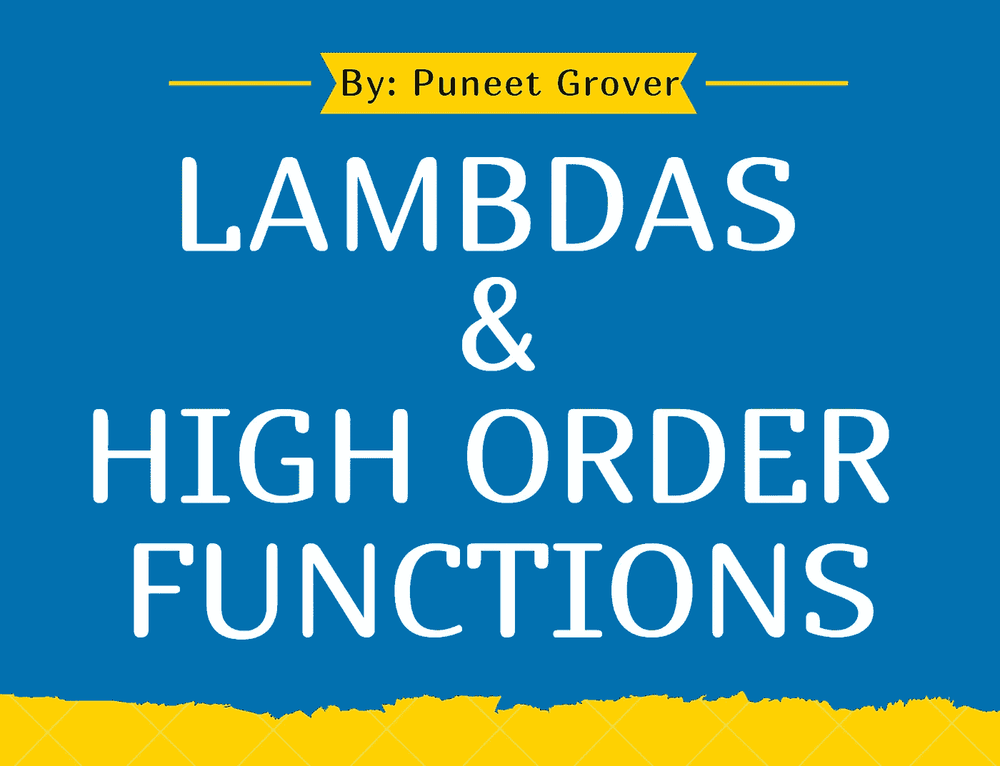

嘿，伙计们，我带着令人惊奇的话题 Lambdas 和高阶函数回来了，这实际上是 Kotlin 相对于 Java 的优势

当我开始学习 Kotlin 时，我发现最不同的&有点困难的概念是 Lambdas 和高阶函数，我谷歌了很多来学习这两个东西，你猜怎么着？我发现到处都有不同的方法来解释这两个概念，而不是在一个地方得到所有的东西

因此，我不仅会让你们理解这两个概念，还会给你们更多的 Lambda &高阶函数的变体🤘

# **λ函数**

*   匿名函数(没有名字的函数)
*   **目的** :-可以被当作一个值，例如(将它们作为参数传递给函数，返回它们，或者做任何其他我们可以用普通对象做的事情)
*   **语法**——以{开始，以}结束，该块下的任何内容——没有该函数的名称
*   **例子**——{ println("嘿普内特我是兰巴？") }
*   现在，above lambda 不带参数，不返回任何内容(没有值)
*   但是当我们想要发送一些参数和返回一些参数时，可能会出现这种情况

现在，让我们用 Kotlin 中的一个简单示例来一步步学习它:

# 1.没有参数和返回值的 Lambda

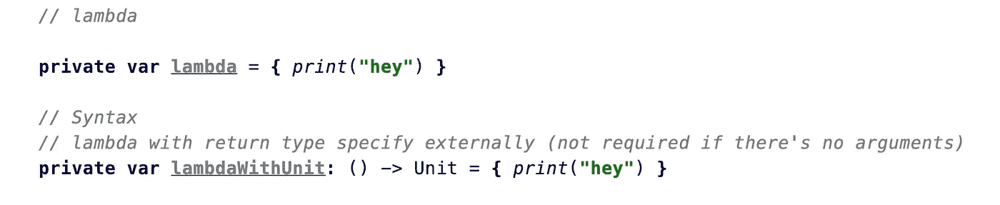

# 2.具有返回值且没有参数的 Lambda

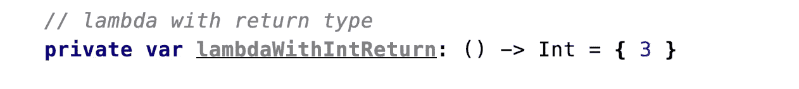

# 3.只有一个参数且没有返回值的 Lambda

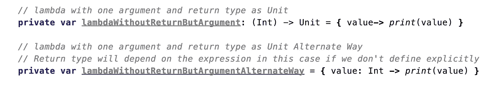

# 4.带有参数和返回值的λ

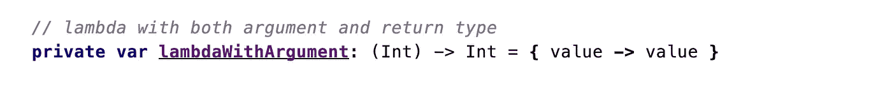

# 5.具有多个参数和返回类型的 Lambda

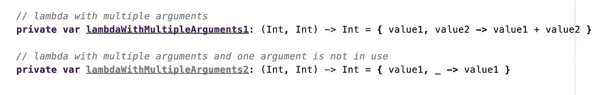

> 你可能在上面的代码中观察到，如果没有使用任何参数，那么可以用下划线' _ '来代替，因为 Kotlin 非常简洁

# ->现在让我们学习如何调用 Lambda 函数

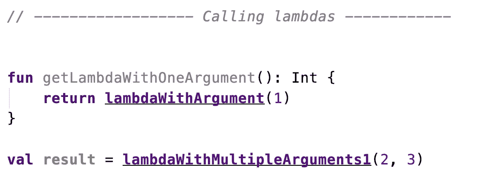

这就是我们如何调用 lambda 函数，在调用它们的时候传递正确的参数

# 重要的一点->

假设我们有一个与 lambda 函数同名且签名相同的普通函数，那么每当我们调用该函数时，它都会优先使用普通函数，而不是 Lambda 函数

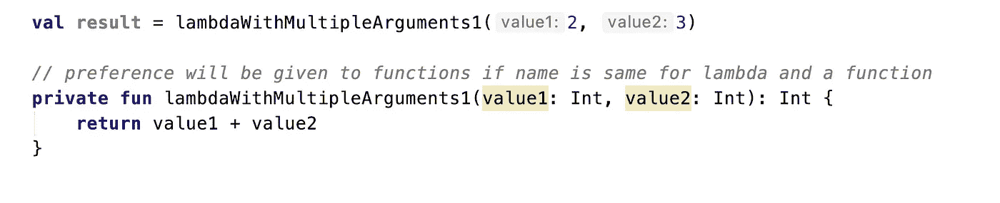

```
*Now What's the Benefit of lambda if same can be done with functions?**Lambdas are treated as Objects which can be passed as argument and can be returned as a value**Here comes High order function into Picture*
```

# **高阶函数**

高阶函数是以函数为参数或返回函数的函数。

## **>多高阶函数与 lambda 挂钩？**

我们将传递匿名函数或 lambdas，而不是整数、字符串或数组作为函数的参数

我们可以将 lambda 表达式作为参数传递给高阶函数

# 示例:-

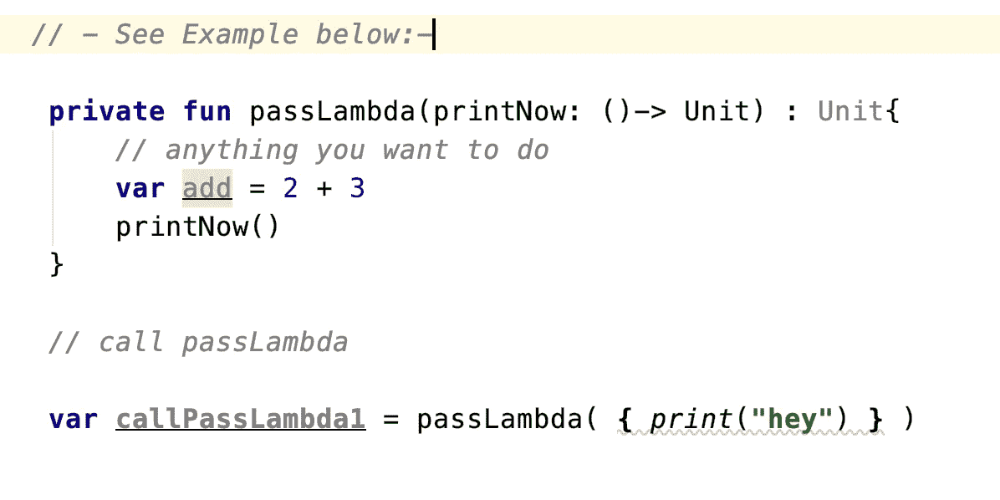

这需要一个 lambda 函数 print now:()-->单元

printNow 只是参数的名称。它可以是任何东西。我们只需要在执行函数时使用它。

**() - >单位**，这个很重要。

**()** 表示函数不带参数。

**Unit** 表示函数不返回任何东西。

因此， **passLambda** 可以接受一个不带参数且不返回任何内容的函数。

# ->因为 Kotlin 是一种非常简洁的语言，所以有另一种方法在高阶函数中传递 Lambdas 而省略括号

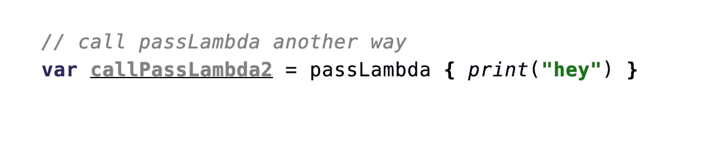

# ->我们可以这样直接传递函数也可以传递高阶函数

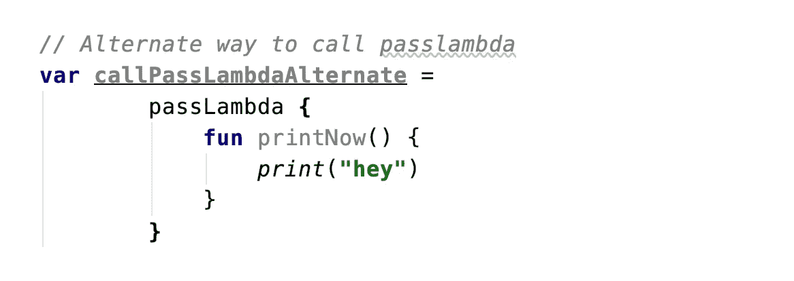

# 重点

现在让我们结合上面在 Lamda 函数中讨论的要点来讨论这一点

## 假设我们有一个高阶函数，它接受一个字符串和一个 lambda 函数作为参数

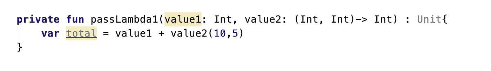

## 我们可以这样调用这个函数->

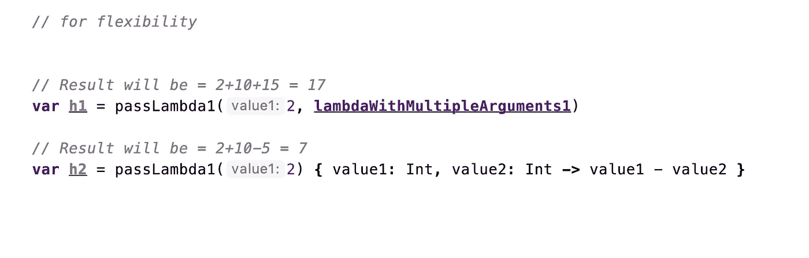

在这里，当调用高阶函数时，我们已经传递了上面创建的 lambda 函数**lambda 函数 lambdawithmultiplearguments 1**,即它接受两个参数并返回两者的相加

我们可以称之为传递不同的λ的减法定义

## 因此，它为我们提供了灵活性！

是的，首先在传递参数时，它把 Lambdas 作为优先级，而不是普通函数，因为普通函数不能作为参数传递

其次，它为我们提供了调用任何参数的灵活性，这些参数反过来会做一些其他的操作，这不是很酷吗？

# Android 中的高阶函数示例

如果我们想点击 list/Rv 中的某个项目，我们为此创建一个接口，在适配器中设置接口，调用接口函数并在 UI- frag/activity 中覆盖该接口

所以最终，我们会编写大量代码来完成这项任务

这可以用高阶函数/lambda 非常容易地完成，也不需要样板代码

**片段->**

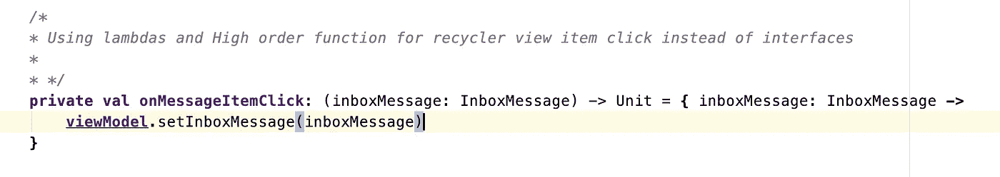

**适配器的初始化- >**

```
**messageAdapter** = MessageAdapter(**onMessageItemClick**)
```

**适配器->**

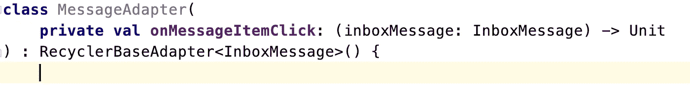

## 单击项目时从适配器调用高阶函数-->

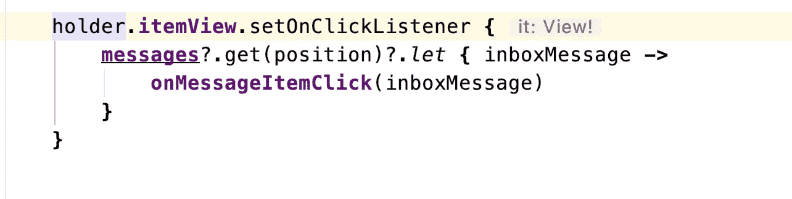

> 这就是高阶函数和 Lambdas 的美妙之处

**我这边就这样！！**

**分享这个博客来传播知识|如果你喜欢，请跟随并鼓掌**

**快乐编码！！**

**加我在**[**Linkedin**](http://www.linkedin.com/in/puneet-grover-android-soft)**和**[**Twitter**](https://twitter.com/puneetgrover_)**了解更多精彩更新和概念**