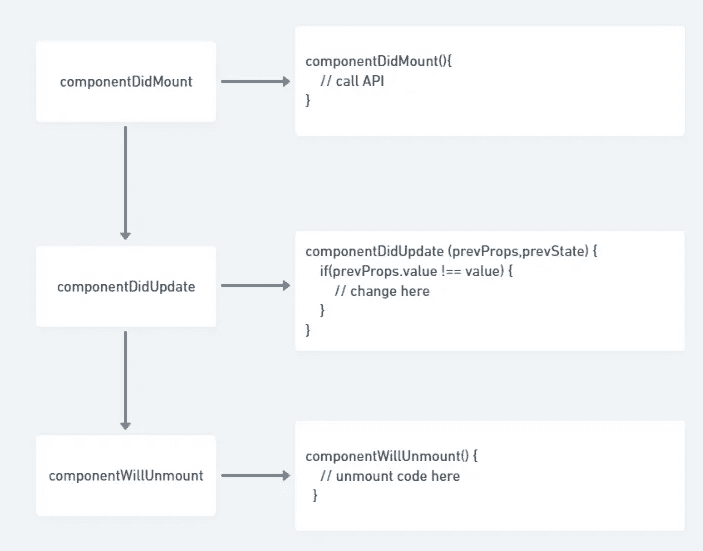
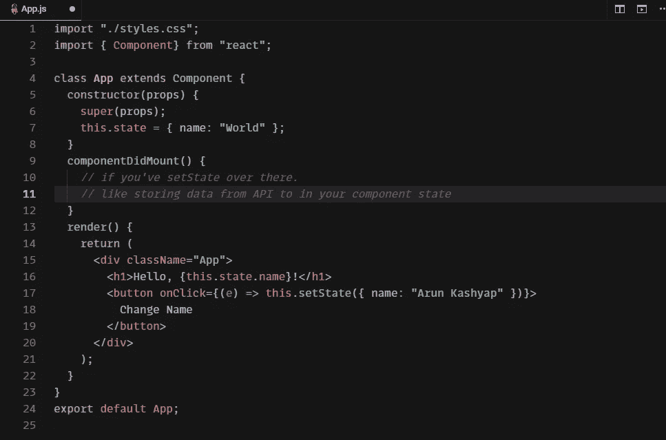
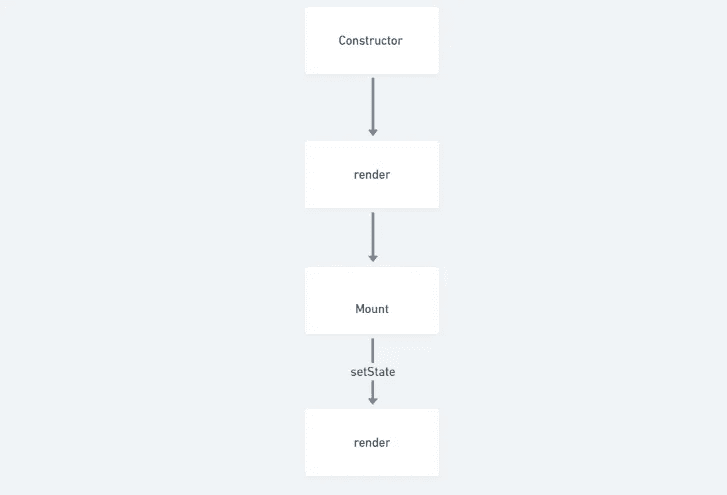
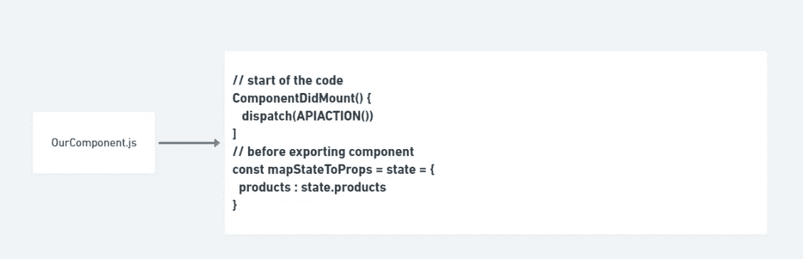
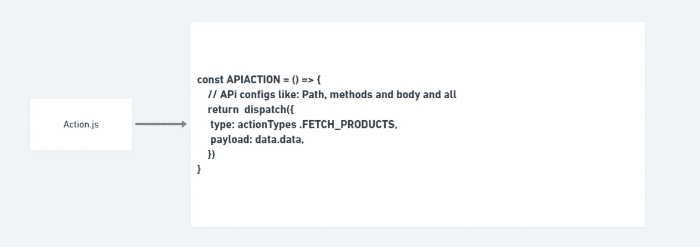
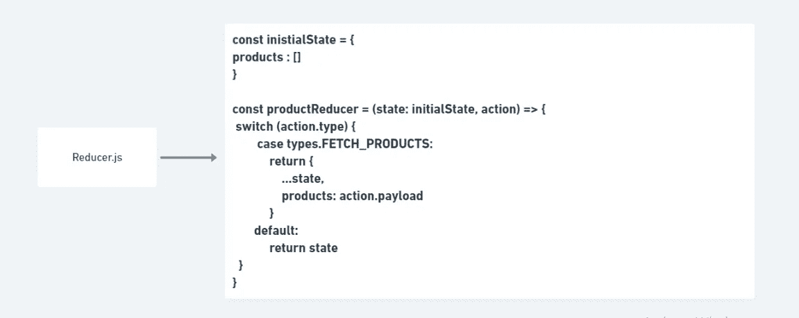

# 了解 React 数据流，让你成为优秀的 ReactJS 开发者！

> 原文：<https://medium.com/nerd-for-tech/understand-react-data-flow-which-makes-you-brilliant-reactjs-developer-54ff2c7066e1?source=collection_archive---------7----------------------->

让我们了解如何反应数据流…

[万花筒](https://unsplash.com/@kaleidico?utm_source=medium&utm_medium=referral)在 [Unsplash](https://unsplash.com?utm_source=medium&utm_medium=referral) 上拍摄的照片

我们通常不理解组件中的数据流。我们将了解组件中的数据流，以及何时设置状态。 ***要想擅长 Reactjs，你需要知道我们的数据流向哪里，以及如何从一个位置到另一个位置。***

让我们以这些流程为例:

1.  **类组件**
2.  **生命周期方法**
3.  **设置状态**
4.  **冗余数据**

## ***1。类组件***

我们以一个类组件为例，它有构造函数和生命周期方法，然后是呈现方法。

让我们看看他们调用的顺序:

## 2.**生命周期方法**

基本上，我们有三种主要的生命周期方法，就像我们在上面的例子中展示的那样。现在，我们将了解我们的生命周期方法是如何工作和调用的。

**组件装载:**

这个生命周期方法用于调用 API 来获取我们想要的组件数据。这个数据显示在我们的 JSX。这在第一次呈现页面时调用。

**componentDidUpdate :**

这个生命周期方法用于更新我们的组件的数据，该组件在***componentDidMount***调用后改变数据。

我们基本上是在条件里勾选道具，想改就改。

**组件卸载*:***

生命周期的下一个阶段是当一个组件被从 DOM 中移除或者**卸载**时**反应**喜欢这样称呼它。

## **3。设置状态**

在这种情况下，我们将了解 DOM 实际上是如何设置呈现在屏幕上的状态的。

*这是我们的代码:*

*我们的数据就是这样流动的……*

## **4。冗余数据**

最重要的是要知道你的 redux 数据是如何流动的。就像一个文件，我们的数据来自哪里。要想擅长 Reactjs，你需要知道我们的数据流向哪里，以及如何从一个位置到另一个位置。

所以，让我们来学习最重要的话题 **REDUX。**

Redux 允许我们使用状态，reducer 来存储多个状态，它为我们提供了一个功能来传递一个用于命中 API 动作，并通过**检测哪种类型**(动作类型)将数据存储在 reducer 中。它用于减速箱中。

并且借助于那个类型，我们检查这是哪个事例，当事例匹配时， ***数据存储在相关状态*** 中。

让我们以一小段代码 的 ***为例，它通常用于现实生活中的项目，而 **o *正式的方式是在我们的项目中拥有结构文件******

第一次调用，在我们的 componentDidMount 中，我们**只是分派了**一个将要访问 API 的动作。**和下面的 mapStateToProps 将从减速器获得状态**。ProductReducer 具有状态**命名的产品。**

第二次调用，这里有一点代码丢失(对不起 Lil。懒)。尽管它只是一个 API。**作为回报，它匹配该类型，并且该类型也包含在将要匹配并仅存储状态的缩减器中。**

第三次调用，这个 reducer 中的**匹配用于存储 API 数据的 action 类型和 action.payload。**

我希望这是可以理解的。让我知道！！

感谢哥们看得太远:)