# 了解 Redux 和 React 的几个步骤

> 原文：<https://medium.com/nerd-for-tech/understand-redux-with-react-in-few-steps-a49853a49e37?source=collection_archive---------4----------------------->

在本教程中，你将了解作为初学者你需要知道的关于 redux 的一切。我们将从概念转向实际操作。在本教程结束时，我们将构建一个计数器程序来了解如何使用 redux。

[***先决条件***](https://www.google.com/search?rlz=1C1CHBD_frTN939TN940&sxsrf=ALeKk00fasQyt-JbxTSfTJsGMfZnn7WXIw:1625345399633&q=Prerequisites&spell=1&sa=X&ved=2ahUKEwj6kbq548fxAhUPnBQKHUd0BxAQkeECKAB6BAgBEC0) : React，Javascript ES6

# 概念

## 1-了解状态管理

状态管理是以数据结构的形式呈现应用程序中使用的数据的一种方式。因此，在组件之间交换这些数据会更容易。它促进了不同组件之间的通信，并让它们以一种简单的方式了解任何更新的数据。

在 React 中，有许多不同的状态管理库:Redux、反冲、上下文 api 等。

## React 中组件之间的通信，无冗余

在我们学习 redux 如何工作之前，了解一下 React 在不使用 Redux 的情况下是如何工作的是很重要的。

事实上，组件之间的通信是使用道具从上到下进行的。这意味着，无论何时您想要传递数据，它都应该从父节点传递到子节点。

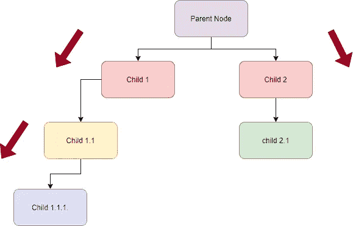

在上图中，如果*子节点 1.1.1* 需要一个在父节点中声明的数据，那么将会发生以下情况:

父节点将数据作为道具传递给*子节点 1* ，然后*子节点 1* 接收数据并将其作为道具传递给*子节点 1.1* ，然后*子节点 1.1* 接收数据并将其作为道具传递给*子节点 1.1.1*

我们将这个循环称为 **Prop-Drilling** ，这意味着为了将数据从一个组件传递到另一个组件，它应该遍历两个组件之间的树的所有组件，从上到下进行通信，即使它们没有请求这样做。

想象一下，如果这个应用程序变得更大，我们可能有上百个组件，使用这种方法将非常困难。光是想想就很累，让人不知所措！

这种方法的另一个缺点是，我们希望在*子 1.1.1* 和*子 2.1* 之间进行数据通信，这可能非常具有挑战性。

## 3- Redux

作为对前面问题的解决方案，Redux 作为状态管理库被引入。

Redux 让一切更简单！

**Redux 如何工作？**

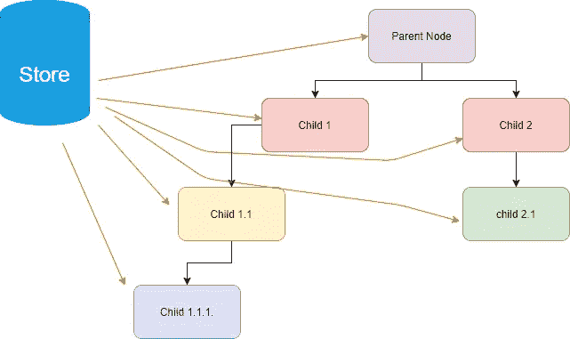

Redux 定义了一个保存所有数据(状态)的存储。每当你更新一个状态时，它将在商店中自动更新，并从商店传递到你的应用程序的所有组件。

因此，每当组件需要数据时，它就直接从存储中获取数据。

# 我们来练习一下！

在这一部分，我们将使用 redux 构建一个计数器程序。这个应用程序非常简单，但却教授了很多东西。

这个应用程序允许你增加或减少一个状态(计数器)的值

**1-安装**

创建 react 应用程序后，执行以下步骤来安装 redux。

使用 npm:

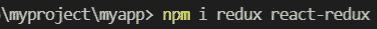

带纱线:

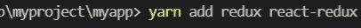

注意，我们需要安装 redux 和 react-redux。

Redux 允许我们创建商店，react-redux 允许我们在 react 应用程序中使用 redux。

安装后，创建一个名为 Store 的文件夹。在这个文件夹下，再创建两个文件夹，一个名为 actions，另一个名为 reducers。

您可以根据需要命名文件夹，但这是最佳做法

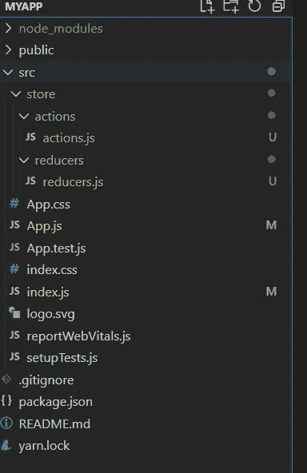

**2-编码**

为了使用 redux，无论构建什么样的应用程序，都有几个步骤是适用的。你可以从任何你想要的步骤开始，但我喜欢按如下步骤进行:

1–定义行动

2–定义减速器

3-定义商店

4-分派操作

*   **定义行动**

动作只是一个函数，它返回一个具有两个属性的对象:

-type:一个字符串，表示您正在执行的操作

-有效负载:您将用来更新您的状态的数据

在我们的例子中，我们需要两个动作，一个增加状态，另一个减少状态。

因此，类型可以是:“增量”和“减量”(例如)。它只是一个字符串，你可以随意命名。最好用大写字母来写。

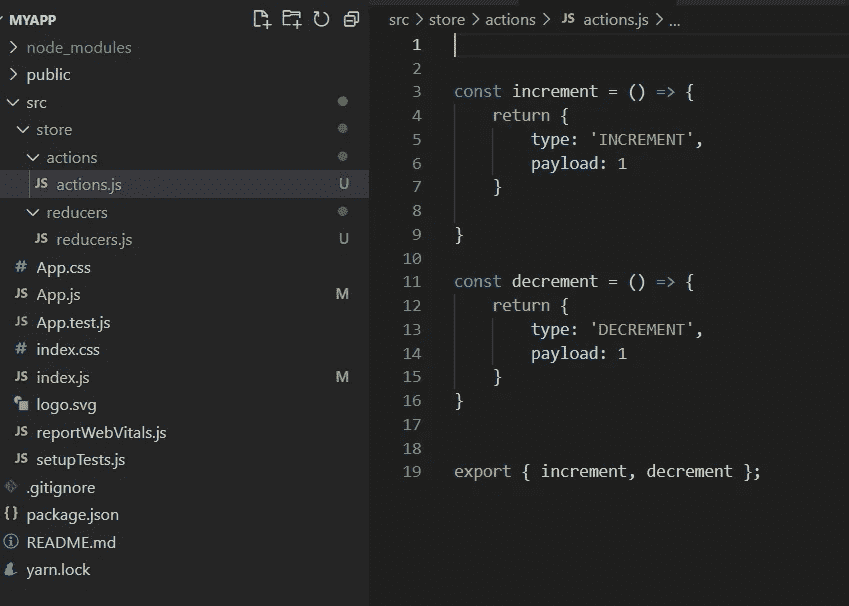

*   **定义减速器**

减速器是做增量或减量工作的函数。它需要两个参数。第一个参数是将被更新的状态，第二个参数是将在状态上执行以改变它的动作。

重要的是要知道，无论你在 redux 中作为第一个参数传递什么，redux 都会将其识别为状态，并自动保存在存储中。

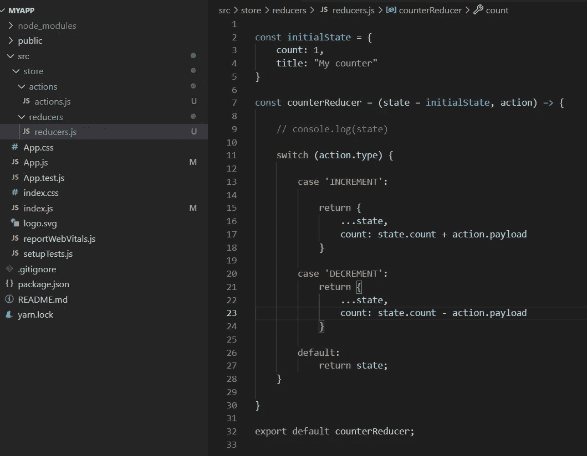

我们定义了一个对象 initialState，并将其传递给 State 参数作为它的初始化。

基于动作类型“递增”或“递减”,缩减器将返回状态，除了计数字段将被加上有效载荷的值之外，其他字段保持不变。

*   **定义商店**

现在我们已经准备好了我们的操作和 reducer，我们需要创建商店。在您的 **index.js** 文件中执行以下操作:

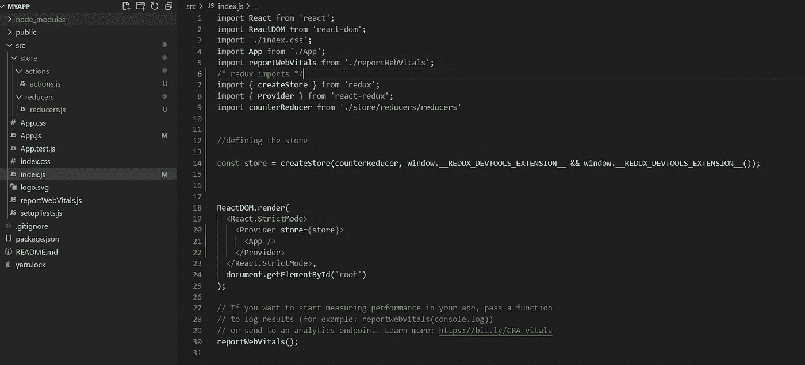

为了创建商店，我们使用从 redux 导入的函数 createStore。该函数将我们之前定义的 reducer 作为参数，因此当我们将状态传递给 reducer 时，它知道要存储什么状态。

为了更好地可视化正在更新的状态，我们使用 Redux dev tools 扩展。只需将它添加到您的浏览器中，然后将以下内容添加到 reducer 旁边的 createStore 方法中

窗户。_ _ REDUX _ dev tools _ EXTENSION _ _ & & window。__REDUX_DEVTOOLS_EXTENSION__()

为了让所有组件都可以访问这个存储，我们使用了一个从 react-redux 导入的提供者。这个提供者以商店为道具，传递给我们的 app。这将允许所有组件访问存储和其中的数据。

<app></app>

*   **定义调度员**

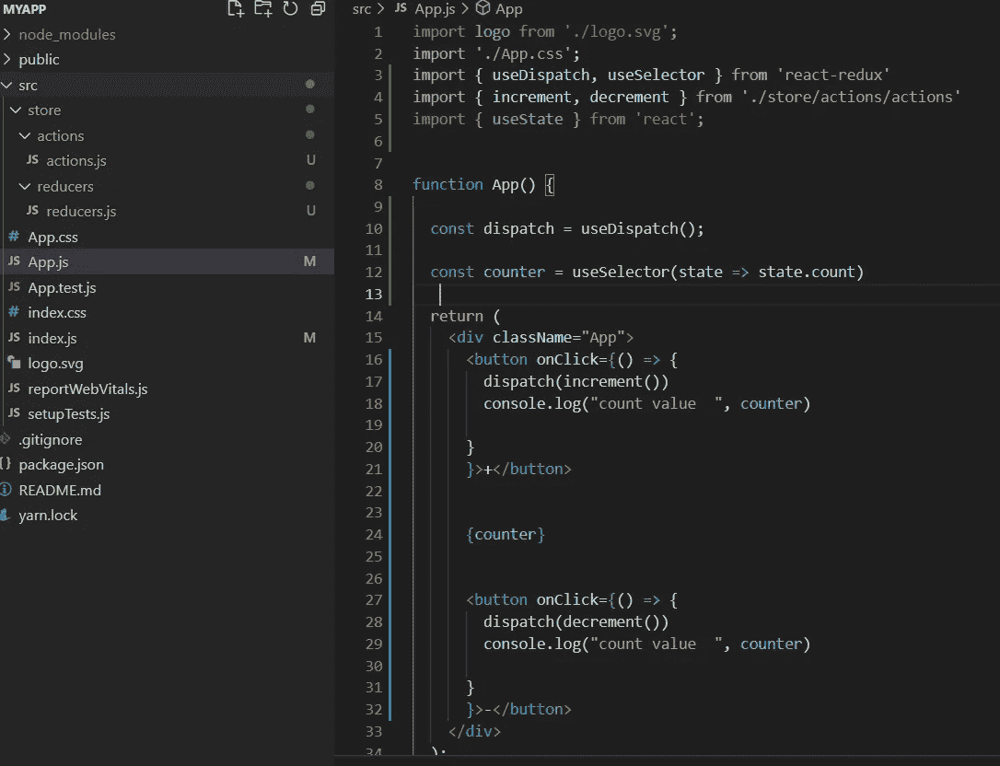

*useDispatch* 是一个钩子，用来定义调度器。dispatcher 是一个函数，它将一个动作作为参数，并触发 reducer 执行该动作。

当我们单击按钮+时，调度程序将 increment 动作传递给 reducer，这个 reducer 将在 state 上执行它。

当我们单击按钮-时，调度程序将减量操作传递给 reducer，这个 reducer 将在状态上执行它。

但是我们如何从这个文件中访问状态呢？

多亏了存储库，我们使用了 *useSelector* 钩子，它默认将我们保存在存储库中的状态作为参数。

然后，我们使用它从任何组件访问我们的状态。

计数器将相应地更新

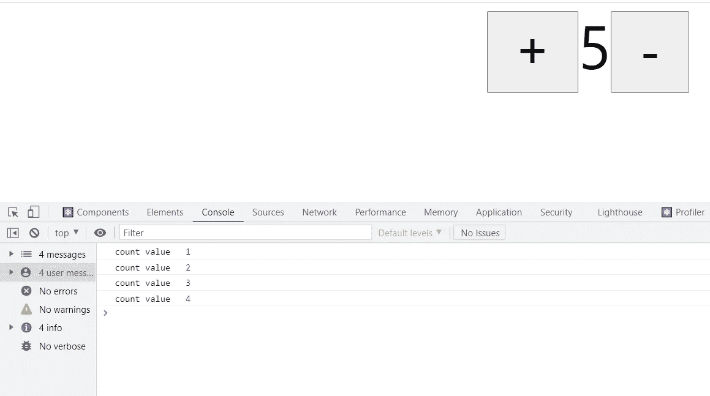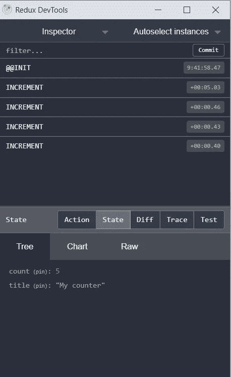

如果你发现它势不可挡，不要担心！Redux 在开始的时候有点难理解，但是自己重复这个教程，你会做得很好的！

如果你有任何问题，不要犹豫，在评论中问我！

完整代码:

 [## JiheneBarhoumi/Counter_Redux

### 这个项目是用 Create React App 引导的。在项目目录中，您可以运行:在…中运行应用程序

github.com](https://github.com/JiheneBarhoumi/Counter_Redux)