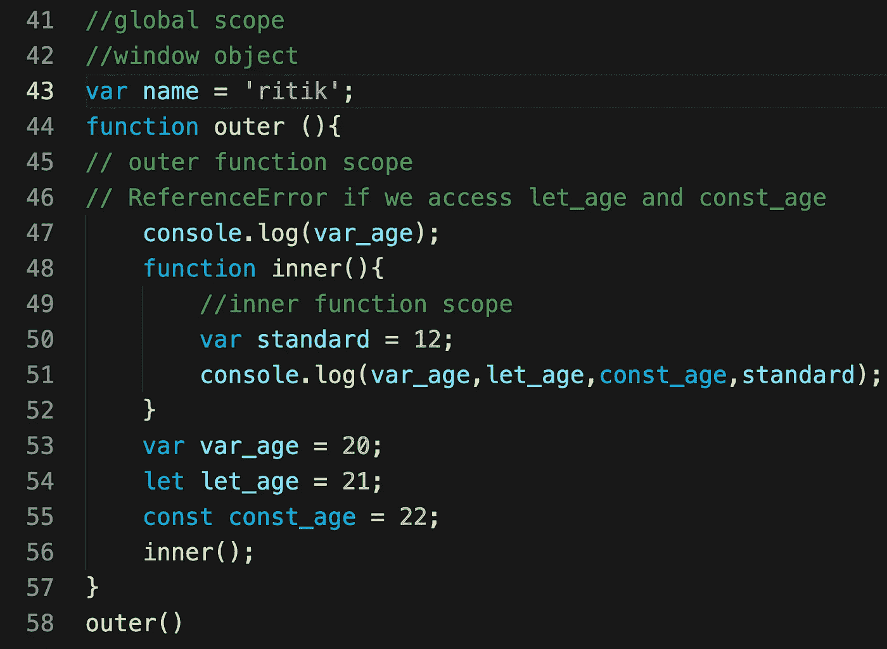
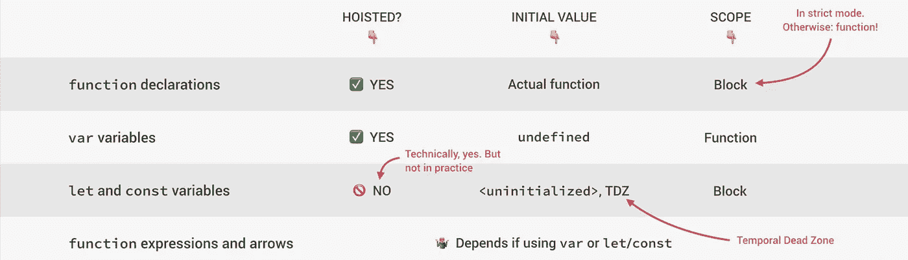
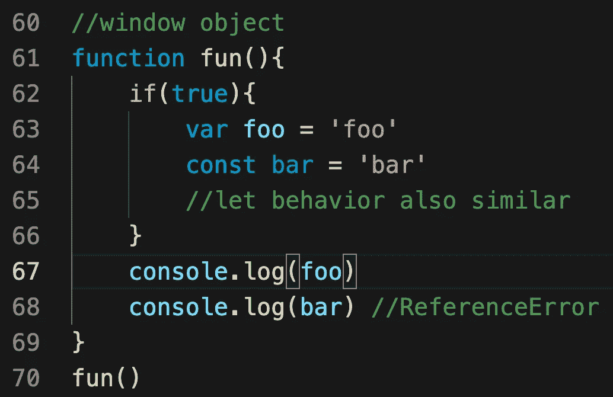

# 理解 JavaScript 中的范围和范围链

> 原文：<https://medium.com/nerd-for-tech/understand-scopes-and-scope-chain-in-javascript-12ee91161abb?source=collection_archive---------8----------------------->

## 范围

JavaScript 中的 ***作用域*** 是指代码的当前上下文，决定了变量对 JavaScript 的可访问性。简单来说，我们可以说我们的程序如何组织和访问变量“我们可以访问的地方”。

JavaScript 中的**词法范围**意味着在函数外定义的变量可以在变量声明后定义的另一个函数内访问。但反之则不然；函数内部定义的变量在函数外部是不可访问的。

作用域有两种——***全局作用域*** 和 ***局部作用域*** 。

**全局范围**

在函数外定义的变量**在全局范围内。此外，在整个 JavaScript 文档中只有一个全局范围。一旦你声明了一个全局变量，你就可以在代码中的任何地方使用它，甚至是在函数中**

**局部范围**

函数中定义的变量**在局部范围内。并且它们对该函数的每次调用都有不同的作用域。此外，每个函数在被调用时都会创建一个新的作用域。所以也有一个函数作用域。**

重点介绍**外**和**内**和*的功能。每个*函数都有它的局部作用域。

名称变量在任何地方都是可访问的，因为这是一个全局变量。

在内部函数中，所有变量都是可访问的。为什么？

*由于*我们已经讨论过的词法范围。那么会输出什么呢？

那为什么 var_age 未定义？

这是因为**的**的**吊装。** *什么*如果我们访问 let 和 const。然后我们得到 ReferenceError，因为**临时死区**。

我们来讨论一下 *let，const，和 var* 的作用域。

提升和临时死区将在后续文章中讨论。

**功能范围** *让我们通过例子*来理解

这里变量 foo 是可访问的，因为 var 是函数作用域。

JavaScript 中的所有作用域都是仅用 ***函数作用域*** 创建的，它们不是由 ***for 创建的，而*** 循环或表达式语句如 ***if 和开关*** 。block 语句中定义的变量将保留在它们原来所在的范围内。

这些都在范围内。希望你喜欢。

## 范围链

现在你可能会问什么是**作用域链**以及它如何影响代码？

**作用域链**建立给定函数的作用域。每个定义的函数都有其嵌套的作用域，在另一个函数中定义的任何函数都有一个链接到外部函数的局部作用域，这种链接称为链。

*调用函数不会影响作用域链。怎么会？*让我们看看

只能访问全局变量和临时变量。*为什么？*

要访问“foo”和“bar ”,我们必须将第三个函数限定在第二个函数中。

我希望你在这里学到了新东西。

谢谢你的 time☺️