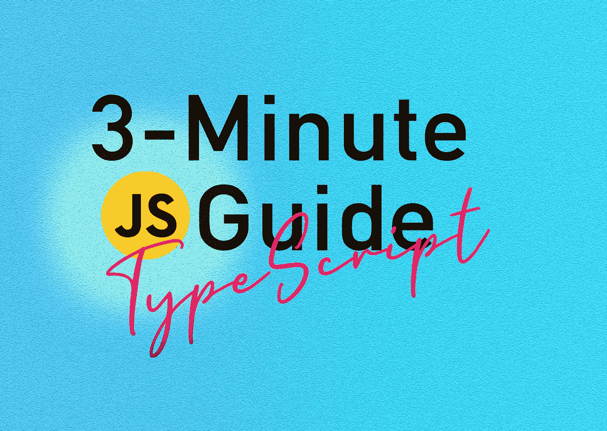

# 3 分钟指南后理解打字稿#06

> 原文：<https://medium.com/nerd-for-tech/understand-typescript-after-a-3-minute-guide-06-ff2634dba57a?source=collection_archive---------16----------------------->

## Typescript:提前验证您的 JavaScript 代码！

Javascript 是一种动态语言，有能力做出疯狂的事情。一个突出的例子就是引用不存在的东西。换句话说:处理未知形状的物体。