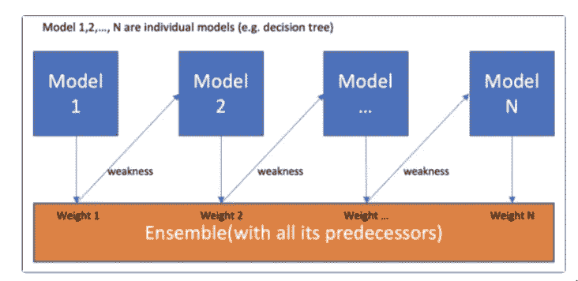
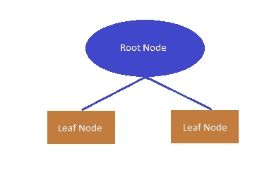
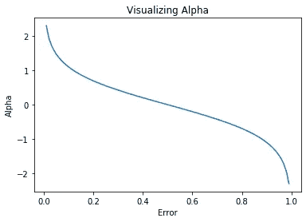
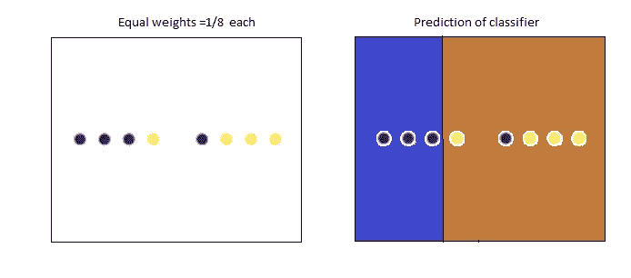
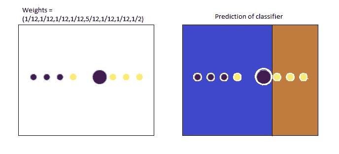
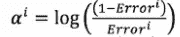
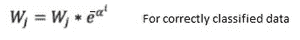
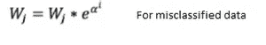
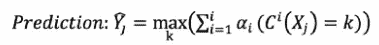

# 了解 AdaBoost

> 原文：<https://medium.com/nerd-for-tech/understanding-adaboost-5f1f1750160d?source=collection_archive---------11----------------------->

AdaBoost 是自适应学习算法，它以顺序的方式反复调用弱学习算法进行学习。它适应个体弱假设的错误率。这是它名字的基础——“ada”的意思是适应的。这是一个整体增压模型。

首先让我们看看什么是升压，然后了解 AdaBoost 是如何工作的。

# 助推

助推是一种将一群弱学习者组合成强学习者的技术。

弱学习者是性能很差的分类器(准确率比随机猜测略好)。相比之下，强学习者是具有任意高准确度的分类器。

Boosting 思想是按顺序训练弱学习者，每个人都试图纠正其前任。这意味着，算法总是要学习一些并不总是完全准确的东西，但通过顺序纠正错误，它提高了预测能力。



面向数据科学的图像

在 boosting 中选择和组合弱学习者的方式取决于方法/算法。例如 AdaBoost、Gradientboost、XGboost。

# adaboost 算法

AdaBoost 算法首先在原始数据集上拟合一个弱分类器，产生一个输出假设，然后迭代地重新加权错误分类的数据，以拟合下一个弱分类器。每个弱学习器被分配一个系数，使得得到的提升分类器的训练误差之和最小。

训练 AdaBoost 分类器包括迭代学习以与弱学习者的表现相关的方式加权的弱分类器，并将它们添加到最终的强分类器。在添加弱学习者之后，输入数据权重被调整，称为“重新加权”。

重新加权意味着错误分类的输入数据将获得更多权重，而正确分类的数据将失去权重。因此，下一个弱学习者更关注先前弱学习者误分类的数据。

AdaBoost 分类器中常用的弱学习器是称为决策树桩的单分裂决策树。



作者图片

# 分类器的系数

AdaBoost 使用重新加权的样本数据训练一系列分类器(弱学习器)，根据误差为各个分类器生成系数 **α** 。这个系数决定了这个弱分类器对最终组合分类器的贡献。

**α** 查看分类器产生的错误。从下图中可以看出，当误差较大时， **α** 较小，即在投票中有误差的分类器重要性较低。当误差较低时， **α** 较大，这意味着在投票中较高的重要性。



图像编码器包

最终组合分类器的预测是通过加权投票完成的。当测试数据通过每个分类器时，预测输出将是将数据分类到特定类别的每个分类器的系数总和的最大值。

从下面的例子可以详细理解这个过程。

# 例子

假设有 2 个蓝色和棕色类，用于训练的样本数据集有 8 个点(4 个黑色和 4 个黄色)，如果输出应将所有黑色点分类为蓝色类，将所有黄色点分类为棕色类:

对于第一次迭代，所有点的权重都是 1/8。当数据传递到第一个弱分类器时，它预测 3 个点属于蓝色类，5 个点属于棕色类。



作者图片

因此，第一分类器将 1 个黑点误分类为棕色类。因此，对于第二次迭代，该错误分类的黑点权重增加，而其他点的权重减少。即误分类黑点的权重增加到 **5/12** ，剩余点的权重减少到 **1/12** (在任何时候，所有样本数据的权重之和应该总是 1。因此，执行权重的归一化)。

现在，新的加权数据集通过第二个分类器。



作者图片

第二分类器将 5 个点分类为蓝色类，将 3 个点分类为棕色类。虽然该分类器正确地将先前误分类的黑点分类到蓝色类别，但是该分类器将一个黄色点误分类到棕色类别。因此，再次调整权重，使得错误分类的黄点的权重增加，而正确分类的数据的权重减少，即，新的更新的权重将是 1/16，1/16，1/16， **6/16，4/16** ，1/16，1/16，1/16(权重被归一化以使总和为 1)。

这个训练过程一直持续到所有的训练数据点都被正确地分类到蓝色和棕色类别中。

在上面的**例子中**经过训练，如果我们最终得到 5 个弱分类器，每个分类器的 **α(系数)**为 0.8，0.6，0.3，0.5，0.4。

假设对于**一个** **测试**数据点，如果具有 **α** 0.4 和 0.6 的 2 个分类器预测该测试数据点属于蓝色类，并且具有 **α** 0.8，0.3，0.5 的 3 个分类器预测该测试点属于棕色类，则最终预测将是具有最高加权投票的类。即具有最大总和 **α的类别。**

即最大值为 0.4 +0.6 =1.0(蓝色级)和 0.3+0.5+0.4 = 1.6(棕色级)。所以，最终输出是该点属于布朗类(因为 sum=1.6)。

# 伪代码

这是 AdaBoost 算法的伪代码。

1.  初始化输入数据的权重 W: W1，W2，W3，…，Wn=1/n
2.  对于每次迭代，i = 1: T

*   使用由 w 加权的数据训练每个弱学习算法。这产生弱分类器假设 **C** 。
*   使用以下公式计算分类器系数α



面向数据科学的图像

其中误差是错误分类数据的权重之和

*   将权重更新为:



面向数据科学的图像



面向数据科学的图像

*   归一化权重，使权重之和等于 1

3.模型的输出通过加权投票完成。预测是将数据分类到特定类别 k 的每个分类器的系数之和的最大值



面向数据科学的图像

# 用 Python 实现

Scikit-learn 提供 AdaBoost 分类器的实现。我们所需要做的就是用数据填充 AdaBoost 分类器，并传递参数，如要使用哪个弱学习算法以及 boosting 的迭代次数等。一切都是在 AdaBoost 分类器中完成的。

**class sk learn . ensemble . adaboostclassifier(base _ estimator，n_estimators，learning_rate，algorithm，random_state)**

kaggle 的示例代码片段:

```
from sklearn.ensemble import AdaBoostClassifier
model=AdaBoostClassifier(base_estimator=DecisionTreeClassifier(max_depth=2),learning_rate=0.1,n_estimators=100,) 
model.fit(train_X,train_y) 
prediction=model.predict(test_X)
print('The accuracy is',metrics.accuracy_score(test_y,prediction))
```

以下是 AdaBoost 分类器的**参数**:

1.  这个参数告诉 AdaBoost 要选择哪个弱学习分类器。默认值是 max_depth = 1 的决策树分类器。
2.  **n_estimators** :该参数给出了估算器(迭代)的最大数量，在该数量时增强终止。默认值为 50。
3.  **learning_rate** :该参数告诉分类器的学习对输入数据权重的贡献。如果学习率降低，则输入权重会降低 learning_rate 倍，从而迫使模型训练速度变慢。默认值为 1。低学习率需要更多的 n 估计量。
4.  **算法**:该参数告知 SAMME 或 SAMME 的哪个升压算法。r 待定。萨姆。r 要求 base_estimator 支持类概率的计算。SAMME 支持多分类。默认为 SAMME.R。
5.  **random_state** :该参数影响返回结果的再现性。默认值为无。

# AdaBoost 的利与弊

**优点:**

1.  它快速、简单且易于编程。
2.  减少偏差
3.  它被扩展到二进制分类以外的问题

**缺点:**

1.  它易受噪音影响
2.  可能导致数据过度拟合

# 来源

*   增压算法解释:

[https://towards data science . com/boosting-algorithms-explained-d 38 f 56 ef 3 f 30](https://towardsdatascience.com/boosting-algorithms-explained-d38f56ef3f30)

*   在 Python 中理解和实现 AdaBoost 算法；

[https://coders packet . com/understanding-and-implementing-AdaBoost-algorithm-ensemble-learning](https://coderspacket.com/understanding-and-implementing-adaboost-algorithm-ensemble-learning)

*   AdaBoost 算法:

https://www.educba.com/adaboost-algorithm/

*原载于 2021 年 2 月 22 日 https://numpyninja.com*[。](https://www.numpyninja.com/post/understanding-adaboost)**