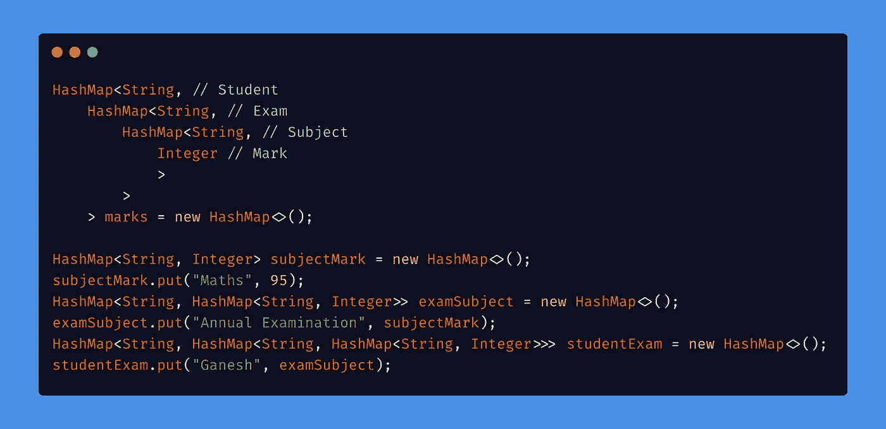
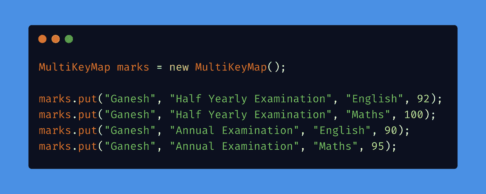
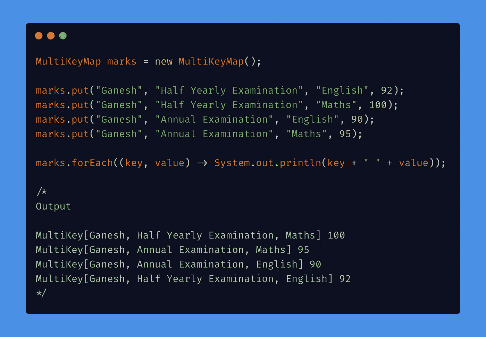
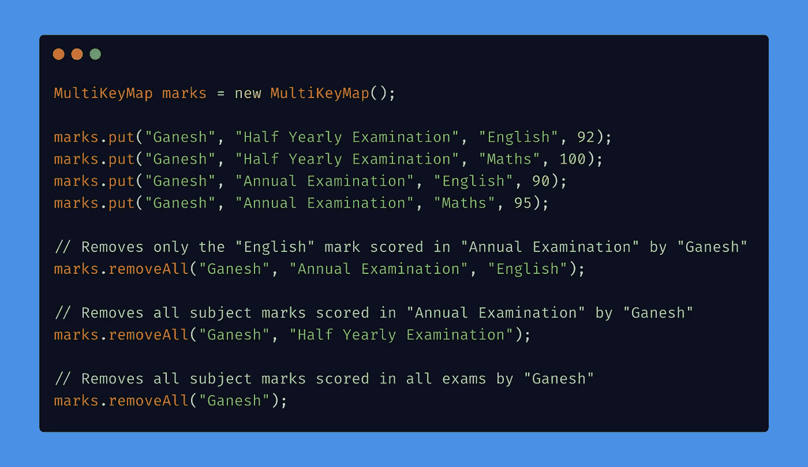

# 了解 Apache 多键映射

> 原文：<https://medium.com/nerd-for-tech/understanding-apache-multikeymap-170fe518cb96?source=collection_archive---------1----------------------->

## 一种数据结构，用于在映射中存储具有多个键的值

[春丽居](https://unsplash.com/@chunlea?utm_source=medium&utm_medium=referral)在 [Unsplash](https://unsplash.com?utm_source=medium&utm_medium=referral) 上拍照

# 概观

HashMap 是一种很棒的数据结构，它以键-值对的形式存储数据，在 ***O(1)*** 时间内提供插入、更新、检索和删除操作。

HashMap 有一个限制，它只能有一个键。但是等等。为什么一个值需要多个键？让我们看一个例子。

假设我们想通过**学生**、**考试、**和**科目**来查询一个学生的成绩。典型的解决方案是创建一个嵌套地图，如下所示。

使用嵌套映射实现

但是看看代码有多复杂。如果有大量的键，可能会变得更加复杂。这可以用 [**多键映射**](https://commons.apache.org/proper/commons-collections/apidocs/org/apache/commons/collections4/map/MultiKeyMap.html) **解决。它是阿帕奇 [**公地集合 4**](https://mvnrepository.com/artifact/org.apache.commons/commons-collections4) 包的一部分。**

# **多键映射**

现在让我们使用**多键映射来实现上述特性。**

## 将值插入多键映射

使用多键映射实现

在上面的代码中，put 方法的前 3 个参数是键，最后一个参数是值。

## 迭代多键映射

使用 **forEach** 迭代器可以很容易地迭代多键映射。

迭代多键映射

看看上面代码的输出。所有的键都存储为[**multi key**](https://commons.apache.org/proper/commons-collections/apidocs/org/apache/commons/collections4/keyvalue/MultiKey.html)**，这是 Apache commons-collections 库提供的一种**数据结构。这就是所有密钥在内部存储的方式。

## 从多键映射中删除值

可以使用单个键或多个键从多键映射中删除值。

从多键映射中删除值

完整的代码可以从下面的网站下载

# 结论

当我们需要使用多个键来查找时，多键映射就很方便了。多键映射也有一个限制，即它最多支持 5 个键。该库可以从官方 [**Maven 资源库下载。**](https://mvnrepository.com/artifact/org.apache.commons/commons-collections4)

# 谢谢你🤘

想了解我更多，请访问 [**ganeshkumarm.me**](https://www.ganeshkumarm.me/)

