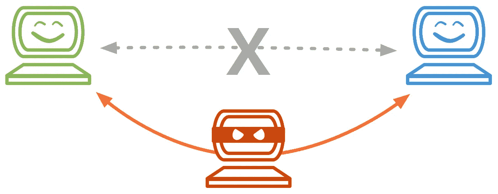
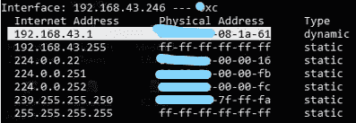
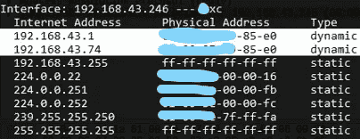

# 了解 ARP 并执行 ARP 欺骗攻击

> 原文：<https://medium.com/nerd-for-tech/understanding-arp-and-performing-arp-spoofing-attack-e3b6a39de873?source=collection_archive---------4----------------------->

我们将首先理解地址解析协议，然后使用*ARP 欺骗执行 ARP 欺骗攻击。*

# **地址解析协议**

ARP 是一种通信协议，用于将动态互联网协议地址(IP)映射/解析为静态媒体访问控制地址(MAC)。

> 互联网协议(IP)是逻辑 32 位地址，是网络层协议，而 MAC 是物理 48 位地址，位于数据链路层。ARP 工作在 OSI 模型的第 2 层和第 3 层之间。

还要提一下，ARP 是一个请求-响应协议；因为它基于请求及其相应的响应工作。它总是在单个网段下运行，从不通过网关或路由器进行路由。

**ARP 是如何工作的？**

假设魔鬼和天使连接在同一个局域网中。现在魔鬼想开始与天使交流。于是魔鬼先用 DNS 获取天使的 IP 地址为 192.168.43.1。魔鬼也需要天使的 MAC 地址来启动通信，因为 IP 是一个动态的逻辑地址。

每台计算机都维护一个 ARP 缓存表(其中存储了具有相应 MAC 地址的 IP 条目)。所以魔鬼的机器会先在 ARP 缓存表中寻找天使的 IP (192.168.43.1)对应的 MAC 的条目。如果找到了，魔鬼就会直接开始通讯。否则，为了获得天使的 MAC，它将在网络中广播具有其自己的 IP (192.168.43.246)、MAC、天使的 IP(目的地 IP)和广播 MAC (FF:FF:FF:FF:FF: FF 作为目的地 MAC)的分组。连接到同一个网络的每台计算机都会收到这个数据包。只有安吉尔的计算机会接受这个数据包(当目的 IP 匹配时)。然后，它将发送一个响应，其中包含天使的 MAC 和 IP(作为源地址)和魔鬼的 MAC 和 IP(作为目的地址)。现在 devil 和 angle 的电脑都会更新各自的 ARP 缓存表，开始通信。

使用 Wireshark 捕获的 ARP 广播消息(不要将其与上述示例联系起来)

**ARP 欺骗**

[https://docs.cpanel.net/img/mitm.png](https://docs.cpanel.net/img/mitm.png)

正如我们在上面看到的，ARP 协议是多么简单。恶意行为者利用了 ARP 的简单性。ARP 没有任何安全检查或响应验证检查。因此，攻击者可以欺骗 ARP 响应来执行 ARP 欺骗攻击。

假设一个恶意的演员僵尸想要进行 ARP 欺骗攻击，拦截魔鬼的机器和魔鬼连接的默认网关之间的通信。为此，僵尸将试图操纵魔鬼机器中的 ARP 缓存表。僵尸将发送一个虚假的 ARP 响应到魔鬼的机器，这意味着将僵尸的 MAC 关联到默认网关的 IP。所以在收到这个假响应后，魔鬼的机器会假设僵尸的机器的 MAC 地址是默认网关的 MAC 地址，但这不是实际情况。同样，Zombie 可以向默认网关发送一个假的响应消息，将 Zombie 的 MAC 与 devil 的 IP 关联在默认网关缓存表中。通过成功地做到这一点，僵尸变成了中间人，可以拦截所有的流量。

# 执行 ARP 欺骗攻击

我们将使用运行在虚拟机器上的 Kali 机器作为攻击者，使用 Windows 主机作为受害者。

> 确保在 Kali 中启用了桥接网络，以便它也可以连接到与 Windows 计算机连接的相同默认网关(在本例中为路由器)。

攻击前的 ARP 缓存表

在 windows 上，打开 CMD 并使用命令 *arp -a* 显示 arp 缓存表。现在打开 Kali 机器并在其上启用端口转发。在 kali 中打开两个不同的终端，在第一个终端 ***中运行以下命令 ARP spoof–I【接口】–t【目标 IP】【路由器 IP】****，在第二个终端上运行***ARP spoof–I【接口】–t【路由器 IP】【目标 IP】****。**

********

> **[interface] =您可以使用 *ifconfig* 识别 kali 机器上的接口，使用 CMD 中的 *ipconfig* 可以找到【目标 IP】和【路由器 IP】。**
> 
> **在我这里 *eth2* 是接口，192.168.43.1 是网关的 IP，192.168.43.246 是 Windows 的机器 IP，192.168.43.74 是 kali 的 IP**

****

**攻击后的 ARP 缓存表**

**在上图中，可以看到 MAC 对应的路由器被更改为 kali 的 MAC**

**在执行这两个命令时，它会向目标 Windows 机器和默认网关发送虚假的 ARP 数据包。为了验证攻击的执行，在 Windows 机器上使用 *arp -a* ，你会发现缓存表被与默认网关的 IP 对应的 kali 机器的 MAC 的假条目操纵。要终止这种攻击，在两个 kali 终端上按下 *ctrl+c* ，并再次使用 *arp -a* 进行确认。现在 ARP 缓存表将恢复到原来的状态。**

**成功的 ARP 欺骗攻击可以为一些更严重的攻击打开大门，如中间人、拒绝服务和会话劫持。**

**上述攻击仅用于教育目的。**

**对于任何技术或其他错误，随时与我联系，以便进一步的读者受益。**

**感谢您的阅读。知识就是力量，所以不断获取！😈**

**在 GitHub 上关注我吧！**