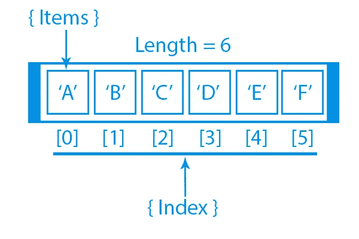

# 理解 JavaScript 中的数组

> 原文：<https://medium.com/nerd-for-tech/understanding-arrays-in-javascript-6472e3dfb1c5?source=collection_archive---------4----------------------->



数组是最简单的数据结构，其中每个数据元素都可以通过使用其索引号直接获得。

在 JavaScript 中，数组是用于存储不同元素的单个变量。

例如，如果我们想存储一个足球运动员在 5 场比赛中的得分，那么就没有必要为每场比赛定义单独的变量。相反，我们可以定义一个数组，将数据元素存储在连续的内存位置。

*   数组 **scores[5]** 定义了足球运动员在 5 场不同比赛中的得分，其中每场比赛的得分位于数组中的特定位置
*   例如**标记[0]** 表示第一局的得分，**标记[1]** 表示第二局的得分，以此类推。

**声明一个数组**声明一个数组有两种方法。
**举例:**

```
var Scores= [ ]; // method 1 
var Scores= new Array(); // method 2
```

有时，您的应用程序可能会处理一系列对象。例如，购物列表中的产品列表，或者用户选择的颜色列表。在这种情况下，可以使用数组来存储列表。

让我告诉你怎么做。所以这里我要声明另一个变量叫做 selected objects。

```
let selectedObjects=['cup','table','plate'];
```

这里我使用了一个有意义的名字。我没有 vr 或者其他什么古怪的名字。

现在我们可以初始化它，并将其设置为一个空数组。所以方括号就是我们所说的数组字面量。它们表示一个空数组。现在，我们将初始化这个数组，并添加几个项目，如一个杯子。

现在让我们在控制台上记录这一点。

```
console.log(selectedObjects);
```

当你想访问一个数组中的元素时，你可以使用索引。

现在让我们指定索引:

```
console.log(selectedObjects[0]);
```

JavaScript 是一种动态语言。所以变量的类型可以在运行时改变。同样的原理也适用于我们的数组。

所以数组的长度，以及数组中对象的类型都是动态的，它们可以改变。

让我们把这个数组从三个元素初始化为四个，我们可以给这个数组添加另一个元素，所以数组会扩展。

```
 let selectedObjects=['cup','table','plate'];
selectedObjects[3]='chair';
console.log(selectedObjects); 
```

# **结论**

数组是一种特殊类型的对象。JavaScript 中的`typeof`操作符返回数组的“object”。JavaScript 数组最好被描述为数组。数组使用**数字**来访问它的“元素”。JavaScript 变量可以是对象。数组是特殊类型的对象。因此，在同一个数组中可以有不同类型的变量。数组中可以有对象。数组中可以有函数。数组中可以有数组。

快乐学习！