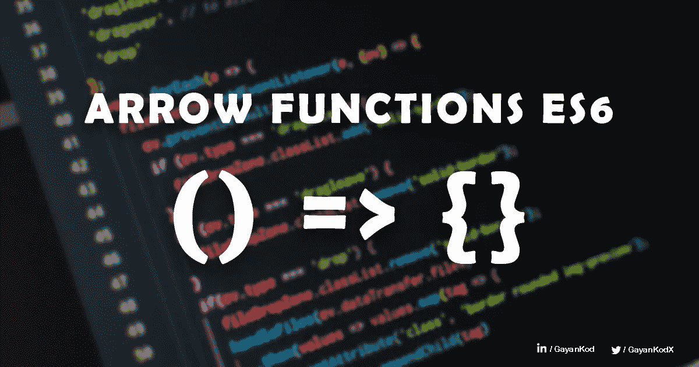
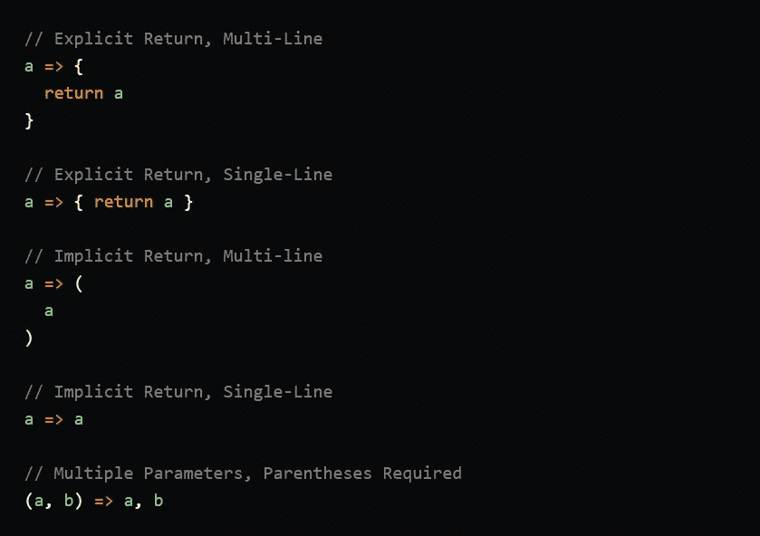
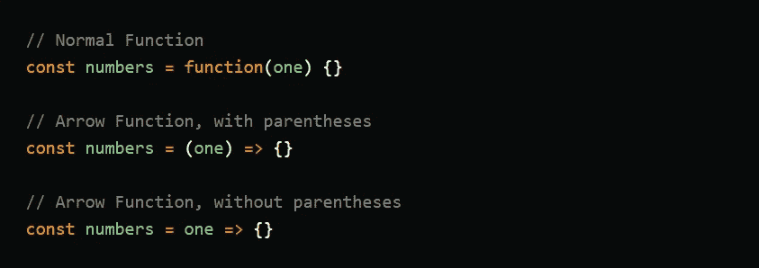
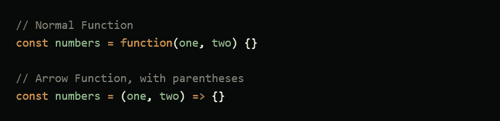

# 理解 JavaScript ES6 中的箭头函数—完整指南

> 原文：<https://medium.com/nerd-for-tech/understanding-arrow-functions-in-javascript-es6-3fa900b3c1c6?source=collection_archive---------1----------------------->



JavaScript 是推动网络发展的语言。网络当然被它所主宰。你可能想知道 ES6 是什么意思？你可能见过 ES4，ES5，ES6…术语。Javascript 甚至并不总是被称为 Javascript。事实上，当 Brendan 第一次创建它时，它实际上被称为 LiveScript，然后微软的人决定尝试对程序进行逆向工程，他们最终得到了一个叫 Jscript 的东西。因此，网络上运行着各种略有不同的 Javascript 版本，这开始变得相当混乱。因此，欧洲人做了欧洲人最擅长的事情，他们决定标准化这种语言。这就是 ECMAscript 的来源。那代表欧洲计算机制造商协会的文字。有趣的唯一原因是，你经常会看到不同版本的 Javascript，不是 JS5 或 JS6，而是 ES6 或 ES7，ES 当然来自 ECMAscript。所以在 JS 的 ES6 版本中引入了箭头函数。

好了，历史到此为止。
让我们看看什么是箭头功能以及它是如何工作的！

当你明白那里会发生什么时，这就很容易了。但是如果你不知道箭头功能背后的概念是什么。我肯定你已经搞不清楚那两个大括号、箭头和两个花括号是什么意思了。

简单的箭头功能也是一个普通的功能。但是它被简化以减少代码行。

# 简单函数➜箭头函数的步骤

```
function myFunction(a, b){
  return a * b;
}
```

这是一个普通的 javascript 函数，它返回两个参数 a 和 b 的乘积。

但是我们可以不用函数名来写这个函数。调用 JS 中的匿名函数。

```
function (a, b){
  return a * b;
}
```

现在，你可能会想，如果没有函数名，我们怎么调用这个函数，如果不调用这个函数，这个函数有什么用。好吧，我同意，但是这些匿名函数不是为了调用而写的。

例如，假设我们有一个按钮来获取两个数字的乘积。为此，我们必须为 onClick 编写一个函数。所以我们可以直接用匿名函数这样写。

```
<button onClick={function(a,b){
     return a*b;
}}> 
   Get Product
</button> 
```

澄清了这一点，现在让我们看看下一步。

我们也可以删除“function”关键字。让我们去掉函数关键字。

```
(a, b){          //This will give an error
  return a * b;
}
```

但是这将会给出一个错误，所以在去掉 function 关键字之后你需要放一个箭头。

```
(a, b) => {
  return a * b;
}//let's write it in one line
(a, b) => {return a * b;}
```

如你所见，这是 JS 中基本的箭头函数。箭头函数也是一个被简化的函数。
去掉函数名和函数关键字即可。我们需要放一个箭头，而不是 function 关键字。
希望你现在已经了解了 JavaScript 中的箭头函数！

现在看看前面的例子。我们可以简单地写成如下。

```
<button onClick={(a,b)=>{return a*b;}}> 
   Get Product
</button>
```

等等，另一个重要的事实！如果你的函数只有一行，你不需要用花括号把那一行括起来。在这种情况下，不需要用花括号将 return a*b 括起来，也不需要编写 return 关键字。编译器知道应该返回。

```
<button onClick={(a,b)=> a*b}> 
   Get Product
</button>
```

简单来说，我们可以这样写箭头函数。现在你可以知道为什么在 JS 中使用箭头函数了。在开发一个复杂的系统时，它减少了许多代码行。

同样，用 JavaScript 编写箭头函数有很多种方法。现在让我们快速了解一下如何编写一个箭头函数。

# JS 中箭头函数的备忘单。



备忘单—箭头功能 ES6

这是箭头函数 ES6 的备忘单。
也许当你看到这个的时候，你会觉得这到底是什么，就像那个……:D 别担心，我会在这个备忘单里解释一切。让我们去…

# 隐性与显性回报

首先，你需要明白什么是隐式返回和显式返回。

对于普通函数，如果你想返回某个东西，你必须使用`return`关键字。箭头函数也有。当您使用`return`关键字时，它被称为**显式返回**。
然而，箭头函数允许所谓的**隐式返回**，其中可以跳过`return`关键字。让我们看一些例子。

示例 A:正常功能

```
const sayHi = function(name) {
  return name
}
```

示例 B:带有显式返回的箭头函数

```
// Multi-line
const sayHi = (name) => {
  return name
}

// Single-line
const sayHi = (name) => { return name }
```

示例 C:带有隐式返回的箭头函数

```
// Single-line
const sayHi = (name) => name

// Multi-line
const sayHi = (name) => (
  name
)
```

**注意到区别了吗？**使用花括号`{}`时，需要明确声明返回。然而，当你不使用花括号时，`return`是隐含的，你不需要它。

这实际上有一个名字。

当你在*例子 B* 中使用花括号时，它被称为**块体。**
和*例 C 中的语法*称为**简洁体。**

简单来说，

*   Block body 是使用花括号的地方，并且有一个显式的`return`。
*   简洁的正文是你不用花括号的地方，你跳过了`return`关键字。

## 好了，关于箭头函数的括号()的另一件事。

首先，括号的意思是我们放在函数中用来包装参数的两个大括号。有时候会是空的。

所以，在普通函数中，我们总是需要括号。但是在箭头函数中，如果只有一个参数，我们就不需要括号。

## —括号对于单个参数是可选的—



## —多个参数需要括号—



# 重要—返回对象

然而，当你在 Arrow 函数中返回一个对象时，即使函数中只有一行，你也应该加上括号。

```
const me = () => { name: "Gayan" };

me(); //Output --> undefined
```

上面那个是错的❌

```
const me = () => ({ name: "Gayan" });

me(); //Output --> { name: "Gayan" }
```

这是正确的✅

就这些了。我希望你对箭头函数 ES6 有所了解，并且觉得这篇文章很有用，我也希望看到你对这篇文章的反馈。或者如果你有任何问题，请把它们都放在评论区，我会回复你。

关注我的 [Twitter @gayankodX](https://twitter.com/GayanKodX) 了解更多更新！