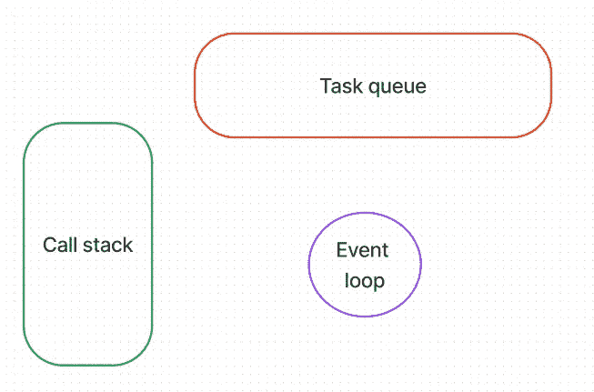
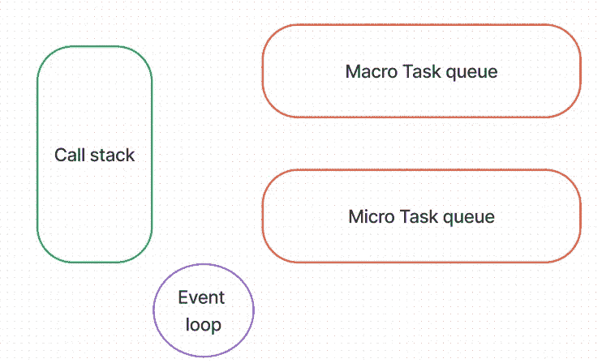

# 理解 JS 中的异步、事件循环、任务队列

> 原文：<https://medium.com/nerd-for-tech/understanding-async-event-loop-task-queue-in-js-86e956985dc2?source=collection_archive---------0----------------------->

我们知道 Javascript 是单线程和同步的。在此阅读更多关于此[的内容。](https://www.pansofarjun.com/post/understanding-execution-context-hoisting-call-stack-closures-scope-block-in-javascript)

> ***单线程*** *=一次处理一行。*
> 
> ***同步*** *=顺序=一个接一个。*

下面给罗生门对**同步性的影响。**

*   如果它一个接一个地处理，第二行等待第一行，第三行等待代码中的第二行，依此类推。
*   如果任何一行或块花费更多的时间，后面的行或块将不得不等到前者完成。
*   但是我们可能在代码中有一些行的完成时间不受 javascript 执行的控制。
*   如果那些不受控的需要' **x** 秒才能完成，那么后面的行或块应该等待' **x** 秒。所以**同步**是

> 我不知道完成这个过程需要多少时间。 ***请等待*** *这个任意的时间对你执行死刑。*

*   这是同步系统或执行的限制。我们无法承受特定块或代码不受控制的时间来执行其余的代码。
*   这就是**异步编程**的进化点。

所以**异步**是

> 我不知道完成这个过程需要多少时间。 ***不要为了我而暂停你的执行*** *。*

异步主要来自 API 调用和超时。我们稍后会看到这一点。

举个例子，

```
const a = 1; 
let b = 2; // After 3 seconds,it will  run 
setTimeout(() => {   
console.log(a)   
console.log(b)   
},3000); console.log('Hello')    
b = 3;
```

当您运行上面的代码时，输出将是

```
Hello 
// After 3 seconds, 
1 
3
```

当 JS 识别 setTimeout 函数时，超时运行 3 秒。当超时结束时，它将其放入一个**队列**。谁运行超时？在大多数情况下，它将是运行它的一些内部机制(浏览器引擎或节点 js)。

**还记得排队吗？**

发生这种情况是因为 JS 不能等待 3 秒来执行其余的代码。所以异步操作因为这个**队列**而发生。

> ***栈*** *用于同步执行。*
> 
> ***队列*** *用于异步执行。*

因此，它将 setTimeout 放入队列中，并跳转到下面的代码。它打印**‘你好’。**

然后' **b'** 被重新分配给 **3。**

3 秒钟后，setTimeout 函数被推入**队列。**反正 setTimeout 里面有回调函数(匿名)。

这个匿名回调函数被推入调用堆栈。为此函数和作用域创建了单独的执行上下文。

当到达安慰**‘a’**时，打印 **1。**

当到达安慰【T6’b’时，打印 **3。等等！为什么不是 2？**

这是因为 **b** 的第一次重新分配发生，然后 setTimeout 发生，即使 setTimeout 在代码中的重新分配之前发生。感谢 JS 的异步性。

谁来协调堆栈和队列？等等！我们将这个队列命名为**任务队列。**

这个协调器被称为**事件循环。**

**堆栈 vs 队列？**


堆栈与队列

**堆叠** =垂直排列=便于移除**顶部**最多账面= **最后**增加账面=后进先出(LIFO)

**队列** =水平排列=便于取出**第一个**书= **第一个**加书=先进先出(FIFO)



事件循环

*在执行调用堆栈中的程序时，假设某个任务被添加到任务队列中(例如超时结束)。这种情况下* ***事件循环*** *做什么？*

这个答案很重要！我们知道 JS 是**同步**，然后我们添加**异步**作为**附加**特性。

由于同步与调用栈有关，只有当**调用栈**为空时，事件循环**才会寻找**任务队列。****

任务队列程序的运行方式和同步程序一样。两者的唯一区别是谁控制着程序完成的时间。

> ***事件循环*** 只在 ***调用栈*** 为空时寻找任务队列。

如果队列中有更多任务，将首先挑选哪些任务？先进先出。队列中最先到达的任务=任务中最早的任务。

嗯！异步没有那么简单。

还记得 setTimeout 函数吧？在某种程度上，我们确定代码将在 3 秒后运行，但是时间不是由 javascript 管理的。因为我们作为开发者通过指定时间打破了同步性。

> 任何打破同步的东西=异步。

让我们看另一个场景，

我们需要来自另一个应用程序的数据。所以我们向那个应用程序发送一个 ***API*** ***请求*** ，最后由 ***API 响应*** 获取数据。

基于我们获得的数据，我们使用这些数据进行一些操作，比如在屏幕上呈现表格。

我们将在这里做一些调查。

**setTimeout** 和 **API** 调用都会中断同步操作，因为这需要时间来完成，因此会中断执行的同步流程。因此**异步**！

在 setTimeout 的情况下，我们将执行的代码是预定义的和谨慎的，但是在 API 调用的情况下，代码取决于我们作为响应获得的**数据**。

我们确定 setTimeout 函数中的**结果/输出**，除非代码中出现一些错误。

API 代码的预期结果/输出为**不确定**。如果我们想把它显示在表格中，我们事先不知道有多少行和列。这类场景在 JS 中被称为**承诺**。

承诺超出了本文的范围，我们将有一个不同的专用帖子。

根据经验，记住这一点。

> **承诺** =代码依赖于响应数据，并且数据来自代码执行的另一个应用程序=结果/输出不确定。

所以有两种类型的异步任务——独立的和相关的。

它们需要分别对待。如果分开，哪一个需要优先？谁优先？再次事件循环！

哪一个故意打破同步性？它是 setTimeout，因为我们通过给定一个指定的时间来推迟执行。但是在 API 调用的情况下，时间不在我们手中。我们需要在收到回复后立即使用这些数据。所以我们没有刻意推迟行刑。

**自然要优先考虑 API 调用。**

我们如何区分任务？

需要有另一个队列，这个队列称为**微任务队列**。所以我们将已经建立的队列重命名为**宏任务队列。**



要记住的一点:

*   JS 利用任务队列进行异步操作。
*   有两种异步操作——依赖的(承诺)和独立的(Settimeout)。
*   因此有两个队列——微任务和宏任务队列。
*   相对于宏任务队列，微任务队列被给予优先权。微任务将基于承诺的调用(API 调用)排队。
*   调用栈-微任务和宏任务队列的总协调器称为**事件循环。**
*   ***事件循环*** 只在 ***调用栈*** 为空时寻找任何任务队列。

*原载于 2022 年 9 月 16 日 https://www.pansofarjun.com**的* [*。*](https://www.pansofarjun.com/post/understanding-async-event-loop-task-queue-in-js)