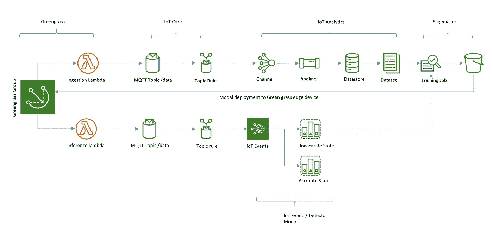
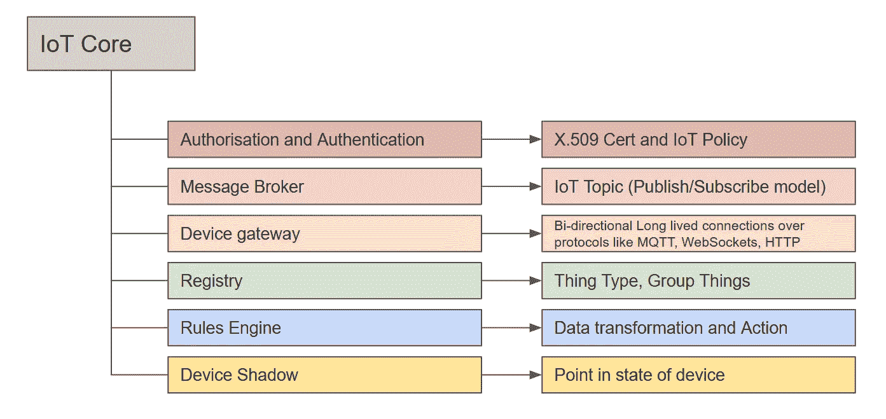
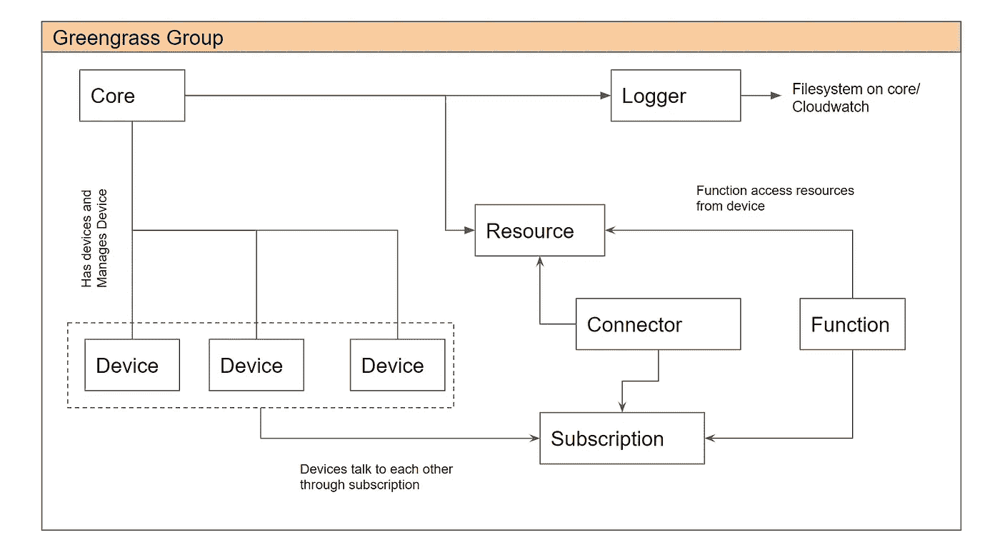
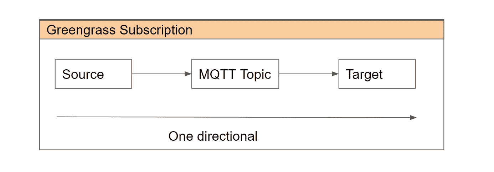
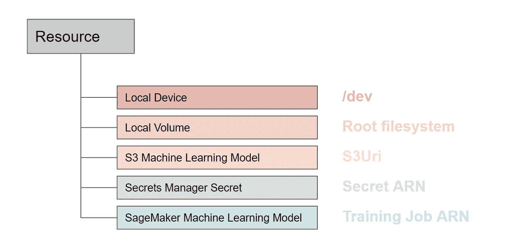
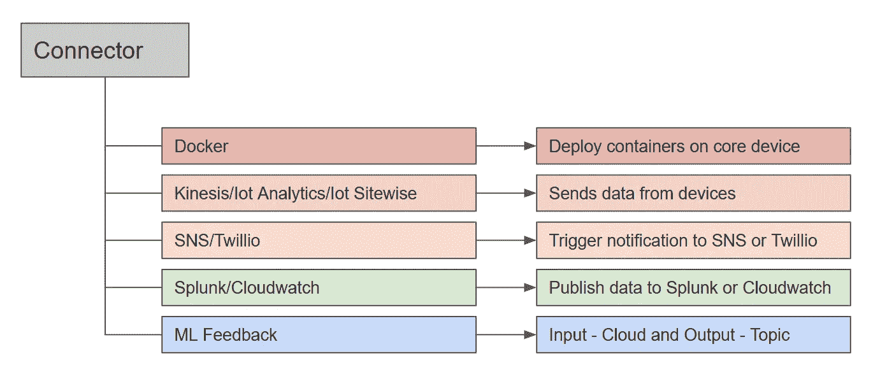
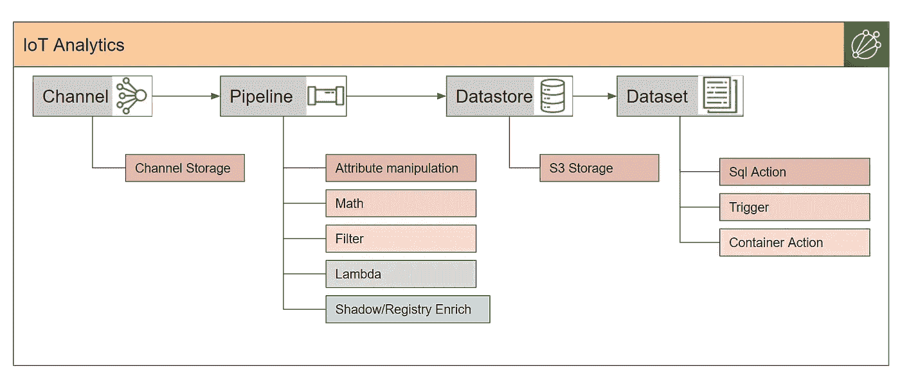
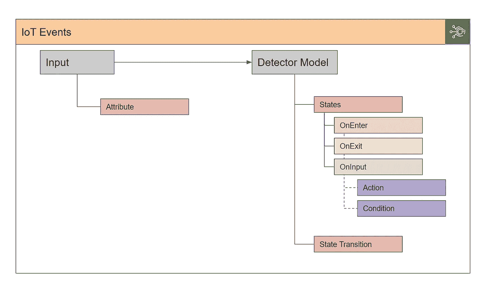

# 了解 AWS IoT — IoT309

> 原文：<https://medium.com/nerd-for-tech/understanding-aws-iot-iot309-f4a7272d483c?source=collection_archive---------0----------------------->

在 [Unsplash](https://unsplash.com/s/photos/smart-home?utm_source=unsplash&utm_medium=referral&utm_content=creditCopyText) 上由 [BENCE BOROS](https://unsplash.com/@benceboros?utm_source=unsplash&utm_medium=referral&utm_content=creditCopyText) 拍摄的照片

我最近在 AWS 物联网上观看了一个来自 [re:Invent 2019](https://www.youtube.com/watch?v=IbunGCa3-YM) 的优秀动手视频。这个帖子也是基于同样的。应用程序的基本流程如下。我们将通过这个例子来理解物联网服务。

在上图中，我添加了服务名称空间。我们将逐一介绍它们以及它们的功能。让我们从物联网核心开始。

**物联网核心**允许我们将物联网设备连接到云。它通过一个证书和物联网政策来实现这一点，该政策授权设备调用 AWS APIs。Message broker 允许设备从云中发布和使用数据。我们可以按类型对资源进行分组，并将它们作为一个实体进行管理。设备阴影有助于了解设备状态，并用于模拟实际设备状态。通过使用规则引擎，我们可以进行各种数据转换，然后采取行动。

**Greengrass** 允许我们在本地管理、分析和处理设备生成的数据。核心是用来管理所有其他设备的东西(物联网东西)。该设备公开其资源供共享使用。它由设备组、记录器、资源、订阅、连接器和功能组成。函数是 lambda 函数，用于在本地执行运行时任务。

**订阅**是一个单向通道，允许设备从源向目标发送消息。如果我们需要来回通信，那么我们需要再创建一个源和目标交换的订阅。

**资源**。如上所述，核心设备暴露了可由功能或连接器消耗的某些资源。在演示应用中，我们使用本地卷将模拟数据从设备发送到物联网核心。

我们有各种类型的**连接器**，允许我们将第三方服务与集团连接。我们甚至可以在受支持的边缘设备上部署容器。

一旦我们在物联网云中有了数据，我们希望对其进行转换、分析和存储，以便长期保留。**物联网分析**允许我们配置执行数据转换的管道。稍后，我们可以将数据传递到 S3 的数据存储区。我们还有数据集，允许我们对数据运行查询(SQL)或分析功能(容器上的笔记本)。

**物联网事件**允许我们检测操作事件。根据检测到的事件或流程状态，它可以触发响应。在我们的演示架构中，我们创建了一个检测器模型。它是根据状态定义的我们的设备或过程的*模型*。

既然我们已经了解了物联网和绿草的基本构造。我们可以从这个[回购](https://github.com/aws-samples/amazon-sagemaker-aws-greengrass-custom-timeseries-forecasting)中部署 CFN，并观察实际情况。

快乐实验！！