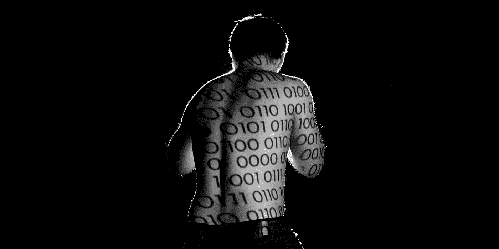

# 理解二进制

> 原文：<https://medium.com/nerd-for-tech/understanding-binary-a373fe1a2489?source=collection_archive---------11----------------------->

0 和 1 的介绍

丹尼尔·兰茜朵在 [Unsplash](https://unsplash.com?utm_source=medium&utm_medium=referral) 上的照片

## 为什么你应该读这篇文章

甚至在我学会如何编码之前，我就知道有一种叫做二进制的东西，它是计算机说的语言。我以为在 15 周的训练营中，我们会讨论难以捉摸的 0 和 1，但我错了。结果是，我用 JavaScript 写的代码被编译成 0 和 1，作为计算机可以理解的指令。你可能会想“好吧，所以我不需要了解二进制或数制来编码，那么我为什么要学习它呢？”尽管理解数字系统并不是编码所必需的，但它对我们理解计算机科学仍然是必不可少的。如果你有兴趣深入研究计算机的工作原理，你应该从数系开始，特别是二进制。

## 我们知道的数字，也就是十进制

照片由[克里斯·利维拉尼](https://unsplash.com/@chrisliverani?utm_source=medium&utm_medium=referral)在 [Unsplash](https://unsplash.com?utm_source=medium&utm_medium=referral) 上拍摄

数字以一种叫做位值符号的方式呈现给我们。这意味着必须知道该数字及其位置(或位值)才能确定其值。

让我们从数字系统的角度来看这个问题。5 本身在我们的数字系统中被认为是第一位的，因此为了确定它的值，我们把它乘以 1，得到 5。如果 5 在第二个位置呢？我们的数字系统中的第二个位置将数字乘以 10，使其值为 50。如果 5 在第三个位置呢？第三个位置将数字乘以 100，使其值为 500。

我肯定你们大多数人现在都在说“废话”。但是像这样分解数字将帮助我们理解我们遇到的其他数字系统。看待上述内容的另一种方式是，通过将 10 提高到一个不断增加的值(将 10 本身乘以一定次数)并将结果乘以该数字来确定每个位置值。由于这些原因，我们的数字系统被称为十进制。在上面的例子中:

> 第一个位置的 5 = 5*10⁰= 5 * 1 = 5
> 第二个位置的 5 = 5 * 10 = 5 * 10 = 50
> 第三个位置的 5 = 5 * 10 = 5 * 100 = 500

数字 10 不仅决定了每个位值的数量级，还代表了每个数字可能值的数量，即 0-9。上面的例子只在不同的位置使用了一个数字，但是如果我们在不同的位置有多个数字呢？

> 第一个位置的 2 =2*1⁰= 2 * 1 = 2
> 第二个位置的 5 = 5 * 1 = 5 * 10 = 50
> 第三个位置的 6 = 6 * 1 = 6 * 100 = 600
> 600+50+2 = 652

需要注意的一点是 0，它表示一个没有值的位置，不管它在什么位置。0 乘以 10 ⁰ (10，000，000，000)仍然是 0。因此，携带数值的最低位数是 1，而不是零。

每个位置只有 10 个可能的数字，当最大可能数字(9)增加 1 时会发生什么？我们将携带值的最低数字添加到下一个位置，并将当前位置重置为 0 或无值。换句话说，9 变成了 10。

## 计算机知道的数字，也就是二进制

图为[翁贝托](https://unsplash.com/@umby?utm_source=medium&utm_medium=referral)在 [Unsplash](https://unsplash.com?utm_source=medium&utm_medium=referral)

现在我们已经复习了小学数学，并介绍了一些新的术语，我们将按照处理以 10 为基数的数字系统的相同方式来分解二进制。

首先，问问自己对二进制了解多少。你的答案很可能是每个位置只能是 0 或 1。根据我们上面讨论的，二进制是什么基数？答案是 2。基数 2 不仅意味着每个位置只能有两个可能的数字中的一个，而且每个位值的数量级以 2 的幂而不是 10 的幂增加，就像我们的数字系统一样。

让我们使用基数为 10 的例子中的模型来分解二进制，使用数字 1

> 第一个位置的 1(1)= 1 *2⁰= 1 * 1 = 1
> 第二个位置的 1(10)= 1 * 2 = 1 * 2 = 2
> 第三个位置的 1(100)= 1 * 2 = 1 * 4 = 4
> 第四个位置的 1(1000)= 1 * 2 = 1 * 8 = 8
> 第五个位置的 1(10000)= 1 *2⁴= 1 * 16 = 16

上面演示了我们如何将二进制数转换为十进制数，这是基于 1 位于不同的位置并且具有不同的位值。如果二进制数是 11111，我们可以将上述所有值相加，得到十进制的总值

> 11111 = 1 + 10 + 100 + 1000 + 10000 = 1 + 2 + 4 + 8 + 16 = 31

另一种看待这个问题的方式是

> 11111 是 100000 减 1 或
> (1 * 2⁵) - 1 = 32 - 1 = 31

为了理解这一点，我们需要做一些基本的二进制计数。0 和 1 是每个位置仅有的两个可能的数字，1 是具有最高值的数字。从 0 开始，如果我们加 1，我们得到 1(如果我们把 1 加到 0，我们在十进制中看到的是一样的)。如果我们把 1 加 1 会怎么样？就像十进制中的 9 一样，当我们将二进制中的 1 加 1 时，我们将值的最低位添加到下一个位置，并重置当前位置。

> 1 + 1 = 10

按照这种增加 1 的模式

> 0
> 1
> 10
> 11
> 100
> 101
> 110
> 111
> 1000

将二进制的 0–100 转换为十进制:

> 0 = 0 *2⁰= 0 * 1 = 0
> 1 = 1 *2⁰= 1 * 1 = 1
> 10 =(1 * 2)+(0 *2⁰)=(1 * 2)+(0 * 1)= 2+0 = 2
> 11 =(1 * 2)+(1 *2⁰)=(1 * 2)+(1 * 1)= 2+1 = 3
> 100 =(1 * 2)+(0 * 2)+(0 * 2⁰)=(1 * 4)+

这有助于我们理解二进制作为一个数字系统，但它们在计算机中的真正价值不仅仅是以不同的方式表示十进制数。

照片由 [Tim Hüfner](https://unsplash.com/@huefnerdesign?utm_source=medium&utm_medium=referral) 在 [Unsplash](https://unsplash.com?utm_source=medium&utm_medium=referral) 上拍摄

## 构建模块中的二进制转换

一系列的 0 和 1 是如何成为曾经存在过的每一个计算机应用程序的？正如字母可以组合成单词，单词可以组合成句子，句子可以组合成段落。二进制可以被分组来表示一切，从简单的十进制数(正如我们在上面看到的)到复杂而精细的指示计算机游戏中角色行为的指令。

上面，在比较二进制和我们的数字系统时，0 和 1 被称为数字。然而，在二进制是所有计算机操作基础的代码中，0 和 1 是比特。也就是说，0 本身是一个比特，1 本身也是一个比特。当八个位组合在一起时，就形成了一个字节。终于有个熟悉的名词了！

除了数字，一个字节最简单的用途之一是代表一个字母。这是通过美国信息交换标准码或 ASCII 实现的，ASCII 是“电子通信的字符编码标准”。ASCII 码代表计算机中的文本”。

> ABC:010000001000010 01000011
> 你好，世界！: 01001000 01100101 01101100 01101100 01101111 00101100 00100000 01110111 01101111 01110010 01101100 01100100 00100001

*(把自己的秘密消息做成二进制* [*这里*](https://www.rapidtables.com/convert/number/ascii-to-binary.html) *)*

如果一个字节只能容纳一个字母，你可以想象一首歌、一部电影或一个游戏需要多少个。

这显然是一个广泛的话题，但正如这篇文章的副标题所说，这是一个“0 和 1 的介绍”，而不是一个权威的指南。我希望这篇文章可以作为您自己探索二进制和其他计算机科学概念的起点。