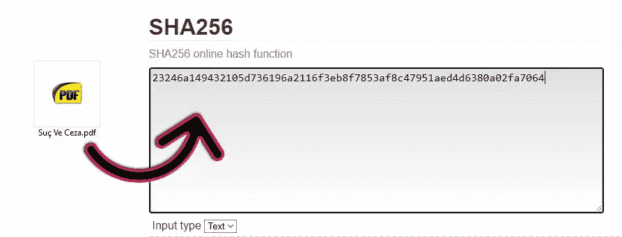
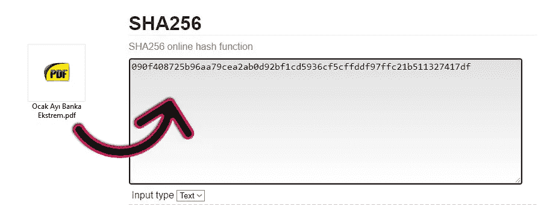
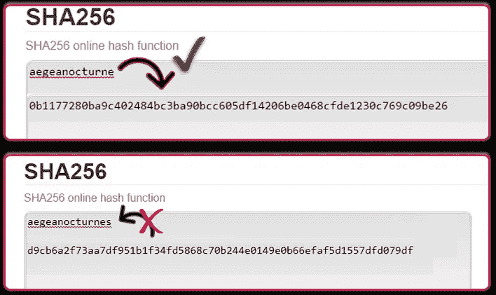
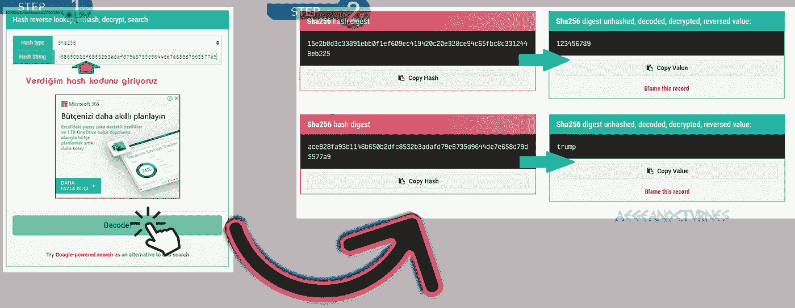
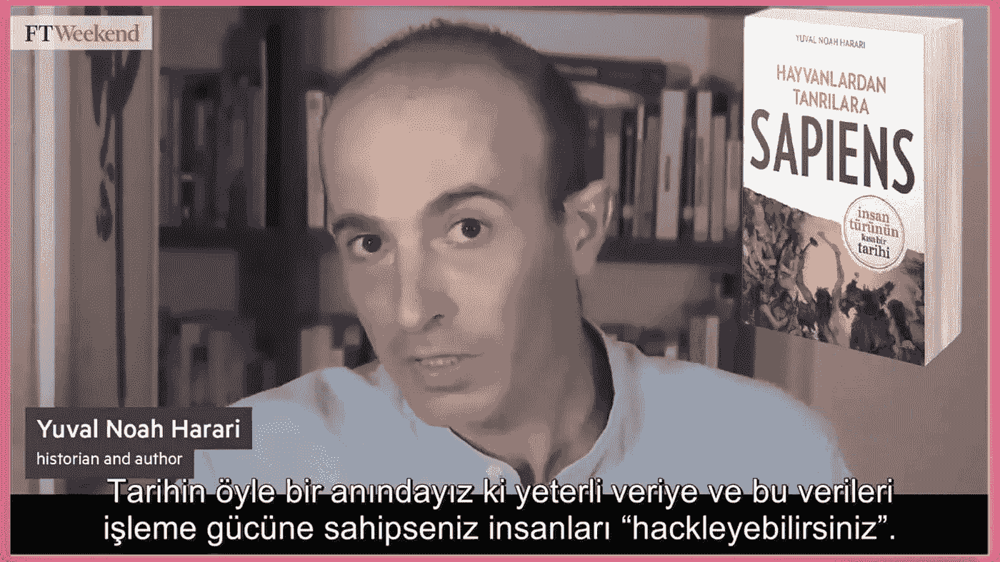

# 理解比特币的算法并破解 SHA256

> 原文：<https://medium.com/nerd-for-tech/understanding-bitcoins-algorithm-and-breaking-sha256-42a636cc9de6?source=collection_archive---------0----------------------->

## 你准备好搞清楚比特币的算法了吗？

在本文中，我们将非常简单地了解 SHA256 算法，然后评估它与比特币的关系。所以让我们摇滚吧！

伙计们，下图中用紫色箭头显示的加密数据称为哈希。当我们说“散列”时，我们将理解数据的加密输出。红色箭头指向的是主数据，也就是加密的内容。这意味着输入。

【aegeanocturne 这个词是根据 sha 256 algorithm.jpg 加密的

哈希在数字媒体中用于加密数据和区分数据是否被篡改。

**如果我们把主题再亮一点:** 把输入转换成同样固定长度的加密输出的数学运算叫做 hash。根据使用的算法，输出中的字符数可以是 32、64、10 等数字。由于我们正在讨论 SHA256 算法，这是比特币在本文中使用的算法，因此输出将是 256 位，即 64 个字符长。
无论输入的是一个单词、一个字母，还是一卷卷的百科全书，SHA256 算法的 hash 总是一个固定的字符长度。(64 个字符)

**陀思妥耶夫斯基的罪与罚小说，共 687 页，用 SHA256 算法加密**

我一月份的银行对账单只有两页

**那么把数据转换成 hash 的目的是什么呢？**
1)加密数据
2)证明该数据原始性。也就是验证它是否被篡改过。这使得诸如身份验证、文件验证、接收者、所有者验证等交易变得容易和可靠。使用 SHA-256 散列码，很容易验证文件、钱包、官方文件、文凭是否被篡改。

**请注意，即使一个字母发生变化，算法也会完全重新生成。这使得预测算法几乎是不可能的。即无法建立投入与产出变化之间的联系，无法进行统计推断，也无法建立投入与产出之间的线性关系！！**

这个我们到目前为止解释过的 SHA 256 算法，就是比特币网络中使用的哈希算法。在下面的[这个链接](https://www.blockchain.com/btc/unconfirmed-transactions)上，可以查看 hash 格式的即时比特币交易，sha-256 加密。

# SHA 256 密码破解

从加密的 SHA256 输出(哈希)获得原始数据只有在逐一尝试每个组合并失败的情况下才有可能。考虑到有 10 个数字和 29 个字母，要找出这 39 个数字和字母在 64 个字符的密码中有多少种不同的排列方式是相当困难的。你应该试试⁵⁶组合，这样你就能找到密码。这种尝试的次数甚至比世界海滩上所有沙粒的数量还要多！

但是，有一些破解网站可以帮助破解 SHA256 哈希码。这些网站/公司手中都有庞大的数据库。实际上，这个过程是基于这样一个原则:获取你发送的加密散列码，在数据库中进行匹配，并找到它的等价物。然而，你在这些网站上成功的几率并没有你想象的那么高。因为在这些数据库中，只保留先前确定的、暴露的或解析的密码的记录。

## 例如:

> *ace 828 fa 93 b 1146 b 650 b 2 DFC 8532 b 3 adafd 79 e 8735d 9644 de 7 e 658d 79d 5577 a 9
> 或
> 15 e 2 b 0d 3c 33891 ebb 0 f1 ef 609 EC 419420 c 20 e 320 ce 94 c 65 FBC 8 c 3312448 EB 225*

当你把上面的一个散列复制到下面名为 [MD5Hashing](https://md5hashing.net/hash) 的破解网站，用解码按钮解码，它会在几秒钟内破解 sha256 算法。

 [## MD5 哈希

### 哈希函数是将可变长度的数据映射到固定长度的数据的任何算法。由…返回的值

md5hashing.net](https://md5hashing.net/hash) 

我们之所以能在这么几秒内轻松破解 sha256 哈希码，是因为加密的数据非常容易。如图所示，我给了你 ***123456789*** 和 ***trump*** 密码的哈希码。既然这样简单的数据以前就出现在别人的脑海中，解码并双面保存到数据库中，自然地，当我们输入相同的内容时，系统会立即匹配其响应并呈现给我们。

众所周知，每笔比特币交易都会生成自己唯一的哈希码。换句话说，你发送到比特币网络的交易指令，可以被世界上任何一个人看做一个哈希(加密)。然而，这个散列是唯一的，并且以前不可能被输入到数据库中。自然，破解网站的数据库无法解决首次创建的 btc 哈希。

以 2021 年的技术来看，用 SHA256 算法解决一个 hash 的几率，也就是转换成主输入的几率是非常非常低的。因为求解一个 hash 需要大量的数学(组合)处理、CPU-GPU 功率和电能。用现在的电脑破解一个精心设计的密码可能需要几千年。

**我们正处在这样一个历史时刻，如果你有足够的数据和处理这些数据的能力，你就可以黑掉、控制和抢劫人。**

SHA256 的输出在字符数方面比 SHA512 更短，在带宽方面更有效。SHA-256 算法还不容易破解。而且 SHA256 算法，如 SHA-512 算法相比其他安全顶模型计算速度更快，是目前应用最广泛的算法之一。然而，IT 专家谈到 SHA-256 可能很快就会变得脆弱的指控和发展。互联网、CPU 和 GPU 速度的未来发展可能需要慢慢向 SHA-512 靠拢。也许在几十年甚至更近的将来，一台量子计算机被开发出来，可以通过尝试世界上所有的组合在短时间内破解一个散列码。当然，实现这一点将意味着到目前为止存储的所有数据和密码都将面临危险。然后，在这种情况下，所有现有的金融、军事、官僚基础设施及其数据都必须用量子密码重新加密。

## aegeanocturne Turco 经济学家。

 [## LinkedIn 数据泄露- 5 亿条记录泄露并被出售

### 更新于 07/04:我们更新了我们的个人数据泄漏检查器数据库，其中包含 780，000 多个相关的电子邮件地址…

cybernews.com](https://cybernews.com/news/stolen-data-of-500-million-linkedin-users-being-sold-online-2-million-leaked-as-proof-2/) 

恐怕全世界的黑客都在攻击，窃取存储 sha-256 哈希。在未来的处理器技术中，这些散列会非常有用👍

算法比特币数学加密分享经济