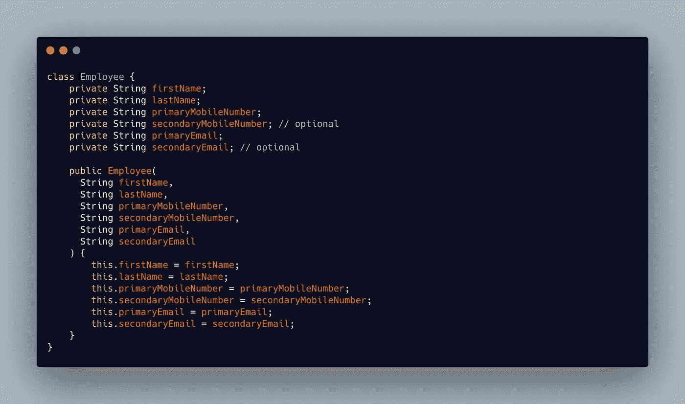
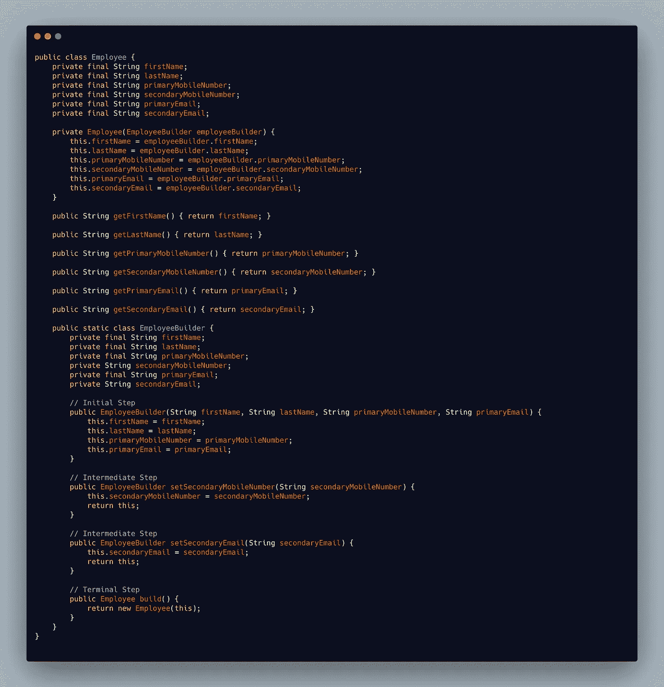
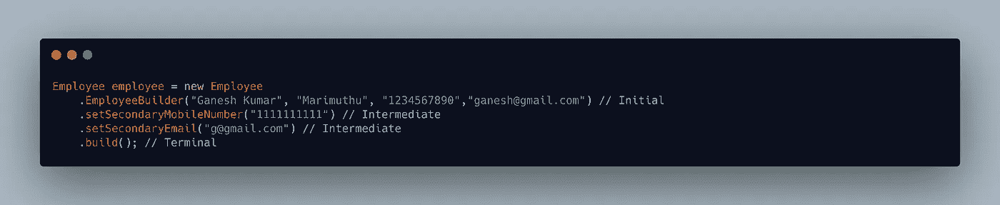

# 理解生成器设计模式

> 原文：<https://medium.com/nerd-for-tech/understanding-builder-design-pattern-761fbf9f48f1?source=collection_archive---------16----------------------->

## 逐步构建复杂的对象

纳扎里·尤尔科夫在 [Unsplash](https://unsplash.com?utm_source=medium&utm_medium=referral) 上的照片

假设我们想要创建一个 Employee 类，它具有下面的强制和可选属性。

**强制属性**

*   名字
*   姓
*   主移动电话号码
*   初级邮件

**可选属性**

*   次要移动号码
*   次级邮件

Employee 类及其构造函数如下所示

上述构造函数的主要问题是，我们必须为不想使用的可选属性手动传递空值。

在我们的类中看起来很简单，但是考虑一个具有更多强制和可选属性的复杂类。而且我们也不知道哪个是强制的，哪个是可选的。

创建 Employee 类的另一种方法是为所需的属性组合设置多个构造函数，这甚至更复杂。

救命恩人来了， **Builder 设计模式**。

> 构建器模式使用简单对象并使用逐步方法
> - [教程要点](https://www.tutorialspoint.com/design_pattern/builder_pattern.htm#:~:text=Builder%20pattern%20builds%20a%20complex,final%20object%20step%20by%20step)构建复杂对象

在构建器模式中，实际的类依赖于另一个名为构建器类的类来创建对象。

使用构建器模式，可以使用多个步骤创建对象，**初始步骤**、 **0 个或更多中间步骤**和**终止步骤**。

现在，我们在 Employee 类中添加了一个名为 EmployeeBuilder 的嵌套类。EmployeeBuilder 类将负责构造 Employee 对象。

所有的强制属性都可以通过 **EmployeeBuilder** 构造函数来设置。

所有可选属性都可以通过公共 setter 方法**setSecondaryMobileNumber**和 **setSecondaryEmail** 进行设置

一旦设置了所有属性，就可以通过调用 **EmployeeBuilder** 类的 **build** 方法来创建对象。build 方法创建并返回一个**雇员**对象。

**Employee 类的构造函数是私有的，因此只能从 EmployeeBuilder 类访问它。**

现在，可以使用 EmployeeBuilder 类创建该对象，如下所示

整个源代码可以在下面的要点中找到

# 谢谢你🤘

想了解我更多，请访问 [**ganeshkumarm.me**](https://www.ganeshkumarm.me/)

