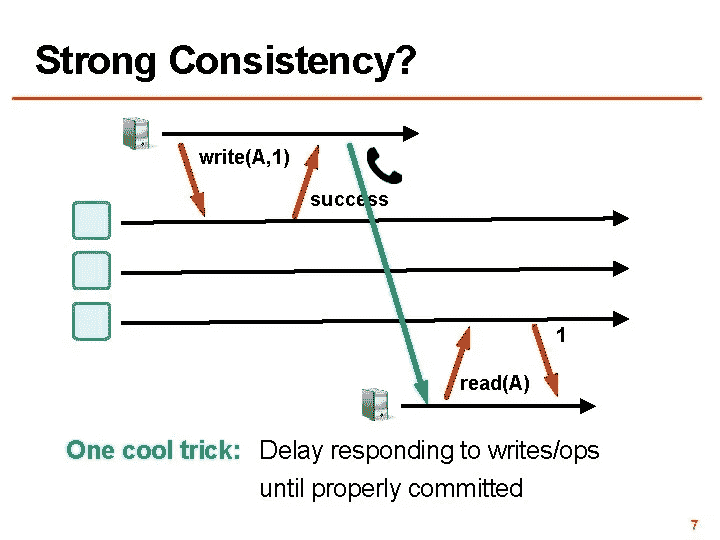
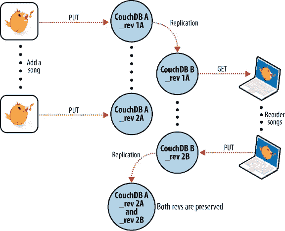
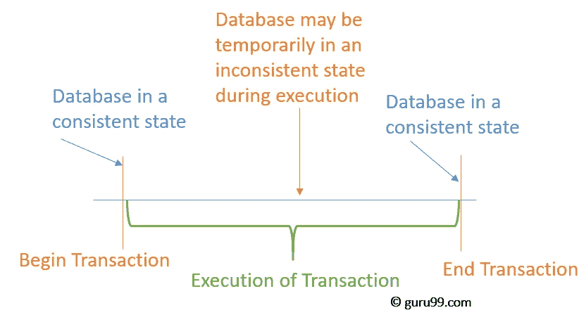
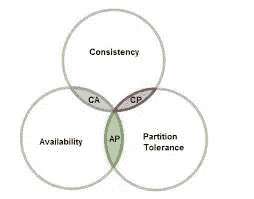
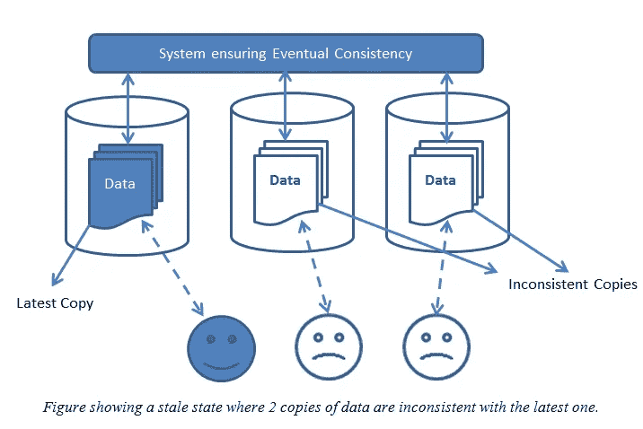

# 理解一致性

> 原文：<https://medium.com/nerd-for-tech/understanding-consistency-37156d9f4608?source=collection_archive---------6----------------------->

# 什么是一致性？

一致性是指不能写入违反有效数据规则的数据。如果某个操作试图引入不一致的数据，则整个操作会回滚并向用户返回一个错误，一致性有多种类型，如强一致性和最终一致性

# 什么是强一致性？

强一致性简单地说就是一旦一个写请求到达数据库的一个副本，数据将被传递到所有副本，以使世界上的所有节点都应该包含相同的值
,实现这种行为的唯一方法是在更新时锁定节点，就像在关系数据库中一样。

例如，想象你去自动取款机，从你的账户上取一些钱，然后你取了钱，检查你的账户余额，看到取款成功地从你的账户上扣除

在我们的案例中，我们看到:

*   自动取款机被堵住了，告诉我们拿钱和收据
*   钱立即被扣除

# 什么是最终的一致性？

最终一致性确保数据库中每个节点的数据始终保持一致。数据库的节点获得一致性所花费的时间可以像在非关系数据库中那样定义，也可以不定义。

例如，假设你去一家商店订购了两种产品。收银员接受你的订单，你付款，然后等着订单准备好

当你走到下一个窗口等待拿起你的订单准备好

在我们的案例中，我们看到:

*   收银员可以接受您的订单，并给您一张交易收据
*   你可以保证你最终会*拿到你的订单，但是你不知道确切的时间*

# *数据库系统的一致性*

**

*在数据库系统中，一致性确保数据库状态在任何事务发生后都有效，维护数据库不变量:根据所有定义的规则，包括约束、级联、触发器及其任何组合，写入数据库的任何数据都必须有效。*

*关系数据库具有 **ACID** 属性，这种属性旨在保证数据的有效性，即使出现错误、断电和其他灾难，也能确保强一致性*

*NoSQL 数据库有**基础**,数据库试图平衡一致性和数据可用性，而不是做出酸性保证。当给定数据库群集中的节点充当数据库一部分的主管理器，而其他节点持有只读副本时，通常会出现这种情况。*

# *与 CAP 定理的一致性*

**

*CAP 有时表现为一致性、可用性、分区容差三选二。*

*不幸的是，这样说是有误导性的，因为网络分区是一种错误，所以它们不是你可以选择的事情:不管你喜欢与否，它们都会发生。当网络正常工作时，系统可以提供一致性和可用性。*

*但是如果网络不能正常工作，你应该设计你的系统有一定程度的一致性(强，弱，最终，等等..)而你的选择会影响可用性*

# *分布式系统中的一致性*

**

*分布式系统通常具有提供读写的多节点，以确保高可用性和可扩展性，但这可能会带来一些问题:*

*   *消息异步(asynchronous):真实的网络不是一个可靠的通道，存在消息延迟或丢失*
*   *节点故障停止:节点继续崩溃，并且不会恢复*
*   *节点故障恢复(一段时间后的节点恢复，在分布式系统中最常见*
*   *网络分区:网络链接有问题，将 N 个节点分成多个部分*

*因此，大多数试图确保一致性的分布式系统最终使用(2pc、3pc、sages 等)*

# *结论*

*在这篇文章的最后，是一些阅读和获取更多知识的资源*

*   *[**阿西德**](https://en.wikipedia.org/wiki/ACID)*
*   *[**一致性(数据库系统)**](https://en.wikipedia.org/wiki/Consistency_(database_systems)#:~:text=Consistency%20in%20database%20systems%20refers,triggers%2C%20and%20any%20combination%20thereof.)*
*   *[**一致性 _ 模型**](https://en.wikipedia.org/wiki/Consistency_model)*
*   *E [库存一致性](https://link.springer.com/referenceworkentry/10.1007%2F978-0-387-39940-9_1366)*