# 了解卷积神经网络(CNN)。

> 原文：<https://medium.com/nerd-for-tech/understanding-convolutional-neural-network-cnn-9f5ec8a308ac?source=collection_archive---------7----------------------->

CNN 背后的整个想法始于我们的大脑。人脑很容易处理图像，图像通过视网膜作为电信号传递到由大量密集细胞层组成的初级视觉皮层。它提取图像的各种信息，如图像的边缘、部分，相关地，CNN 使用各种滤波器从输入图像中提取信息。

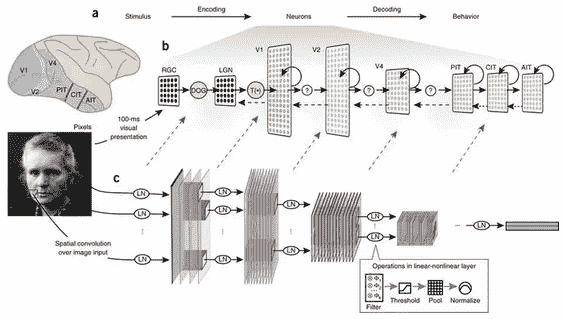

卷积神经网络 vs 人脑

## 图像内核/过滤器:

如果你曾经使用过照片编辑软件，你可能见过滤镜，比如模糊滤镜。但是这些是如何工作的呢？

滤镜本质上是一个**图像内核，**是一个应用于整个图像的小矩阵。滤波器允许我们通过识别边缘从图像中提取信息来转换图像，其中在神经网络中使用多个核来识别边缘。内核以滑动窗口的方式应用于元素。

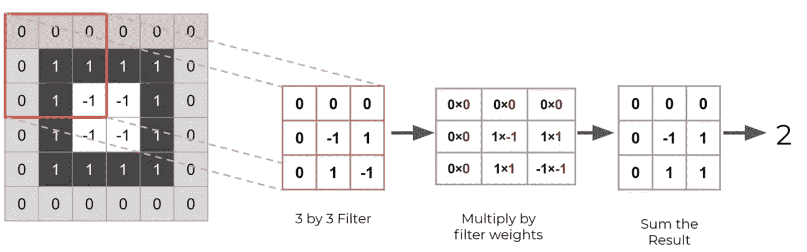

过滤

我们本质上是在输入矩阵上滑动核，即图像乘以滤波器权重和这些结果的总和以获得最终特征。注意分辨率是如何降低的，因为我们取 9 个输入值，输出到一个值。参考这个网站来了解内核如何工作[深蜥蜴](https://deeplizard.com/resource/pavq7noze2)。这些滤波器被称为**卷积核。将它们传递到图像上的过程被称为卷积。内核在步中的运动叫做**大步**一般是一步。如果步幅增大，图像尺寸将减小。卷积的主要用途是使用特征检测器在图像中找到特征，将它们放在特征图中，这仍然保留了原始图像的重要性。**

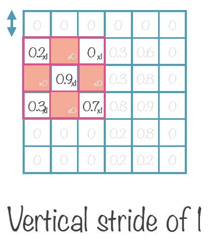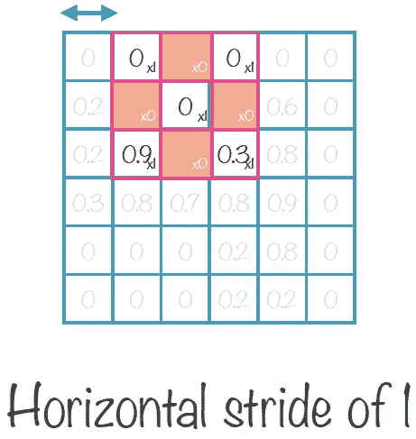

进展

在卷积过程中，我们会丢失边界信息。所以我们可以用更多的值填充图像。零填充是非常常见的做法，这样我们就不会丢失边界上的信息。在图像周围添加零以正确捕捉边缘称为**零填充。**

→知道不加填充的卷积矩阵大小的一般公式是**(N×N)*(F×F)=(N-F+1)x(N-F+1)。**这可以通过为参数填充赋予“有效”来实现。

→带填充的卷积矩阵大小公式为 **(N+2p-F+1)x(N+2p-F+1)。**如果填充大小为 1，则结果矩阵大小与输入矩阵相同。这可以通过为参数填充赋予“相同”来实现。

→为了描述什么是正确的填充尺寸，使用这个公式 **p = (F-1)/2。**

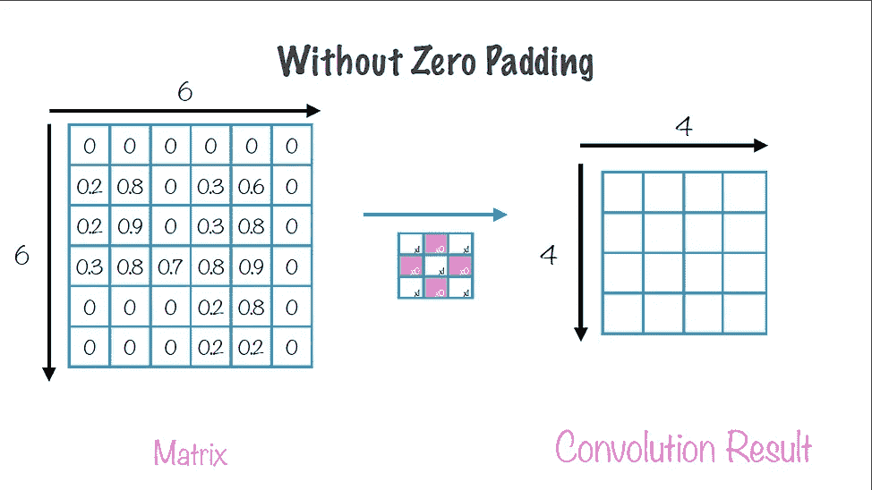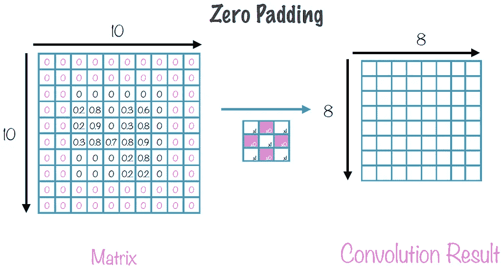

无填充与有填充。

## 将人工神经网络用于图像的缺点:

人工神经网络导致参数爆炸，训练神经网络的参数过大。在拼合图像时，ANN 会丢失信息。人工神经网络更适合类似的图像。ANN 只捕捉图像的中心，而 CNN 不考虑任何位置。

CNN 使用卷积层来帮助缓解这些问题。当我们对输入图像应用多个图像滤波器时，就创建了一个卷积层。然后，将对该层进行训练，以计算出最佳过滤器权重值。CNN 还通过关注本地连通性来帮助减少参数。在卷积层中，并非所有神经元都完全连接。相反，神经元仅连接到下一层中的局部神经元的子集，下一层最终成为过滤器。

卷积侧重于局部滤波，这里不同的滤波器开始识别图像的不同部分。将滤波器堆叠在一起会产生卷积层。对于彩色图像，我们有 RGB 的强度值，它被表示为 **(1280，720，3)** (高度，宽度，颜色)。在彩色图像中，我们以 3D 过滤器结束，其中通常卷积层被馈送到另一个卷积层，这允许网络发现模式中的模式，通常对于后面的卷积层来说更复杂。

## 池层:

为什么我们需要共用？

假设我们拍摄猎豹的图像，每张图像的不同位置都有人脸。汇集从图像中提取重要的特征，这有助于识别图像，而不管图像处于什么位置。

即使有本地连接，当处理彩色图像和可能的数十或数百个过滤器时，我们将有大量的参数。我们可以使用池层来减少这种情况。池层接受卷积层作为输入。池层中的神经元没有权重或偏差。池层只是将一些聚合函数应用于所有输入。

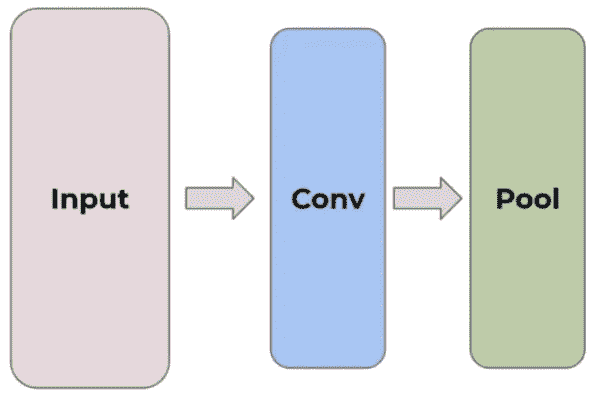

CNN 架构

有几种类型的池可用，如最大池，平均池，总和池。

最大池取在矩阵中移动的盒子的最大值，过滤器大小为(2 x 2)，步长为 2。

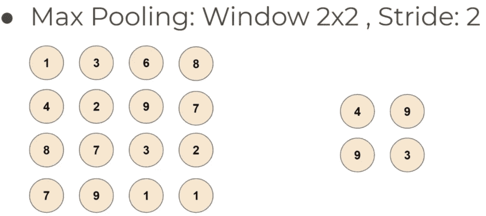

最大池化。

从上图中可以看出，应用合并图层后，重要信息仍然保留，而 16 个元素减少为 4 个元素，这有助于神经网络识别与位置无关的特征(位置不变性)。平均池是简单地取出盒子矩阵的平均值。

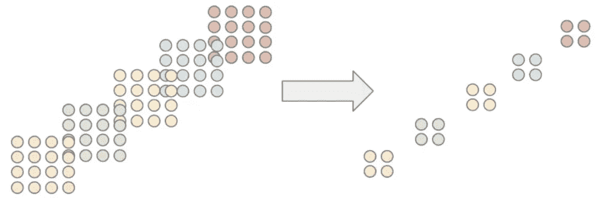

池大大减少了我们的参数数量。这个池层最终将删除大量信息，甚至一个跨度为 2 的(2x2)小池“内核”也将删除 75%的输入数据。然而，总的趋势将是真实的，通过汇集层，它创建了通用模型，减轻过度拟合。

## 扁平化:

在将汇集的特征映射馈送到密集连接的人工神经网络之前，将其展平为列向量。

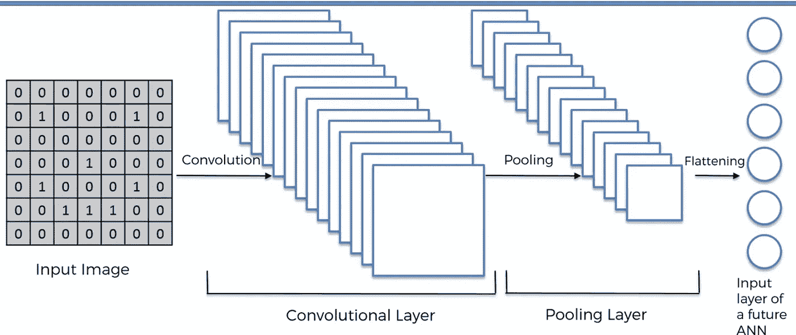

CNN 架构

输入图像由卷积层处理，卷积层由内核和激活层组成，以使图像非线性，然后通过池层以最小化图像的大小，然后将其传输到完全连接的层，图像被展平。

CNN 可以报道所有类型的建筑。没有设计架构的经验法则，它完全基于错误度量和用例。

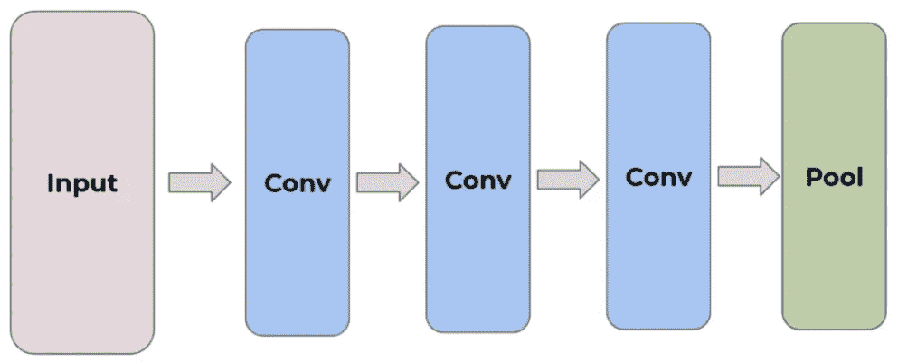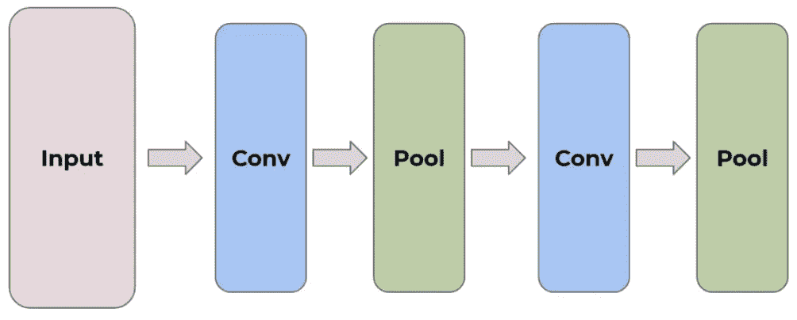

不管 CNN 的结构如何，最后的特征图将被展平并送到全连接层，以合并所有提取的特征。

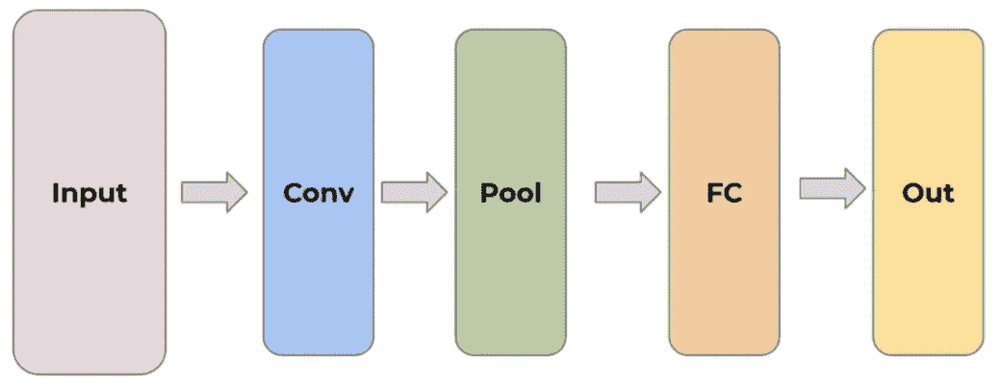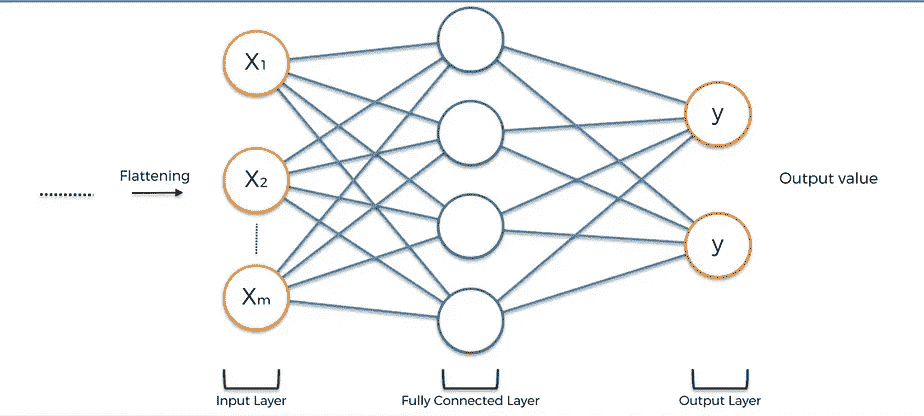

每组卷积之后是也输出图像的激活层。然而，连续的输出越来越小(由于汇集层)以及越来越深(由于卷积层中的特征映射)。这一整套层被送入常规前馈神经网络，最后被送入 SoftMax 预测层。

参考这个网站来了解 CNN 架构如何运作

希望你对 CNN 的工作有了基本的了解，并参考 [github](https://github.com/Rishikumar04/Deep-Learning/blob/main/CNN/01-Keras-CNN-MNIST.ipynb) 使用 python 构建 CNN。