# 了解数据库隔离级别

> 原文：<https://medium.com/nerd-for-tech/understanding-database-isolation-levels-c4ebcd55c6b9?source=collection_archive---------0----------------------->

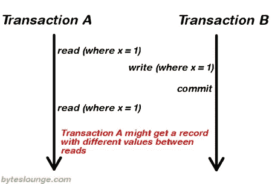

# 什么是**隔离**等级**？**

我们知道，为了保持数据库的一致性，它遵循**酸**属性。在这四个属性(原子性、一致性、隔离性和持久性)中，隔离意味着事务应该以这样一种方式在系统中发生，即它是访问数据库系统中资源的唯一事务。

# 为什么我们需要隔离？

假设您正在为大型电子商务实现一个系统。许多操作必须同时进行，多个客户可能同时想要购买相同的产品，一些产品的价格可能改变，新产品仍在交付中，等等。如您所知，用户执行的单个操作在数据库中作为事务运行，因此我们需要添加一些逻辑来保持一致性，这就是隔离的作用，因为它控制:

*   读取数据时是否锁定，以及请求何种类型的锁定。
*   持有读锁的时间。
*   一个读操作是否引用了被另一个事务修改的行，因此它会阻塞，直到该行上的独占锁被释放，或者检索语句或事务启动时存在的行的已提交版本，这取决于隔离级别

# 什么是“隔离级别”？

**数据库隔离**定义了一个事务必须与任何其他事务所做的数据修改隔离的程度(即使实际上可能有大量并发运行的事务)。首要目标是防止并发事务对临时数据、中止数据或其他不正确数据的读写。

# 事务隔离级别由以下现象定义

## 脏读

事务读取由并发未提交事务写入的数据。(未提交的数据称为“脏数据”)

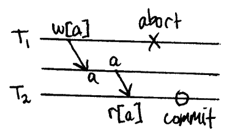

例如，假设事务 1 更新了一行并使其未提交，同时，事务 2 读取更新的行。如果事务 1 回滚更改，事务 2 将读取被认为从未存在过的数据。

## 不可重复读取和读取偏差

一个事务重新读取它以前读取的数据，并发现数据已被另一个事务修改(自初始读取以来已被提交)。

请注意，这不同于脏读，因为另一个事务已经提交。同样，这种现象需要两次阅读才能显现。

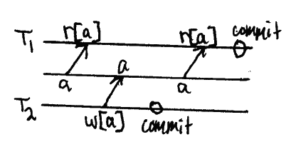

例如，假设事务 T1 读取数据。由于并发性，另一个事务 T2 更新相同的数据并提交，现在如果事务 T1 重新读取相同的数据，它将检索不同的值

## 幻像读取

事务重新执行返回满足搜索条件的一组行的查询，并发现满足条件的一组行由于另一个最近提交的事务而改变了。

这类似于一个不可重复的读取，除了它涉及一个变化的集合匹配一个谓词，而不是一个单独的项目。

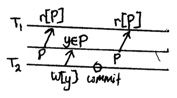

例如，假设事务 T1 检索一组满足某些搜索条件的行。现在，事务 T2 生成了一些与事务 T1 的搜索标准相匹配的新行。如果事务 T1 重新执行读取行的语句，它这次将获得一组不同的行。

## 写入偏斜

两个并发事务中的每一个都基于读取与另一个正在写入的内容重叠的数据集来确定它们正在写入的内容。

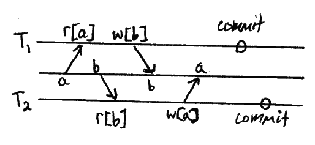

例如，假设 2 个事务读取 x 和 y 的值为 100，那么每个事务单独取其中一个值的反是可以的，总数仍然是非负的。然而，否定这两个值会导致 x+y=-200，违反了约束。对于情感重力，这通常是以银行账户为框架的，只要共同持有的余额总和保持非负，账户余额就可以为负。

# 基于这些现象，定义了这四个隔离级别

## **未提交读取**

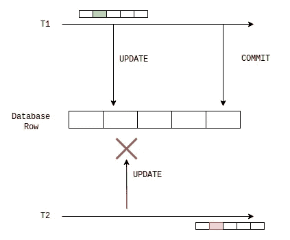

未提交读取是最低的隔离级别。在这个级别，确保**如果另一个事务已经更新了数据库行并且没有提交**，则没有事务可以更新该行。这可以防止更新丢失，但不会妨碍脏读

## **读犯**

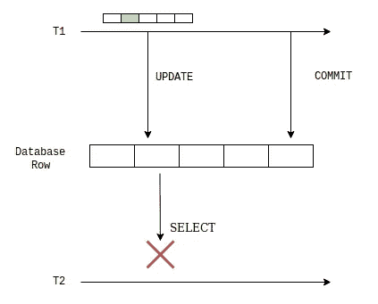

该隔离级别**不允许任何其他事务写入或读取另一个事务已经写入但尚未提交的行**。因此，它不允许脏读。该事务持有当前行的读或写锁，从而防止其他事务读取、更新或删除该行。

## **可重复读取**

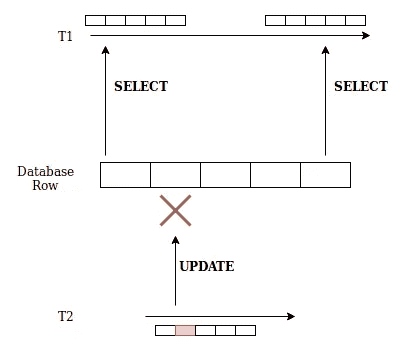

这个隔离级别确保任何从一行读取数据的**事务都会阻止任何其他写事务访问同一行。**这是最严格的隔离级别，它在引用的所有行上持有读锁，在插入、更新或删除的所有行上持有写锁。由于其他事务不能读取、更新或删除这些行，因此避免了不可重复的读取。

## **可序列化**

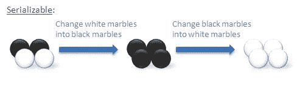

这个隔离级别是最高的隔离级别。可序列化隔离级别需要的不仅仅是限制对单行的访问。通常，这种隔离模式会**锁定整个表**，以防止任何其他事务从其中插入或读取数据。

可串行化执行被定义为操作的执行，其中并发执行的事务看起来是串行执行的。

## 快照隔离

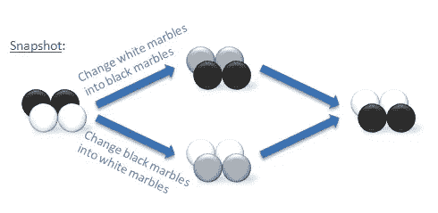

这种隔离级别可以以比事务隔离更低的成本大大提高并发性。当数据被修改时，受影响的行的已提交版本被复制到 temp 并被赋予版本号。这种操作称为写时复制，用于使用这种技术的所有插入、更新和删除操作。当另一个会话读取相同的数据时，将返回读取事务开始时提交的数据版本。

# 选择哪种事务隔离

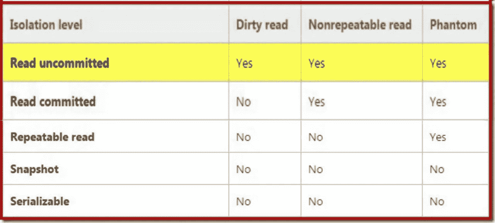

事务隔离级别的选择取决于每个具体情况的细节。这些提示可能会有帮助，但请单独考虑每种情况。

在设计您的应用程序时，您肯定希望确保您的数据库事务不会读取其他事务**的未提交更改。**

因为更改很容易损害您的数据完整性，因为一个事务中的恢复更改可能会被另一个事务读取并接受。因此，在应用程序中确保的最低隔离级别是提交读。
大多数时候你可能不需要可串行化隔离，因为它会在大量并发事务中导致严重的性能问题。
所以这总是取决于您的业务需求

# 结论

在这篇文章的最后，是一些阅读和获取更多知识的资源

[T5【SQL 事务隔离实用指南】T6](https://begriffs.com/posts/2017-08-01-practical-guide-sql-isolation.html)

[**DBMS 中的事务隔离级别**](https://www.geeksforgeeks.org/transaction-isolation-levels-dbms/)

[**了解隔离级别**](https://docs.microsoft.com/en-us/sql/connect/jdbc/understanding-isolation-levels?view=sql-server-ver15)