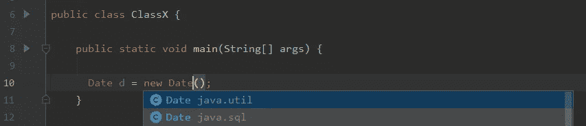
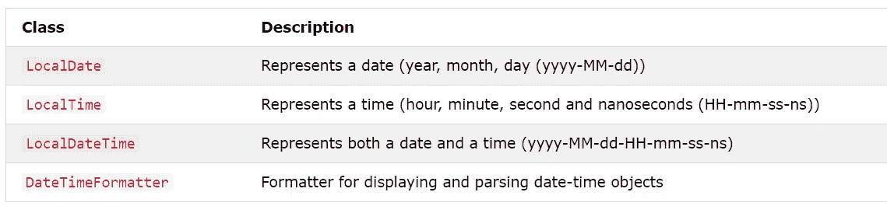

# 理解 Java 中的日期和时间

> 原文：<https://medium.com/nerd-for-tech/understanding-date-and-time-in-java-140221a24944?source=collection_archive---------5----------------------->


在 [Unsplash](https://unsplash.com?utm_source=medium&utm_medium=referral) 上由 [Brad Neathery](https://unsplash.com/@bradneathery?utm_source=medium&utm_medium=referral) 拍摄的照片

对于任何 java 开发人员来说，理解 Java 中的日期和时间是必不可少的。在 java 中，处理日期和时间可能会有点混乱，因为 java 有多种数据类型来处理日期和时间。这些数据类型包含在几个包中。这些包是， **java.util** ， **java.sql** 和 **java.time** 。

那么，为什么 java 中有几个包和多个类来处理日期和时间呢？这就是我们在第一章要讨论的内容。

在 Java 中，我们有两种不同的日期/时间 API，一种是旧的 API，另一种是 Java 8 中引入的新 API。新版本的日期/时间 API 的引入是为了克服旧版本的日期/时间 API 的问题。新的 API 在**“Java . time”**包中有多个类；Java 本身也鼓励使用这种新 API。然而，为什么 java 需要实现一个新的日期/时间 API 呢？因为以前的 API 有几个问题，开发人员每次使用它时都必须面对。

# 旧(经典)日期/时间 API

当 java 第一次发布时(Java 1.0)，它在**“Java . util”**包中有一个非常简单的类。这个类是“Date ”,它代表的不是一个实际的日期，而是一个特定的时刻。但是在较新版本的 java 中，他们添加了多个类来正确地表示日期和时间。然而，在这个日期/时间 API 中仍然存在许多问题。比如，

*   如果您想要创建如下所示的 Date 类的对象，您将看到 Date 类存在于两个不同的包中， **"java.sql"** 和 **"java.util"** 。“java.sql”包处理适合数据库的日期格式,“java.util”包处理适合 java 语言的日期格式。因此，开发人员总是因为导入错误的包而陷入困境。



图像:从日期类创建对象

*   另外，如果您想对日期进行一些格式化，您需要导入另一个名为 **"java.text"** 的包。
*   所有这些日期/时间类都不是线程安全的。如果多个线程在同一个日期对象上工作，并且如果一个线程对该对象做了一些更改，其他线程也会得到该更改。
*   即使对于一些熟练的 java 开发人员来说，使用和管理分区日期也是困难和令人困惑的。

正如您所看到的，Oracle 有足够的理由将这个新的日期/时间 API 引入 java。

# 新的(Java 8)日期/时间 API

在 Java 8 中，它在**“Java . Time”**包中为 Java 引入了一个全新的日期/时间 API。它附带了各种有用的类，我们可以轻松地在 java 中处理日期和时间。这个新 API 支持标准的时间概念，如日期、时间、瞬间和时区。此外，它极大地简化了日期和时间处理，并修复了旧 API 的许多问题。

使用 Java 8 日期/时间 API 的主要优势:

*   **API 清晰:**API 非常清晰，即使对于新手开发者(比如我)也很容易理解🙋‍♂️).
*   **不变性和线程安全:**这个新 API 中提供的所有类都是不可变的和线程安全的。
*   灵活有效的 API: 新的 API 带有不同的时间表示，适合不同的用例。下图显示了新的日期/时间 API 中最常用的类。



图:来自 Java 8 日期/时间 API 的类([https://www.w3schools.com](https://www.w3schools.com))

> 注意:这些类主要在不需要时区时使用

下面是一些使用每个类处理日期和时间的例子。

Java 8 日期/时间类的用法

## 为什么日期和时间对软件工程师很重要？

在软件工程中，无论你擅长什么领域，在大多数时间里，如果不知道如何处理日期和时间，你就无法工作。如果你是一名软件开发人员，几乎你将要开发的每个程序都需要以某种方式使用日期/时间。这意味着在某些时候你必须收集、存储、检索和显示日期或时间。在程序中处理日期和时间之前，开发人员应该考虑几件事情。

*   总是选择正确的数据类型。如果您的语言有不同的数据类型来表示日期/时间，如 Java，那么您必须考虑适合您的用例的有效和正确的数据类型。
*   始终根据您的用例选择正确的数据格式。大多数开发人员通常甚至不太考虑日期/时间的格式。
*   时刻注意何时使用**【时区】**。如果你要在一个项目中使用日期/时间，你必须知道在那个项目中是否必须使用“时区”。

# 用 Java 处理夏令时(DST)


Amy Humphries 在 [Unsplash](https://unsplash.com?utm_source=medium&utm_medium=referral) 上拍摄的照片

如果你问我一个我们需要考虑“时区”的用例，没有比这个更完美的答案了。夏令时是几个国家在夏季使用的一种做法，以提前他们的时间，从而利用额外的一小时自然光。然而，如果您不打算以正确的方式处理 DST，您可能会得到一个有问题的应用程序。所以，让我们看看如何在 Java 中处理夏令时。

如果您必须在 java 8 之前在 Java 中处理 DST，您必须一起使用来自**【Java . util】**包的**时区**和**日历**类。然而，这样做是可能的，即使是一些熟练的 java 开发人员在使用这个旧的日期/时间 API 时也会感到困惑和困难。但是在 Java 8 日期/时间 API 之后，事情变得比以前简单多了。对于 Java 8，我们有各种类来处理时区，如下所示，

**区域 ID :** 代表地区/城市的唯一 ID

```
ZoneId zoneId = ZoneId.of("Asia/Colombo");
```

**区域日期时间:**表示带有时区的 ISO-8601 日历系统中的日期时间

```
ZonedDateTime zonedDateTime = ZonedDateTime.of(localDateTime, zoneId);example : 2021–05–09T14:00:15+01:00 Asia/Colombo
```

**区域偏移:**表示与格林威治有偏移的时区

```
ZoneOffset offset123 = ZoneOffset.of("+05:30");
```

**偏移日期时间:**表示在 ISO-8601 日历系统中，相对于格林威治有偏移的日期时间

```
OffsetDateTime offSetDT = OffsetDateTime.of(localDateTime, offset123);
```

正如您所看到的，有了 Java 8 日期/时间 API，用 Java 处理夏令时就更容易了。

因此，本文到此结束，希望您喜欢。快乐编码👨‍💻。

## 参考

Kristan，g .，2018 年。*在您的申请中使用日期&次*。[在线]萌芽社交。可查阅:<https://sproutsocial . com/insights/date-times-application-development/>[2021 年 5 月 9 日访问]。

贝尔东。2020.*Java 8 日期/时间 API 简介| Baeldung* 。[在线]可查阅:<https://www.baeldung.com/java-8-date-time-intro>[2021 年 5 月 8 日访问]。

W3schools.com，2021 年。 *Java 日期和时间*。[在线]可查阅:<https://www.w3schools.com/java/java_date.asp>[2021 年 5 月 8 日访问]。

Ligios，a .，2020。*在 Java | Baeldung 中处理夏令时*。[线上]百隆。可查阅:<https://www.baeldung.com/java-daylight-savings>[2021 年 5 月 9 日访问]。