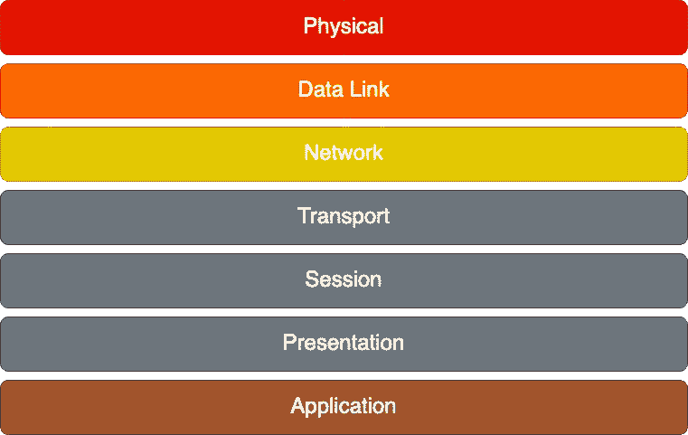
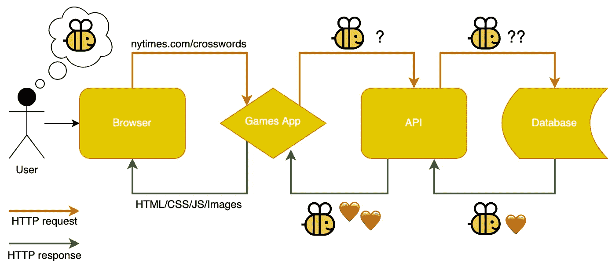
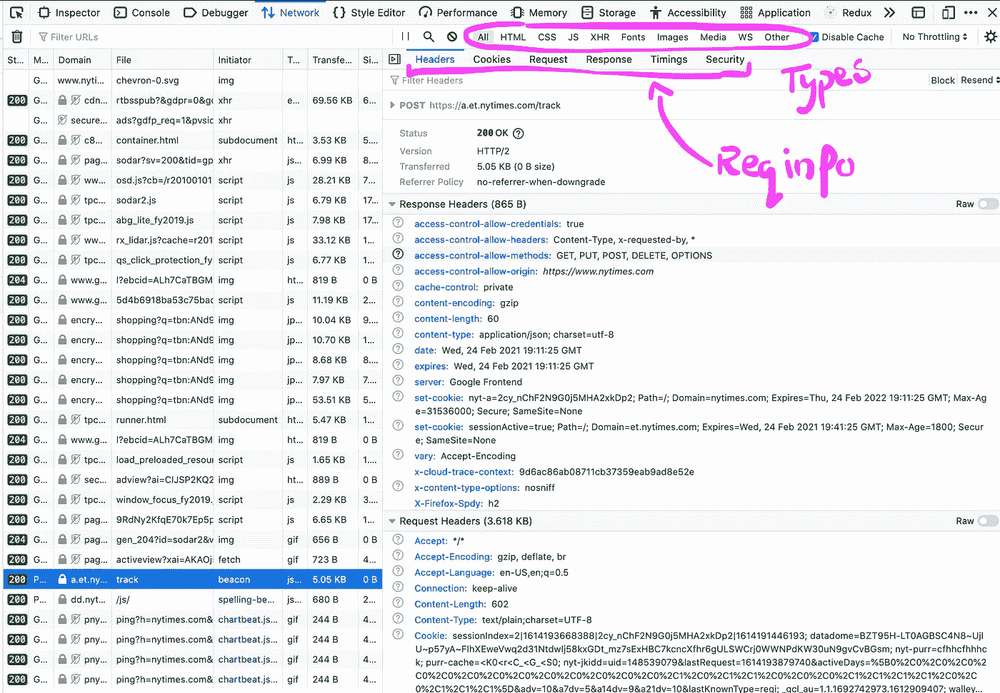
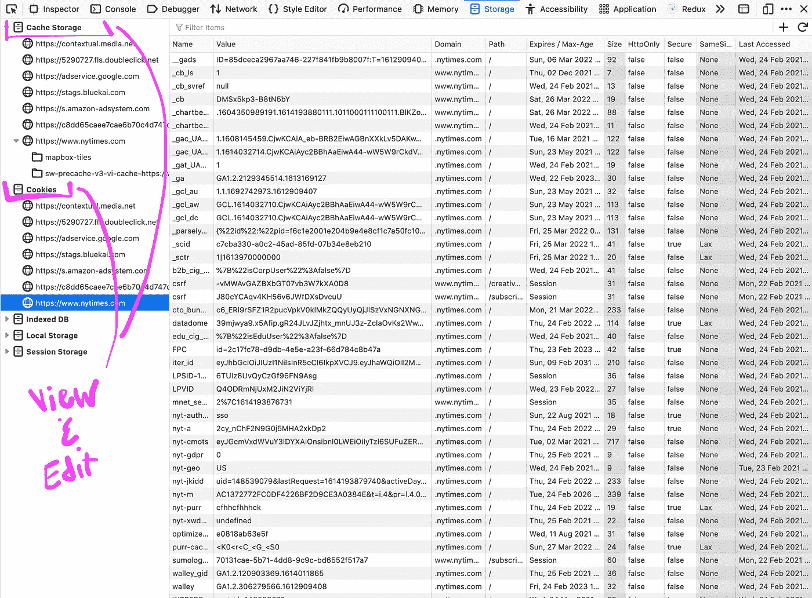

# 理解和调试网络请求

> 原文：<https://medium.com/nerd-for-tech/understanding-debugging-network-requests-b713f85ad6f3?source=collection_archive---------3----------------------->

我以开发网络应用程序为生。我在堆栈中漫游，但我的经验倾向于前端工程。没有 HTTP 请求，我做的任何事情都是不可能的。

尽管如此，我发现了任何“网络”的东西——路由、中间件、cookies、头文件等等。相当吓人。当网络请求出现问题时，我很快就用完了我的调试工具包中的工具。我不确定如何理解或探索我正在开发的应用程序中的网络请求问题。

我想试着解开一些谜团，并分享我在过去几年里学到的东西。

这将是对网络层的高级概述，以及对浏览器和 JavaScript 应用程序中的网络请求的深入研究。

我还将探索浏览器提供的一些调试工具，遍历通过 JavaScript 应用程序传递的请求，并讨论沙盒工具。

# 网络层

我将从简单介绍一些计算机科学概念开始。完全披露——我对这些想法的理解是基本的。我没有计算机专业的学位，也不是网络工程师。如果你属于其中一类，并且对这篇文章有强烈的感受，请联系我们！我很想了解更多。

尽管如此，我会尽我所能分享我所知道的信息。我觉得这些概念非常有趣。没有它们，我们首先就没有词汇或架构来在应用程序中发出网络请求。

话虽如此，还是说说 OSI 吧。

在计算机科学中有一个模型叫做“开放系统互连”(OSI)模型。它可以追溯到 70 年代，是一个学术理论框架。它的设计是技术不可知的，这样我们就可以在网络发展的过程中继续应用相同的原则。

OSI 由七层组成，从最抽象的层(物理层)到最抽象的层(应用层)。我将一个接一个地介绍这些，但是我想给你们一个快速的，丰富多彩的例子。请随意想象这是一个蛋糕。或者冻糕。或者七层沙拉。不管怎样，我都会支持你。

我们从物理层开始——连接计算机的电路——一直到我们的应用程序——一系列抽象的请求和代码，为我们的最终用户提供一些交互。

## 物理层

这是计算机系统的电气和物理表示。当您考虑物理层时，请考虑蓝牙和 USB 等设备的射频和电压协议。

## 数据链路层

数据链路层也是非常底层的，它使用交换机处理节点到节点的数据传输。

## 网路层

更抽象地说，网络层涉及大规模的路由和连接。如果旧金山的一台计算机想与波士顿的一台计算机通信，网络层将使它成为可能。

## 传输层

传输层是 TCP/IP(传输控制协议)存在的地方。HTTP 依赖于 TCP/IP——这是一种标准化请求的协议。它概述了我们如何知道一个连接已经建立，我们如何把我们的请求信息分成包，我们如何转发这些包，等等。

## 会话层

会话层处理两个节点(计算机)之间连接的结构和行为。计算机在超时前要等待多长时间才能建立连接？如果请求超时，我们会自动重试吗？会话层回答了这些问题。

## 介绍会；展示会

表示层(或语法层)格式化我们的请求。我们可能会请求 HTML、JavaScript 或一些原始数据，但我们需要就请求本身的语言达成一致。他们会通过 JSON 编码吗，YAML？可能是 ASCII？表示层还处理加密和解密。

## 应用

最抽象的层是应用层，也是与本次讨论最相关的层。这是 FTP、HTTP(超文本传输协议)、浏览器和我们的应用程序都存在的地方。

虽然我们谈论的大部分未来都不会涉及 OSI，但重要的是要注意我们的应用程序依赖于我们刚刚谈到的每一层。当我们试图通过 **HTTP** 提供一些 HTML 时，它被**编码**，**路由**，并通过**会话**经由 **TCP/IP** 发送，其中**开关**和**电脉冲**将我们的信息传送给在另一端等待的计算机。这一切都发生在几微秒内。

比尔和特德的精彩冒险的 gif 图，特德(山谬·里维)说“哇”

现在我们已经有了一个框架，让我们来讨论一下 HTTP 或网络请求是如何流经应用程序的。

> 您可能会注意到，这个图中没有显示缓存。缓存是另一个非常有趣和复杂的话题。我还特别关注 JavaScript 和 HTTP，所以如果你在寻找 Swift、Kotlin 或 SSL 的信息，这篇文章可能不适合你。

这一切都始于一个用户。当用户打开 Firefox 或 Chrome 或现在孩子们用的任何东西，并输入一个 URL(假设他们想玩[拼字比赛](https://www.nytimes.com/puzzles/spelling-bee))时，浏览器会路由他们的请求。应用程序在那里等待，监听请求，并通过提供任何必要的代码来响应——HTML、JavaScript、CSS、图像和徽标等静态资产……

通常，为了生成正确的代码，应用程序需要发出自己的请求(例如，获取谜题数据)。为此，我们的应用程序将向 API 端点发送一个请求，然后 API 端点将从数据库中请求信息。

可以说，一旦我们到达了行尾，整个请求链就会反转。数据库将数据发送回 API，API 将数据发送回我们的应用程序，应用程序将数据发送回浏览器，浏览器将数据显示给用户。整个循环发生在几分之一秒内。

# 在浏览器中调试

让我们首先关注第一个请求——浏览器和应用程序之间的请求。我们可以在您选择的浏览器中使用现有的开发工具来检查和调试这些请求。

## 打开网络选项卡

从浏览器菜单(Firefox: Tools > Web Developer 和 Chrome: View > Developer)或使用 cmd + option + i (Mac)和 ctrl + shift + i (PC)打开开发者工具。打开开发工具后，检查网络选项卡。

## 我们可以在浏览器中调试什么

*   请求格式
*   请求来源
*   头球
*   饼干
*   隐藏物

请原谅我愚蠢的截图，但这些是我发现自己在网络标签中使用最多的几个功能:

*   检查请求头和 cookies
*   搜索来自特定域的请求(寻找放大镜)
*   按资源类型(HTML、XML、JS 等)过滤请求
*   手动添加和删除 cookies(这存在于存储选项卡中，而不是网络选项卡中，但我认为这值得一提)

## 浏览器中调试的用例

我发现浏览器对于调试有很多架构的网络请求非常有用。这种方法使得操纵请求变得更加困难，但是它又快又简单，而且它还让您非常接近生产环境，这是非常有用的。

浏览器中调试可能有用的几个例子:

*   使用复杂标题和来自 Redux 存储的数据格式化的传出跟踪请求
*   一个传入的请求通过多个中间件功能，在这些功能中提取数据，然后传递给 React 应用程序

# 应用程序中的调试

我们还可以看看图表上第一个请求的另一面，看看我们的应用程序，看看它如何用路由和中间件处理传入的请求。

路由将告诉我们的请求在应用程序中的位置，中间件将检查请求并执行任何必要的副作用。

每个应用程序处理路由和中间件的方式略有不同，但通常会有一个使用 Express 这样的框架的应用程序后端的入口点(寻找服务器端的 index.js 文件或类似的东西)。

一个带有中间件的快速应用程序的例子

## 我们可以在应用程序中调试什么

*   请求和回应
*   请求如何在我们的应用中流动
*   路由问题

## 应用程序中调试的用例

在应用程序中调试的好处在于，一旦你知道了你的应用程序的入口点和路由，你就可以依靠你传统的调试工具包——单元测试、日志、错误处理等等……

应用程序中的调试可能有用的几个示例:

*   请求头或 cookies 未被正确处理的问题
*   请求在浏览器中看起来没问题，但应用程序没有获得预期的请求信息(这通常表明中间件有问题)
*   像意外的 404 这样的路由问题
*   产生不正确 URL 的深层链接错误

# 在沙盒中调试

现在让我们看看我们的应用程序发出的请求。假设我们的应用程序收到了来自浏览器的请求，但是为了用正确的页面做出响应，它需要从服务器获取一些信息。

通常，应用程序会通过 API 发出这些请求。除非我们正在积极地开发这个 API，并且可以在本地对其进行优化，否则我们在这方面的洞察力会有所欠缺。我们只能真正检查我们发出的请求和我们收到的响应的格式。这就是沙盒工具、良好的文档以及与其他开发人员合作的关键所在。

[Postman](https://www.postman.com/) 是我最喜欢的请求沙盒工具之一，但是有很多可用的。它们很棒，因为它们允许我们独立地发出请求——它让我们可以完全控制我们想要包含什么样的头、cookies 和请求数据。这与在浏览器中检查请求完全相反。如果在我们的沙箱中有任何架构围绕着我们的请求，那是因为我们手动地把它放在那里。

## 我们可以在沙盒工具中调试什么

*   传出请求
*   cookies 和标头在孤立状态下的行为
*   响应数据

## 沙盒中调试的用例

设置请求沙箱可能需要一些时间——您需要确保您有正确的头、cookies 和认证协议——但是一旦您有了框架，您就可以轻松地调整您的请求来单独测试小的变化。您还可以保存您的请求并轻松地重新访问它们，或者将同一请求应用于多个域。

沙盒中的调试可能有用的几个例子:

*   用不同的用户或登录配置文件模拟请求
*   通过对缓存键、头或查询参数的微小更改来模仿请求
*   在本地、试运行和生产环境中快速测试相同的请求
*   与队友轻松分享复杂的请求格式

# 调试数据库请求

我们的图表中只剩下一个请求—将 API 连接到数据库的请求。从数据库中获取信息时，有很多选择。您可以使用一个(或多个！)的以下各项:

*   ORM(对象关系映射器),如 Sequelize
*   像 GraphQL 这样的数据层/查询语言
*   像 DynamoDB 这样的对象存储中的键值查找
*   原始 SQL 查询

每种方法都有自己的调试工具套件，但是这些工具通常与我们在本文中讨论的工具很相似。例如，Apollo GraphQL 有自己的浏览器插件、日志工具和沙盒应用。

## 关于其他连接类型的说明

您的应用程序的许多服务器端请求将通过 HTTP 发生，但是还有其他安全的方法来连接数据库并与之通信。例如，TLS、SSL 和 SSH 都有自己的用例，但是它们超出了本文的范围，所以我现在就讲到这里！

感谢您阅读这一切！希望你觉得有用。为了表示感谢，请欣赏这张猫咪照片:

查理喜欢用我的针线盒当栖木