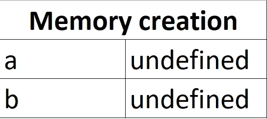
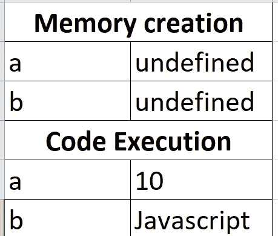
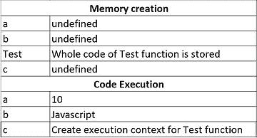
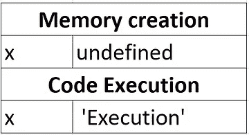
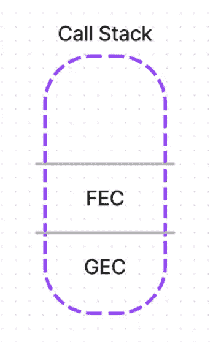
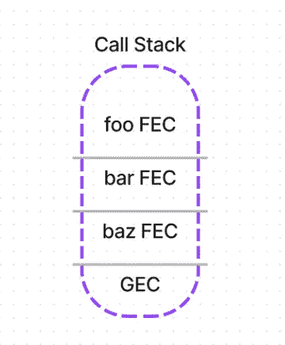
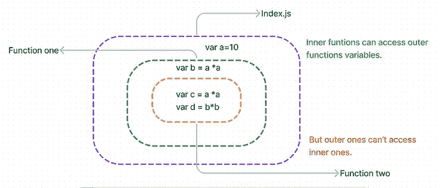
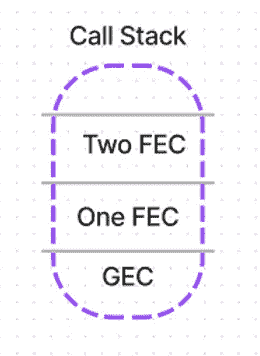

# 理解 JavaScript 中的执行上下文、提升、调用堆栈、闭包、作用域和块

> 原文：<https://medium.com/nerd-for-tech/understanding-execution-context-hoisting-call-stack-closures-scope-block-in-javascript-66eba6abec15?source=collection_archive---------1----------------------->

注意:我已经从我的博客中导入了它。所以可能看起来不像原帖。如果想看博客原文。请在这里访问[](https://www.pansofarjun.com/post/understanding-execution-context-hoisting-call-stack-closures-scope-block-in-javascript#viewer-66cr6)*。*

*JavaScript ***是同步*** 吗？是的。*

*JavaScript ***是单线程*** *-* ***还是多线程*** *？*是的。*

*够了行话就像 ***线程*** 和 ***同步*** *。*我们先来了解一下这些术语。*

> **同步=顺序=一个接一个。**

```
*var a = 10; //first line 
var b = 'Javascript'; //second line 

Here **synchronous** means: 
The first variable '**a**' is assigned to 10, 
and then variable '**b**' is assigned to 'Javascript.' The first line is executed, and then the second line is executed.*
```

> **单线程=一次处理一行。**

```
*var a = 10 ; //first linevar b = 'Javascript'; //second line

Here **single threade**d means:
When the process of assigning 10 to variable '**a**' - no other process happens at that time. 
Only when the first line finishes the second line starts.If the first line or process fails, the whole code fails.*
```

## *深入挖掘！*

*上述过程发生在哪里？这个简单的双赋值操作有一些共同的步骤。*

*   *有两个变量， **a** 和 **b** 。必须有**内存**分配给他们存储。*
*   *代码是**执行**。即对变量' **a** 和' **b** 赋值操作。*

*这些步骤发生在**‘执行上下文’中——**新学期？对！*

> ****执行-上下文*** *=发生*内存创建*和*代码执行 *n 的地方或环境。**

## *第一阶段——记忆创造:*

**

## *第二阶段—代码执行:*

**

> ****执行上下文*** *=* 内存创建 *+* 代码执行 *n.**

*注意变量 **a** 和 **b** 在 ***内存阶段被 ***初始化*** 到 ***未定义*** 。*** 在代码执行之前，变量被初始化为**未定义的**。我们稍后会解释这一点。*

***如果有函数内部使用了变量和参数怎么办？***

*它有**执行上下文吗？是啊！。***

*是一个**单独的**执行上下文吗？**是的！。***

## *为什么要为函数分离执行上下文？*

*因为函数内外都有变量和代码。函数可以访问函数外部的变量，但反之则不行。变量的范围不同。*

*因此，两个执行上下文— **全局**和**运行**执行上下文。*

*当您运行 javascript 文件时，首先会创建一个全局执行上下文。当在 javascript 文件中遇到一个函数时，会在全局执行上下文之上创建一个全新的执行上下文。*

> *一个。js 文件=一个全局范围=一个全局执行上下文(GEC)*

***那么函数的内存分配呢？***

> *任何函数的内存分配都发生在父执行上下文中。*

*让我们来看一个例子，*

```
*index.js  var a = 10; //first line 
var b = 'Javascript'; //second line **//Declaring function** 
**function** Test(x){ 
return x; 
}; **var c = Test('execution');***
```

*当 index.js 运行时，会创建一个全局执行上下文。*

## *GEC:*

**注意:这里，测试函数的内存分配是在 GEC 创建的。因为测试函数的父执行上下文是 GEC 本身。**

**

*当代码执行遇到函数调用时— **测试(‘执行’)。它为测试创建一个函数执行上下文。***

***外汇券***

**

*将 FEC 安排在 GEC 之上被称为**执行堆栈**或**调用堆栈。***

**

***有回调之类的嵌套函数怎么办？***

```
*function foo(x) { 
return x 
} function bar(x){ 
foo(x) 
}; function baz(x){ 
bar(x) 
}; baz('Hello from foo');**//Hello from foo***
```

**

> *调用堆栈/执行堆栈=处理执行上下文的顺序*

***让我们在内存创建阶段定义*未定义的*:***

*我们知道，在执行上下文的内存阶段，所有声明的变量将首先被赋值给未定义的变量。即使在实际代码执行之前，这种赋值也是默认行为。*

*举个例子，*

```
*// We can console the variable even before it is declared without any error console.log(a); 
var a = 10;*
```

*在代码执行之前，**变量‘a’在执行上下文的内存阶段被**赋值给*未定义的*。因此，上面的代码导致*

```
***undefined** --> without any error*
```

*当 **var 'a'** 未声明时，会出现什么错误？*

```
*console.log(a);*
```

*它给出了这样一个参考误差。*

```
*ReferenceError: a is not defined*
```

> *所以 ***未定义*** 和 ***未定义*** 是不同的，至少在 JavaScript 词汇中是这样的。*

*代码执行阶段之前的执行上下文中的内存创建阶段的想法被称为**‘提升’。***

> *提升=甚至在代码执行之前访问声明的变量和函数。它是执行上下文中内存创建阶段的结果。*

****提升*** *是一种 JavaScript 机制，在代码执行前将变量和函数声明移动到它们作用域的顶部。*这里的作用域可以是全局或函数作用域。*

## ***深入研究范围！***

*我们将说明这一点，*

**

*   *这里**变量 a** 的作用域是全局的 index.js。它对函数一和函数二都可用。*
*   *功能一可以访问**‘a’**，但不能访问**‘c’**和**‘d’**。*
*   *函数二可以访问**‘a’**和**‘b’**以及父函数和全局作用域可用的每个变量。*

*如果我们试图在全局范围内访问' **c** 或' **d** '会得到什么错误？*

*是**未定义**还是**未定义**？停下来深思！*

*嗯，答案是*

```
*ReferenceError: c is not defined*
```

***为什么是**？每个函数都将在调用堆栈中创建单独的执行上下文。每个都有自己的**记忆**和**代码**相位。*

*当您创建如上的嵌套函数时，调用堆栈将是，*

**

*两个 FEC 可以访问一个 FEC 和一个 GEC。这种限制访问外部函数的想法被称为“闭包”*

> *闭包=访问外部作用域。*

*闭包用在嵌套函数或回调中。*

*在调用堆栈中，最里面的函数在顶部，最外面的函数在底部。全局执行上下文将是最底层的。*

*在继续之前，让我们回顾一下，*

*   *JS 是一种单线程同步语言——按顺序一次处理一个任务。*
*   *JS 代码分两个阶段实现——内存**阶段和代码执行**阶段。*****
*   *首先是内存阶段，然后是代码执行。*
*   *这两个发生在一个叫做**‘执行上下文’的环境中。***
*   *执行上下文可以是全局或函数执行上下文。 **(GEC 和 FEC)。***
*   *使用内存创建阶段将变量和函数移动到作用域的顶部。这个概念叫做**‘吊装’。***
*   *堆栈中执行上下文的排序称为**执行堆栈或调用堆栈。***
*   *当您嵌套函数时，内部函数将可以访问所有外部函数的范围。这叫做**‘闭包’。***

## ***后果:***

*让我们深入挖掘一下 **var。***

***var 范围:***

```
***var a = 1;** 
console.log(a) // prints 1 because var 'a' is global scoped function print() { 
**var a = 2;** 
console.log(a); // prints 2 because var 'a' is function scoped 
};*
```

*变量寻找最近的作用域，然后向外移动到全局作用域。感谢**关闭。为什么？Function 和 Global 有不同的执行上下文。***

```
***var say = 'Hello'** function name() { 
var person = **'John'** 
console.log(`${say} ${person}`) //Prints Hello John 
}name(); console.log(person) // **Error**: var person is not defined --> person is in FEC name and it is available only to function name.**Hoisting implementation** 
console.log(a) 
var a = 1; is interpreted as

var a = undefined; //First memory phase in EC console.log(a); // prints undefined because of previous step --> This is **hoisting.** a = 1 // Now assignment takes place in the code execution phase in EC*
```

## *Var 的真正问题是:*

*我们知道有两个执行上下文——一个用于全局(覆盖整个*)。js* 文件)和每个函数(函数一执行，就从调用栈中移除)。*

*这意味着除了函数作用域(FEC)内的变量之外的所有其他东西，比如 if..否则，尝试..渔获量将纳入全球范围(GEC)。基本上是两个范围。*

```
*var a = 1; 
var b = true; 
console.log(a); prints 1 because Global scope if(y) { 
var a = 2; 
} console.log(a)  
// prints **2** because values of **var 'a'** has been changed within the global context - no new execution context is created for '**if'** statements unlike **'functions'**.*
```

> *在同一个执行上下文中， **var** 声明是可变的。*
> 
> ***Var** 可以更改或更新。*
> 
> *提升过程中，**变量**初始化为**未定义**。我们可以在**初始化**之前访问它。*

*较大的应用程序有许多变量，如 if 语句、try-catch 等。我们可能会意外地使用相同的变量名，如上面例子中的 **var 'a'** 。这可能会在我们的代码中产生意想不到的后果，从而影响整个应用程序。*

*所以 **var** 声明有两个问题，*

*   *它要么是功能性的，要么是全局范围的。函数之外的任何声明都将具有全局范围。*
*   *它在自己的范围内是可变的——全局的或功能性的。*

## *字母的出生和*常量*:*

> ***const** 处理变更问题，而**让**处理范围问题。事实上，两者都有一个新的作用域叫做**‘块作用域**，并且最初都没有初始化为**未定义***

*但是等等。这里的*挡*是什么？*

> *Block =被 **{ }** 包围的任何东西*

```
*if **{** 
// it is a block 
**}** 
else **{** 
// it is a block 
**}** 
try **{** 
// it is a block 
**}** 
catch **{** 
// it is a block 
**}***
```

*举个例子，*

```
*console.log(a); **//  Cannot access 'a' before initialization** **const** a = 1; // Assignment with **const** a = 2; // **TypeError: Assignment to constant variable.** const a = 2; // **SyntaxError: Identifier 'a' has already been declared**console.log(a); **//  Cannot access 'a' before initialization** 

**let** a = 1; // Assignment with **let** 

a = 2;  *****//Accepts this assignment operation ***** let a = 2; //**SyntaxError: Identifier 'a' has already been declared***
```

**我们可以断定****const****一旦声明就不能更改其值，而****let****可以在声明后更改其值。**

**注意:const 和 let 都不能重声明。它会给出一个语法错误。**

## *let 和 const 中的块作用域怎么办？*

*Block =两个花括号{ }内的任何内容。因此，这包括函数。*

```
*const a = 1; 
let b = 1; if(true) **{** 
...block starts

const a =2; 
console.log(a) // **Prints 2 because of block scope for const.** let b = 3; 
console.log(b) // **Prints 3 because of block scope for let.**  block end... 
**}** ***// Within the block, there must not be the same variable names!!***  **function testing** () **{** const a =2; 
console.log(a) // **Prints 2 because of block scope for const.**  
let b = 3; 
console.log(b) // **Prints 3 because of block scope for let.** **}***
```

***let 和 const 都吊了吗？***

*是啊！它们被提升—移动到作用域的顶部，但没有初始化为未定义。这就是你得到**‘初始化前无法访问’的原因。**如果不吊，就是**'未定义**'*

**最初发表于 2022 年 9 月 4 日*[*https://www.pansofarjun.com*](https://www.pansofarjun.com/post/understanding-execution-context-hoisting-call-stack-closures-scope-block-in-javascript)*。**