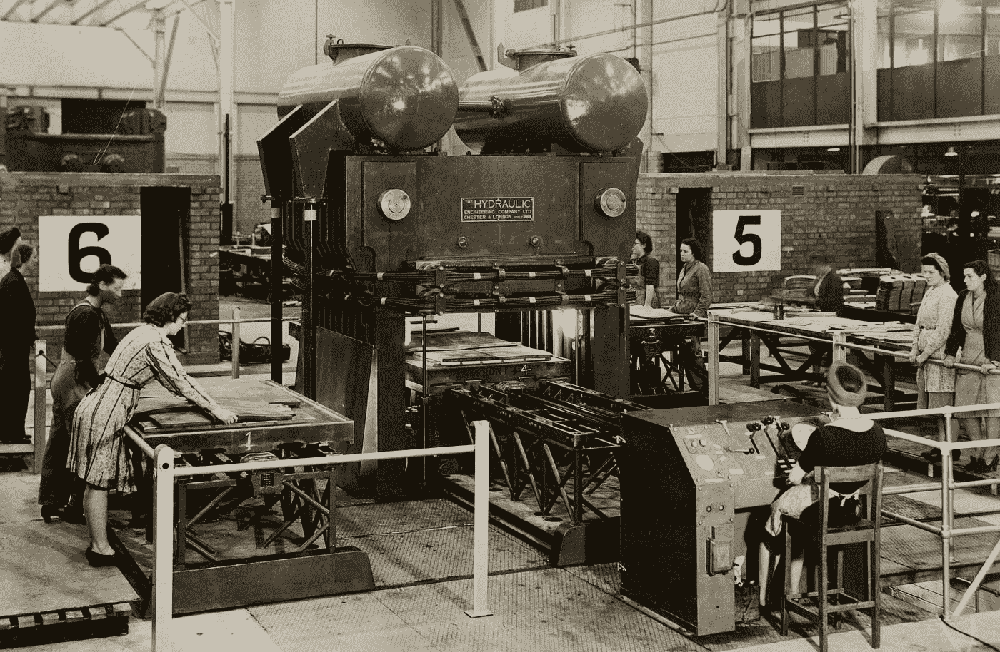
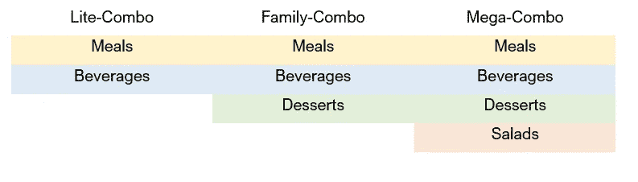
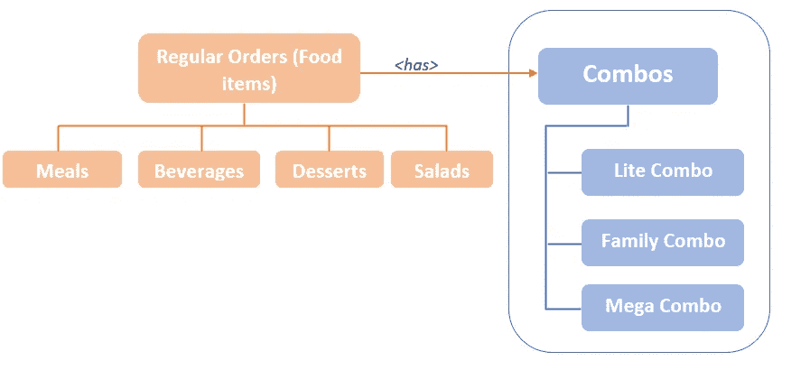
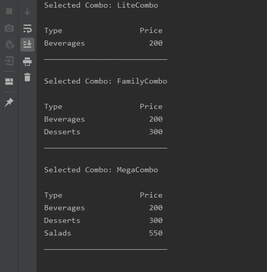

# 理解工厂方法设计模式

> 原文：<https://medium.com/nerd-for-tech/understanding-factory-method-design-pattern-4d7ba8f0dfc4?source=collection_archive---------3----------------------->

伯明翰博物馆信托基金会在 [Unsplash](https://unsplash.com?utm_source=medium&utm_medium=referral) 上拍摄的照片

工厂方法模式也称为虚拟构造器，属于创造性设计模式。这种模式的主要目的是为创建对象创建一个抽象类(也称为工厂)。因此，对象实例化是由其子类完成的。此外，您可以使用接口作为工厂，而不是抽象类。因此，如果您使用 interface 作为工厂，它的子类必须为对象实例化实现它们自己的工厂方法。

在我的 [*上一篇文章*](https://nisal-pubudu.medium.com/introduction-to-design-patterns-understanding-singleton-design-pattern-5a4d49960444) 中，我已经用一些实际例子解释了关于单例设计模式。如果您仔细阅读了那篇文章，您可能会记得我强调了这两种模式之间的区别。那就是，*“如果你想在创建实例时接受任何参数，你应该使用工厂设计模式，而不是 Singleton。”*

所以，当你使用工厂方法模式时，你必须总是使用参数来决定你想要得到哪个实例。但是，如果有必要，您仍然可以使用无参数构造函数。

另一个区别是，Singleton 模式确保您总是得到您正在检索的任何类型的相同实例，但是工厂方法模式通常为您提供每种类型的不同实例。

# 工厂方法模式的用例

在这一章中，我将通过一个使用 Java 的实际例子来解释如何应用工厂方法模式。

假设有一家卖快餐的餐馆。在这家餐馆里，他们有几种快餐，如正餐、饮料、沙拉和甜点。然而，如果顾客想要，他们可以购买组合食品(不同食品的集合)。组合有三个不同的类别，名为，建兴组合，家庭组合和大型组合。根据套餐的预算，每个套餐包含不同类型的食物。

图像:组合类型

下面的图示将为您提供该实现的总体概述

图:实施概述

让我们看看如何一步一步地实现这个用例。

## 步骤 01

在第一步中，我创建了一个名为**“regular orders”**的抽象类。这个类包含一个名为**“打印顺序”**的抽象方法。正如我上面提到的，餐厅有几种食物。因此，这些食物项目中的每一个都应该有一个单独的类，并必须实现作为扩展**" regular order "**类的结果的 **"printOrder"** 方法。之所以将**【regular order】**类扩展为这 4 个类，是因为它们都是可以单独订购的常规食品。

> 沙拉和甜点也有自己的类别，如上两类。

## 步骤 02

在这一步中，我创建了名为**“Combos”**的抽象类，它必须由其他 3 个名为、Lite-Combo、Family-Combo 和 Mega-Combo 的子类继承。如你所见，这个抽象类还包含一个名为**“combo details”的抽象方法因此，这 3 个类都应该在它们的类中实现那个方法。**

正如您所看到的，所有 3 个类都在它们内部实现了**“combo details”**方法。该方法负责通过创建它们的对象来添加属于每个组合的所有食品。因此，如果餐馆想要在他们的菜单中添加一个新的组合，我们唯一要做的就是为这个特定的组合创建一个类，并扩展 **"Combos"** 类。

## 步骤 03

在这一步中，我已经实现了**“combo creator”**类。这个类负责根据**“combo code”返回相关的包**为了保存代码，我为此实现了一个枚举。

## 步骤 04

作为最后一步，我已经实现了**“hot meal application”**类。所以，在这里你可以将与你想要的组合相关的组合代码传递给 **"Combos"** 类的实例。在**“print order”**方法的帮助下，它会给出你所购买的组合的详细信息。

图:工厂方法模式实现的结果

如果你有兴趣，你可以使用下面的 GitHub 链接来看看我的工厂方法模式的完整实现。

 [## 尼萨尔-库马拉/克里希-LP-培训

### 在 GitHub 上创建一个帐户，为 nisal-kumara/krish-lp-training 的发展做出贡献。

github.com](https://github.com/nisal-kumara/krish-lp-training/tree/master/Design%20Patterns/FactoryMethod) 

所以，这是我的文章的结尾，我希望你喜欢它。快乐编码👨‍💻。

## 参考

 [## Java 中的工厂方法设计模式

### 简介设计模式是日常编程中使用的编程方法的集合。他们…

stackabuse.com](https://stackabuse.com/factory-method-design-pattern-in-java/)