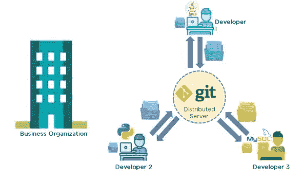
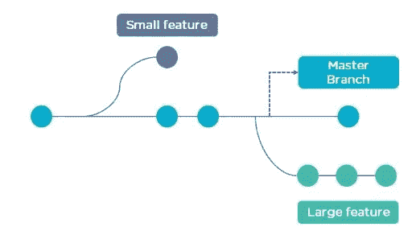
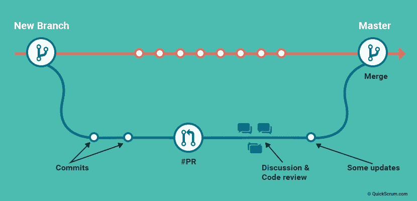

# 理解 Git 和版本控制系统

> 原文：<https://medium.com/nerd-for-tech/understanding-git-and-version-control-systems-e76da5ec8b34?source=collection_archive---------10----------------------->


图片:版本控制([https://blog.cpanel.com/](https://blog.cpanel.com/))

Git 是一个免费的开源分布式版本控制系统工具，旨在快速高效地处理从小到大的项目。你可能是一名网络开发人员或应用程序开发人员；对于任何编写代码或跟踪文件变更的人来说，git 都是一个有用的工具。Git 拥有大多数团队和个人开发人员需要的功能、性能、安全性和灵活性。

它也是一个重要的分布式版本控制 DevOps 工具。因此，在这篇文章中，我将解释 git，它的特性和功能。但是在进入 git 之前，我们应该对版本控制系统(VCS)有基本的了解。

# 版本控制系统

版本控制系统是一种软件工具，它通过跟踪对代码所做的修改来帮助记录对文件所做的更改。作为软件工程师，当我们开发一个软件产品时，大多数时候我们是作为一个团队来合作的。所以，事情是这样的，这些软件开发人员可能位于不同的位置，他们中的每一个人都贡献一些特定类型的功能或特性。因此，为了对产品有所贡献，他们修改了源代码。因此，这个版本控制系统帮助开发人员有效地交流和管理(跟踪)对源代码所做的所有更改，以及诸如谁做了什么更改以及做了什么更改之类的信息。

版本控制系统可以分为两类，

*   集中式版本控制系统(CVCS)
*   分布式版本控制系统(DVCS)

## 集中式版本控制系统(CVCS)

集中式版本控制系统只包含一个存储库，每个用户都有自己的工作副本。您需要致力于在存储库中反映您的更改。通过更新，其他人可以看到您的更改。在 CVCS，要让其他人看到你的更改需要做两件事，即**提交和更新。**

尽管维护单个存储库看起来很好，但是它有一些主要的缺点，

*   它不是本地可用的:因此，您总是需要连接到网络来执行任何操作。
*   丢失数据的高概率:由于一切都是集中的，在任何中央服务器崩溃的情况下，都可能导致项目的全部数据丢失。

## 分布式版本控制系统(DVCS)

分布式版本控制系统包含多个存储库。每个开发人员都有自己的存储库和工作副本。因此，这意味着即使你通过提交做了一些更改，其他开发人员也无法访问你的更改。这是因为提交将在您的本地存储库中反映这些更改，并且您需要推送它们以便使它们在中央存储库中可见。类似地，当您更新时，您不会获得其他人的变更，除非您已经首先将那些变更提取到您的存储库中。在 DVCS 中，有 4 个主要的操作被命名为提交、推送、拉取和更新。

如果你使用 DVCS，你可以比 CVCS 有以下优势。

*   所有操作(除了推和拉)都非常快，因为它只需要访问硬盘驱动器，而不是远程服务器。因此，您并不总是需要互联网连接。
*   提交新的变更集可以在本地完成，而不需要操作主存储库上的数据。
*   因为每个贡献者都有一个项目存储库的完整副本，如果他们愿意的话，他们可以在任何情况下互相共享变更。
*   如果中央服务器在任何时候崩溃，丢失的数据可以很容易地从贡献者的任何一个本地存储库中恢复。

# Git 是什么？

所以，正如你已经知道的，git 是一个免费的、开源的分布式版本控制系统工具，旨在快速高效地处理从小到大的项目。在阅读了版本控制系统之后，您可能已经猜到 Git 是一个**分布式版本控制系统(DVCS)** 。因此，git 为用户提供了前面提到的所有分布式 VCS 设施。

> **热门问题:**
> **Git 与 GitHub 有什么区别？Git 只是一个版本控制系统，管理和跟踪你的源代码的变化，而 GitHub 是一个基于云的托管平台，管理你所有的 Git 库。**



图片:使用 Git 的版本控制([https://www.simplilearn.com/](https://www.simplilearn.com/))

# Git 的特性

## Git 仓库

Git 存储库包含所有的项目文件和整个修订历史。你可以拿一个普通的文件夹，告诉 Git 把它变成一个仓库。这就产生了一个**”。git"** 子文件夹，它包含所有用于跟踪变更的 git 元数据。

## **提交&暂存区**

提交记录您对存储库中的文件所做的一项或一系列更改。提交具有唯一的 SHA1 散列，用于跟踪过去更改的文件。

在我们提交之前，我们必须告诉 Git 我们想要提交什么文件。这被称为**暂存**并使用添加命令。为什么我们必须使用 add 而不是直接提交文件？假设您正在处理两个文件，但是其中只有一个准备好提交。因此，您不希望提交两个文件，只提交准备好的文件。这就是 git 的**“添加”**命令的用武之地。我们可以将文件添加到暂存区域，然后提交已经暂存的文件。

## **分支机构&合并**



图片:Git 中的分支([https://www.simplilearn.com/](https://www.simplilearn.com/))

分支本质上是一组具有唯一名称的代码变更。每个存储库可以有一个或多个分支。主分支是所有变更最终合并的地方，它被称为 **master (main)** 。让我们用一个例子来看看 git 分支是如何有用的。

*   假设您需要为应用程序开发一个新特性。要开始工作，你必须首先创建一个独特的分支。
*   因此，在工作时，您收到一个快速更改的请求，该请求需要在应用程序中立即生效。但问题是你还没有完成你的新功能。
*   所以，你可以做的是，切换回主分支，进行更改，并将其投入使用。
*   然后您可以切换回您的新特性分支并完成您的工作。完成后，将新特征分支合并到主分支中，新特征和快速更改都会保留。

当你合并两个分支时，有时会发生冲突。例如，您和另一个开发人员不知不觉地都在处理一个文件的同一个部分。另一个开发人员将他们的更改推送到远程存储库。当您将它们提取到您的本地存储库时，您将会遇到合并冲突。但是 git 有办法处理这些类型冲突，所以您可以看到两组更改，并决定您想要保留哪一组。

## **拉取请求**



图:拉动请求如何工作([https://guide.quickscrum.com/git-guide/](https://guide.quickscrum.com/git-guide/))

一个开发人员调用一个 pull 请求，要求另一个开发人员将他们的一个分支合并到另一个存储库中。除了让项目负责人更容易监控和跟踪代码变更之外，“拉”还有助于其他开发人员在将代码与代码库集成之前讨论他们的工作。此外，如果某个开发人员由于某种原因无法继续工作，他可以发起一个 pull 请求，向团队的其他成员寻求帮助。

# 常见 Git 命令

该命令分别设置提交时使用的作者姓名和电子邮件地址。

```
git config –global user.name <“name”>git config –global user.email <“email address>”
```

要开始使用 Git，请转到您的终端并在您的项目目录中运行以下命令。这将初始化一个项目目录。

```
git init
```

此命令用于从现有 URL 获取存储库。

```
git clone <url>
```

运行以下命令来添加 Git 要跟踪的文件。这将把这些文件添加到临时区域。

```
git add <filename>
```

此命令将一个或多个添加到临时区域。

```
git add *
```

运行以下命令提交对这些文件的更改。

```
git commit -m “<add a commit message here>”
```

该命令提交您使用 git add 命令添加的任何文件，并且还提交您从那时起更改的任何文件。

```
git commit -a
```

一旦完成，我们就可以推行我们的改变。

```
git push
```

此命令显示尚未转移的文件差异。

```
git diff
```

此命令显示临时区域中的文件与当前最新版本之间的差异。

```
git diff –staged
```

此命令会拆分文件，但会保留文件内容。

```
git reset <file>
```

该命令列出了所有必须提交的文件。

```
git status
```

该命令用于列出当前分支的版本历史。

```
git log
```

该命令列出当前存储库中的所有本地分支。

```
git branch
```

该命令创建一个新分支。

```
git branch <branch name>
```

该命令将指定分支的历史记录合并到当前分支中。

```
git merge <branch name>
```

所以，这是文章的结尾，我希望你喜欢它。快乐编码👨‍💻。

## 参考

艾哈迈德河，2020。*什么是 Git |探索分布式版本控制工具| Edureka* 。[在线]爱德华卡。发布时间:<https://www.edureka.co/blog/what-is-git/>【2021 年 5 月 13 日发布】。

南卡帕根图拉，2020 年。*20 大 Git 命令示例— DZone DevOps* 。[在线]dzone.com。可从以下网址获取:<https://dzone . com/articles/top-20-git-commands-with-examples>【2021 年 5 月 14 日获取】。

Guide.quickscrum.com . n . d .*什么是饭桶？Git 提供了哪些好处？*。[在线]可在:<https://guide.quickscrum.com/git-guide/>[2021 年 5 月 14 日访问]。