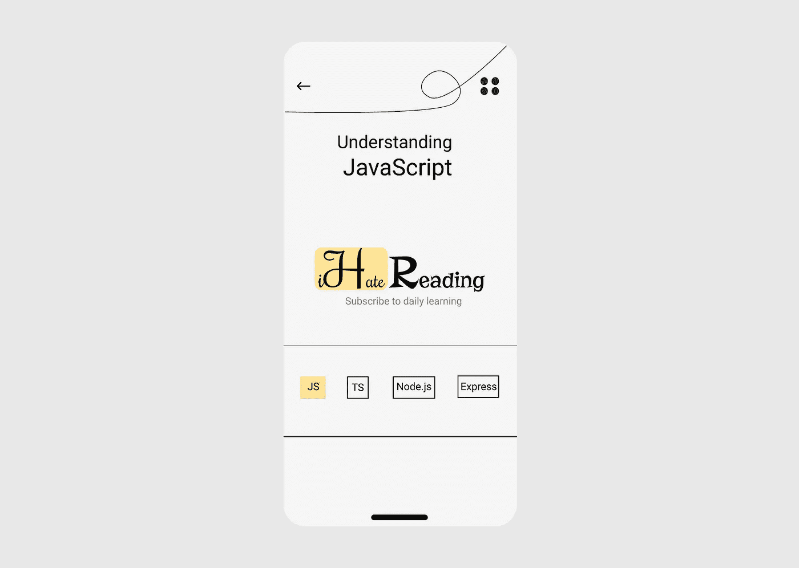

# 理解 JavaScript —创建示例 JSON 数据

> 原文：<https://medium.com/nerd-for-tech/understanding-javascript-creating-sample-json-data-4500db528b9b?source=collection_archive---------16----------------------->

创建用户的样本 JSON 数据

设计创意([查看更多此处](http://ihatereading.in/creativity))

# 在后台

上周，我写了一篇关于 JSON-Server 的文章，介绍了它如何使用 lowdb 和创建带有所有必需的 HTTP 方法的示例 API。如果你们有时间使用 JSON-Placeholder API，那么供你们参考，JSON-Placeholder 是使用`**lowdb**`和`**JSON-Server**`开发的。