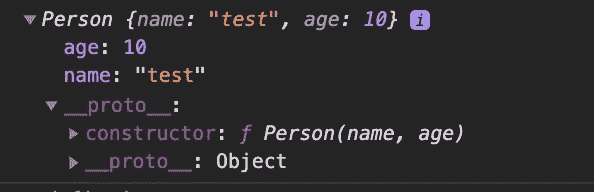

# 了解 Javascript Es6 类

> 原文：<https://medium.com/nerd-for-tech/understanding-javascript-es6-classes-dbce09c0b903?source=collection_archive---------13----------------------->

*面向对象编程*的基本思想是，我们使用对象来模拟我们希望在程序中表示的真实世界的事物，并且/或者提供一种简单的方法来访问我们很难或不可能使用的功能。一般来说，为了使这更容易，我们使用`class`。JavaScript *不像 Java 和其他语言那样*有类。

> 在 Javascript 中，类只不过是现有的基于原型的继承和构造函数的语法糖。

在这篇文章中，我们将通过与基于原型的继承进行比较来探究类在幕后做什么。

**Es6 类提供什么:**

1.  **构造函数方法:**
    构造函数方法是一种特殊的方法，用于创建和初始化用`class`创建的对象。一个类中只能有一个`constructor`方法。

```
//create an object with class keyword
class Person {
    constructor(name, age) {
        this.name = name;
        this.age = age;
    }
}
var person = new Person('test', 12);
console.log(person);
```

构造函数:

```
//define a constructor function
function Person(name, age) {
  this.name = name;
  this.age = age;
}
var person = new Person('test', 12);
console.log(person);
```



无论我们如何通过类或构造函数创建对象。对象指向相同的属性和方法。

**2。静态方法:**

Javascript 静态方法通常用于创建实用函数。Es6 类支持静态方法。要在 Es6 类中声明一个静态方法，我们可以简单地使用 *static* 关键字和方法签名。
静态方法不在类的实例上调用，而是直接在类上调用。

```
class Article {  
  constructor(title, date) {  
   this.title = title;   
   this.date = date;  
  }  
  static createTodays() {   
   //remember, this = Article    
   return new this("Today's digest", new Date());  
  }
 }  
let article = Article.createTodays(); 
console.log( article.title ); // Today's digest
console.log( article.date ); // Thu Mar 25 2021 14:19:38 GMT+0300
```

不使用 class 关键字的静态方法:

```
function Article(title, date) {  
   this.title = title;   
   this.date = date;  
}
Article.createTodays = function() {   
   //remember, this = Article    
   return new this("Today's digest", new Date());  
}  
let article = Article.createTodays(); 
console.log( article.title ); // Today's digest
console.log( article.date ); // Thu Mar 25 2021 14:19:38 GMT+0300
```

**3。getter/setter:**

在 Es6 将 Getter 和 setter 添加到类中之前，ECMAScript 5 已经引入了它们。Getters 和 setters 允许我们定义对象访问器。Getters 和 Setters 为我们提供了以下好处:

*   它给出了更简单的语法
*   它允许属性和方法使用相同的语法
*   它可以保证更好的数据质量
*   这对于在幕后做事很有用

1.  *获取/设置类中的方法*

```
// inside class
class MyClass {
    constructor() {
        this.names_ = [];
    }

    set name(value) {
        this.names_.push(value);
    }

    get name() {
        return this.names_[this.names_.length - 1];
    }
}

const myClassInstance = new MyClass();
myClassInstance.name = 'Joe';
```

*2。函数中的 get 和 set 方法。*

```
// inside function
function MyFunc() {
  this.names_ = [];
}Object.defineProperty(MyFunc.prototype, "name", {
    get: function() {
           return this.names_[this.names_.length - 1];
    },
    set: function(value) {
          this.names_.push(value);
    }
});
const myFuncInstance = new MyFunc();
myFuncInstance.name = 'Joe';
```

**4。继承是面向对象编程中的重要概念。在传统继承中，基类的方法和属性被复制到派生类中。
在 JavaScript 中，直到 ES6 出来之前都是用 prototype 对象来支持继承的。有人称之为“原型继承”，有人称之为“行为委托”。ES6 类提供了从基类复制方法和属性到派生类的功能。**

```
class Car {
  constructor(brand) {
    this.car_name = brand;
  }
  present() {
    return ‘I have a ‘ + this.car_name;
  }
}class Model extends Car {
  constructor(brand, mod) {
    super(brand);
    this.model = mod;
  }
  show() {
    return this.present() + ‘, it is a ‘ + this.model;
  }
}let myCar = new Model(“Ford”, “Mustang”);
console.log(myCar.show()); // I have a Ford, it is a Mustang
```

注意:`super`方法指的是父类。通过调用构造函数方法中的`super`方法，我们调用了父类的构造函数方法，并访问了父类的属性和方法。

我们可以用原型做同样的例子。

```
function Car(brand) {
   this.car_name = brand;
}
Car.prototype.present = function() {
   return ‘I have a ‘ + this.car_name;
}
function Model(brand, mod) {
   Car.call(this, brand);
   this.model = mod;
   this.show = function() {
      return this.present() + ‘, it is a ‘ + this.model;
   }
}
Model.prototype = Object.create(Car.prototype)let myCar = new Model(“Ford”, “Mustang”);
console.log(myCar.show()); // I have a Ford, it is a Mustang
```

**工厂功能:**

工厂函数是任何不是返回对象的类或构造函数的函数。在 Javascript 中，任何函数都可以返回一个对象。当它这样做而没有关键字`new`时，它被称为`factory function`。如果需要创建许多对象，可以将对象文字和工厂函数结合起来。

*   这是使用对象文字创建的对象:

```
const user = {
 userName,
 avatar, 
 setUserName (userName) {
    this.userName = userName;
    return this;
 }
};
```

*   我们可以将它转换成工厂函数来创建多个对象。

```
const createUser = ({ userName, avatar }) => ({
  userName,
  avatar,
  setUserName (userName) {
    this.userName = userName;
    return this;
  }
});
console.log(createUser({ userName: 'echo', avatar: 'echo.png' }));
```

> 如果不想处理`new`关键字、`class`或者`prototypes`，可以用工厂函数实现同样的功能。

在这篇文章中，我们试图看到类的其他替代品。希望它能帮助你更好地理解这个类，并看到幕后发生的事情。它还证明了类只不过是 Javascript 中现有的基于原型的继承和构造函数的语法糖。

**Object.create():**

`**Object.create()**`方法创建一个新对象，使用一个现有对象作为新创建对象的原型。我们也可以利用这种方法通过`Object.create`方法轻松管理继承。

**语法:**

```
Object.create(proto, [propertiesObject])
```

`**proto**` **:** *应该是新创建对象的原型的对象。*

`**propertiesObject**` **:** *可选参数。它指定要添加到新创建的对象中的可枚举属性。*

让我们用 Object.create 方法来说明下面的类示例。

```
// Shape - superclass
function Shape() {
  this.x = 0;
  this.y = 0;
}

// superclass method
Shape.prototype.move = function(x, y) {
  this.x += x;
  this.y += y;
  console.info('Shape moved.');
};

// Rectangle - subclass
function Rectangle() {
  Shape.call(this); // call super constructor.
}

// subclass extends superclass
Rectangle.prototype = Object.create(Shape.prototype);

//If you don't set Rectangle.prototype.constructor to Rectangle,
//it will take the prototype.constructor of Shape (parent).
//To avoid that, we set the prototype.constructor to Rectangle (child).
Rectangle.prototype.constructor = Rectangle;

var rect = new Rectangle();

console.log('Is rect an instance of Rectangle?', rect instanceof Rectangle); // true
console.log('Is rect an instance of Shape?', rect instanceof Shape); // true
rect.move(1, 1); // Outputs, 'Shape moved.'
```

我们可以用`Object.create()`管理相同的继承。

```
let myCar = Object.create(null, );
```