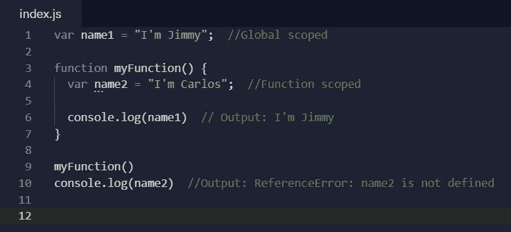
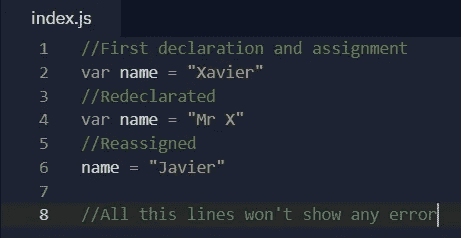
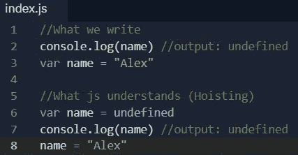
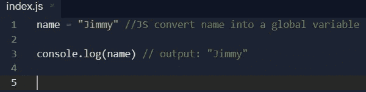
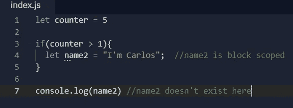
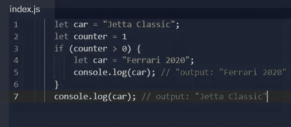
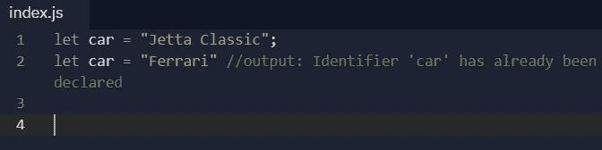
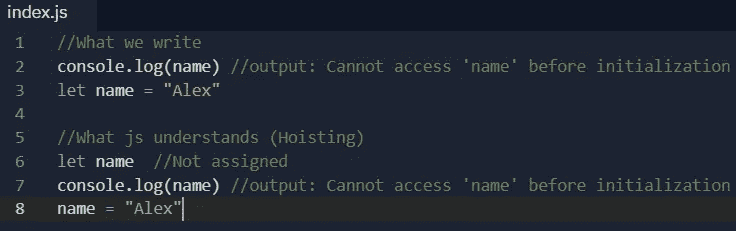
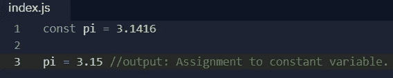

# 引擎盖下的理解 js:var，let 和 const 🦾

> 原文：<https://medium.com/nerd-for-tech/understanding-js-under-the-hood-var-let-and-const-f2b2391d4c1a?source=collection_archive---------10----------------------->

Javascript 是 2021 年的顶级编程语言之一，我真的很喜欢它，这就是为什么今天我们要谈论一个对初学者来说有时非常复杂的话题。为了创建真正强大和优秀的应用程序，我们需要了解 JS 如何管理变量、函数、调用等。那么，让我们来谈谈变量声明，以及在某些情况下我们应该如何小心。

JS 太牛逼了

## Javascript 还是 ECMAScript？，它们是一样的吗？

众所周知，JS 是一种编程语言，它最初只是有机会被用于网络浏览器。ECMAScript 是它所基于的规范。通过阅读 ECMAScript 规范，您可以学习如何创建脚本语言。通过阅读 JavaScript 文档，您可以学习如何使用脚本语言。
浏览器提供标准之间的限制( **JS 引擎，它们解释代码**)，每个浏览器都有不同的 JS 引擎，这就像一个国家的许多地方随着时间的推移而发展的特定语言:英语在得克萨斯州或纽约州是不一样的。或者是“特皮托”或蒙特雷的拉丁西班牙语。

因此，引擎可以解释特定版本的 ECMAScript。当开发人员询问浏览器支持的 ECMAScript 版本时，他们实际上是在询问引擎。以下列表有助于更好地理解这一概念:

带浏览器的引擎和 ECMAScript 版本

总结这一部分，当你写代码时，知道浏览器的一些限制是很重要的，嗯…你可以使用许多工具( [babel](https://babeljs.io/) )来转换你的代码，忘记这一点，但这是另一个话题。

## 重要概念

1.  **作用域:**是这些变量可用的地方。这可能是整个上下文，就像所有关于你写的代码的窗口或文件，或者是函数内部的上下文。
2.  **提升:**提升是一种 JavaScript 机制，在代码执行之前，变量和函数声明被移动到它们作用域的顶部。这就是为什么你可以在一个函数被声明之前调用它。不管你在哪里写声明，js 都会把它移到文件或者上下文的顶部，我们也必须记住 js 只是移动声明而不是赋值。

# ES5

## 定义变量

几年前，在 ES6 之前，使用 var 是最常见和最受欢迎的方式声明。对于 var，我们有两个范围:

*   全局范围:**在整个窗口或文件中可用。**
*   功能范围:**在功能块内部局部可用。**

使用 var

如上图所示， **"name1"** 可以在函数中使用，但是当我们试图显示**" name 2 "**时，我们将阿瑟引用错误，因为 **"name2"** 只存在于 myFunction 中。

**var 的特性**

var 变量可以**重新声明和重新分配，**例如:

这段代码不会显示错误

**var 的问题**

假设你的代码有很多行，你声明了一个初始状态或变量。然后你在一个函数中声明了一个同名的变量，js 不会警告你这个动作，系统或者应用程序会崩溃或者做出不同的行为。

**吊装 var**

我们必须意识到，js 引擎将变量的声明移到了顶部，但也将这些变量初始化为未定义的。

提升 var

**特殊情况:**如果我们没有声明一个变量，但是我们给它赋值，那么它不存在，直到分配它的代码被执行。因此，在执行赋值时，此行为会创建一个全局变量。**我们最知道未声明的变量是全局变量**。

未声明的变量是全局变量

# ES6

## 让

ES6 解决了 var 的一些问题，今天 **let 是首选变量声明的规则。**它解决了 var 的主要问题。

*   块范围:块被认为是由花括号{}包围的一段代码。

块范围

因此，在上面的例子中，我们看到在 if 语句的花括号后面有**“name 2”**no。为了确保万无一失，我们来看另一个例子:

这段代码不会显示错误

使用 var，这段代码可以被理解为重新声明“car ”,但这是错误的。这个例子中的每个变量都存在于自己的作用域中，这就是为什么我们在最后一行看到第一次赋值的值，我们没有改变 car 的值，只是在两个作用域中声明了 car。

**让**的特性

与 var 不同，let 可以被重新分配，但是我们不能在相同的范围内重新声明它。如果我们这样做，会得到一个错误:

解决了 var 的问题

**吊装让**

正如我们所记得的，js 将未定义的 var 声明移动到了顶部。在这种情况下，提升几乎是相同的，但没有给变量赋值，并显示参考误差。

起重绞车

## 常数

如果您想在所有上下文中保持分配给变量的值，建议使用常量变量。我们在这里有相同的相似之处，比如用 let。const 也是块范围的。

**常量的特性**

在用 const 赋值后，我们不能更新该值。所以，我们不能重新赋值或者重新声明一个变量。

使用 const，不可能重新声明或重新赋值

**提升常量:**就像让这些申报单被提升但不被赋值一样。**我们也不能只声明一个常量变量，我们最多初始化它。**

说了这么多，希望你的 js 知识更好更强。有时我们谈论 JS 而不理解它，但是当你越过界限时你就变成了忍者❤.