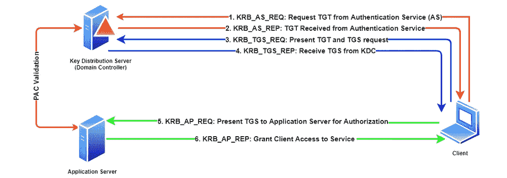
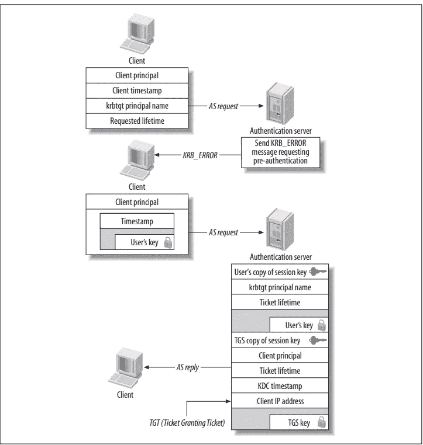

# 了解 kerberos:单点登录认证系统

> 原文：<https://medium.com/nerd-for-tech/understanding-kerberos-the-single-sign-on-authentication-system-3352dd6649af?source=collection_archive---------3----------------------->


kerberos 的完整定义是一个**安全**、**单点登录**、**可信**、**第三方、相互认证**的服务。让我们打破这个定义，快速检查每一个。

*   **安全** : Kerberos 的独特之处在于它使用了*票证*，这是一种通过网络传输消息来提供用户身份的加密措施。而不是通过网络传递消息。
*   **单点登录**:这意味着用户只需要登录一次就可以访问所有支持 kerberos 的服务。
*   **可信第三方**:这意味着所有认证请求都通过集中式 kerberos 服务器路由。
*   **相互认证**:确保不仅键盘后面的人证明他自称是谁，而且他正在与自称是谁的服务器通信。


**Kerberos 术语和概念**

现在让我们来看看 kerberos 身份验证系统特有的术语。

原则、领域和实例

**主体:**Kerberos 安装中包含的每个实体，包括个人用户、计算机和服务器上运行的服务，都有一个与之相关联的主体。每个相关联的主体都与一个长期密钥相关联。这可以是密码或通行短语。每个主体都以一个用户名开始，后跟一个可选的实例。

**实例:**实例用于两种情况，一种是服务主体(用户需要访问的服务)，另一种是为管理使用创建特殊主体(当管理员需要提升权限时)

**Realm** :用户名和可选实例合在一起，在一个给定的领域中形成一个惟一的身份。每个 kerberos 安装都定义了一个不同于其他 kerberos 安装的管理控制领域。例如，kerberos 领域的 DNS 名称是其域转换为大写，如果 example.org 是域名，领域名称将是示例。（同 organic）有机

**服务和主机主体**

用户不是唯一被分配到 kerberos 领域的人。主机和服务也有主体，因为在 kerberos 中，每个端点都可以请求相互身份验证，两个端点都需要一个身份和一个密钥。

**Kerberos 主体名称**

kerberos 5 主体名称的示例如下。

```
username[/instance]@REALM 
service/fully-qualified-domain-name@REALMjoedoe/admin@EXAMPLE.ORG
```

上面的例子表明 joedoe 在 EXAMPLE.ORG 领域拥有管理特权。

**密钥、盐和密码**

一种称为 String2key 的方法用于将字母数字密钥转换为加密密钥。Salt 是添加到密码中的字符序列，使其更加独特。

**密钥分发中心**

密钥分发中心(KDC)是 kerberos 系统的一个组成部分。KDC 由三部分组成。

**认证服务器(AS):** 向希望登录到 kerberos 领域的客户端发布加密的票据授予票据(也称为 TGT)。TGT 是用用户的密码加密的，因为只有用户和 KDC 知道秘密密码。当用户试图登录时，只有正确的密码才能解密密钥，用错误的密码尝试登录将提示再次登录。

**票务授权服务器(TGS):** 票务授权服务器基于来自客户端的两个数据发布个人服务票。

*   代表客户端想要访问的服务的主体名称。
*   授权服务器颁发的 TGT 密钥

**数据库:**存储主成分和相关的关键字。

**把所有的碎片放在一起**

现在让我们把所有的部分放在一起，看看 kerberos 5 的工作情况。

**认证流程**



Kerberos 身份验证流程

*   从客户端到认证服务器的请求，请求将包含用户主体名称和时间戳。使用用户密码加密。
*   尝试解密消息。如果成功解密，将返回 TGT 和 TGS 会话密钥。
*   用 TGT 密钥向 TGS 服务器发送请求。
*   TGS 验证 TGT，如果验证成功，将返回服务票(TGS)。
*   用会话密钥加密 TGS，并将消息发送到应用服务器进行验证。
*   应用服务器尝试解密服务器并允许访问。

**预认证**

kerberos 5 引入了基于身份的认证。要求用户在 KDC 为特定主体发行票据之前证明身份。

如果用户尝试登录并要求预认证，KDC 将发送**KRB _ 错误**而不是 **AS_REP** 。该消息将告诉客户端需要预认证。



作为与预认证交换

**Kerberos 票据类型**

**可转发票证:**用户可以将票证转发到另一台主机，一个常见的用例是用户获取一个 TGT，该票证可以转发到另一台主机。用户不需要在接收主机系统中输入密码。

**可代理车票:**您可以在车票上设置可代理标志。这类似于可转发票证，它可以发送到另一台主机，并可用于获取更多服务票证。

**可更新的门票:**门票的有效期只到一个标准的有效期，之后可以提交给 KDC 进行更新。

**过期票:**这些票在未来的某个特定日期才有效。对将来计划的作业很有用。