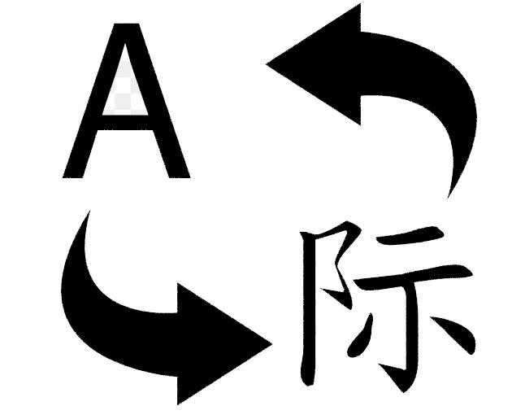

# 理解基于知识的翻译

> 原文：<https://medium.com/nerd-for-tech/understanding-knowledge-based-translation-d96a3a548ea9?source=collection_archive---------5----------------------->

人工智能是一个我们都很熟悉的术语，并且经常以某种形式出现。然而，我们今天所看到的是数十年来基于创造智能机器这一基本理念所进行的研究和开发的高潮，这一理念在 20 世纪 50 年代首次成为现实。在它出现的时候，创造能“思考”的机器的想法被认为是不可能的，但是在不同方向上的发展，如计算机内存、计算速度等，已经打开了这个领域的巨大潜力。人们还认为，到目前为止，我们仅仅触及了真正人工智能的皮毛。

文本翻译中的人工智能

文本翻译是人工智能最常见的应用之一，通常人们甚至不知道人工智能正在其中使用。我们每个人在生活中的某个时候都会去谷歌翻译一个特定的短语或句子到另一种语言，并且可能还会看到有时在翻译整个句子时，它会返回单词到单词的翻译，这通常会在语法或意思上出错。这主要是因为机器无法理解句子的含义及其包含的情感。要让机器有效、准确地自动翻译句子，它需要对语言有一定程度的理解，并且应该有“阅读”的能力。例如，当我们阅读时，我们借助我们的常识和我们对各种物体、人、事等的知识。并与他们联系起来，理解我们刚刚读过的内容。

在机器翻译的初期，Bar Hillel 认为“文本的自动翻译问题等同于对文本的完全理解”。当时，真正的机器翻译被认为是不可行的，因为准确翻译文本需要大量的理解，而且应用这些信息也很复杂。然而，这些年来，随着相当大的实践和理论进步，例如计算速度以及内存管理和其他因素的改善，科学家们相信可以朝着基于知识的机器翻译取得一些进展。另一个开辟了新的可能性的重要发展是对“常识数据库”的贡献。描绘世界知识的许多模型已经被制造出来，并且已经进行了灌输智能的尝试，这些已经成为科学家的垫脚石，这些科学家已经能够创建相当高级的自然语言分析器和翻译器。

**面临的问题是什么？**

自动语言翻译中出现的最重要的问题之一是不同语言之间缺乏一致性。经常可以看到，一种语言中的特定单词在另一种语言中可能没有表示，并且句子和短语可能经常根据它们所使用的上下文而改变意思。因此，机器能够理解文本以准确地执行翻译变得更加重要，并且需要包括各种设置和情况的详细信息知识。在进行了几次实验和研究之后，人们普遍认识到，要准确地进行自动翻译，需要对文本有一定程度的理解，而且是深刻的理解。人们还注意到，即使去掉了语境的概念，翻译也不能仅仅通过句法操作来完成。

为了克服这一点，使用了一种称为基于脚本的机器翻译的方法。脚本是一种用语言无关的意义表达来表达人们日常事件的方法。这意味着脚本包含人们日常活动的信息，如去博物馆等，并包含称为因果链的连续信息。每个因果链都包含关于可能发生的特定行为的信息，其中还包括序列变量。因此，基本上，当一个文本作为输入提供给译者时，它首先试图理解该文本，并在脚本的帮助下将其转换为与语言无关的表示，然后最终试图将其转换为目标语言。关于翻译文本的实际过程的深入细节将不在本文中讨论，也许在将来会讨论。然而，我们将更加关注对过程的基本理解，它的需求，以及它的问题。

需要多少理解？

在谈论基于知识的机器翻译时，一个总是会出现的问题是，执行准确的翻译需要对一种语言有多少了解。据信，完整的理解是非常低效的，因为任务本身是非常复杂的，并且需要每个单词及其用法的详细描述。因此，已经发现全自动高质量翻译(FAHQT)的一般方法是不充分的，并且关于这一点已经进行了大量的辩论和争论。人们还认为，对文本的最低限度的理解足以在一对语言之间进行可接受的准确翻译，因为这将变得更加复杂和有效。

创建一个理想的自动翻译系统的目标离我们现在的位置还有很长的路要走，需要我们的科学家不断努力才能有一天实现这个目标。由于人工智能本身在几十年前被认为是不可能的，我们可能不知道未来会发生什么，也不知道将会有什么样的发展来实现这一目标。但我们现在可以说的一件事是，人工智能将在塑造我们的未来中发挥不可或缺的作用。

 [## 理解基于知识的翻译

### 人工智能是一个我们都很熟悉的术语，并且经常以某种形式出现…

mokshjaswal.com](https://mokshjaswal.com/f/understanding-knowledge-based-translation)