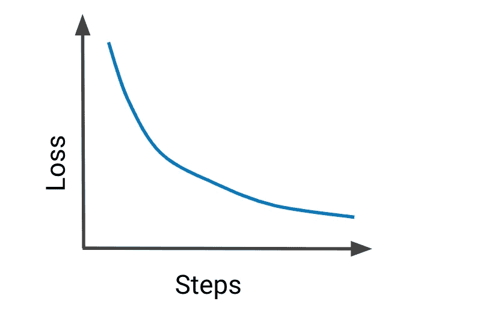

# 理解损失函数

> 原文：<https://medium.com/nerd-for-tech/understanding-loss-functions-cfbb44b5d17f?source=collection_archive---------7----------------------->



损失函数量化了模型表现的好坏。就优化而言，这是一个收敛指标。选择正确的损失函数变得非常关键。在这个博客中，我们将看到一些最常见的损失函数。

```
**from** **sklearn.metrics** **import** hinge_loss
**from** **sklearn.metrics** **import** log_loss
**from** **sklearn.metrics** **import** mean_absolute_error
**from** **sklearn.metrics** **import** mean_squared_error
**from** **sklearn.metrics** **import** mean_squared_log_error
**from** **scipy.stats** **import** entropy
```

## 回归损失

> 预测连续值

**均方误差**—也称为 L2 损失。如果你有高斯分布，这被使用。这个损失函数将严重惩罚高估。这是最常见的损失函数之一。此外，这也是一个很好的起点。

```
**def** mse(y_predicted, y_actual):
    **return** np.sum((y_predicted - y_actual)**2) / y_actual.size
```

**平均绝对误差** —也称为最小绝对偏差(L1)损失。如果您有带有异常值的高斯分布，则使用此选项。

```
**def** mae(y_predicted, y_actual):
    **return** np.sum(np.absolute(y_predicted - y_actual)) / y_actual.size
```

**Huber**—MSE 和 MAE 的结合。这意味着当误差较小时，它表现得像 MSE，否则，它表现得像 MAE。阈值(δ)被确定为超参数。

```
**def** Huber(y_predicted, y_actual, delta=1.):
    **return** np.where(np.abs(y_actual-y_predicted) < delta,.5*(y_actual-y_predicted)**2 , delta*(np.abs(y_actual-y_predicted)-0.5*delta))
```

**均方对数误差** —当高斯分布具有较大值时使用。这个损失函数对低估的惩罚大于对高估的惩罚。

## 分类损失

> 预测离散值

**二元交叉熵**——也称对数损失。如果您的预测目标值在集合(0，1)中，则使用此选项。对于 NN 输出层，应激活 sigmoid 或使用 logits 作为 true。

```
**def** cross_entropy(y_predicted, y_actual):
    **if** y_actual== 1:
      **return** -log(y_predicted)
    **else**:
      **return** -log(1 - y_predicted)
```

**铰链损耗** —最初主要用于 SVM。当集合中有目标值(-1，1)时使用。在神经网络输出层应具有双曲正切激活，使值在上述范围内。

```
**def** Hinge(y_predicted, y_actual):
    **return** np.max(0, y_actual - (1-2*y)*y_predicted)
```

**分类交叉熵** —目标值在集合{0，1，3，…，n}中，其中每个类被分配一个唯一的整数值。在 NN 输出层应该有 softmax 激活。

```
def categorical_cross_entropy(y_actual, y_predicted):
    sum_score = 0.0
    for i in range(len(y_actual)):
        for j in range(len(y_actual[i])):
            sum_score += y_actual[i][j] * log(1e-15 + y_predicted[i][j])
    mean_sum_score = 1.0 / len(y_actual) * sum_score
    return -mean_sum_score
```

**kull back Leiber Divergence—**简而言之，它比较实际值和预测值的分布。它告诉你，当你改变概率分布时，你损失或获得了多少熵。也称为相对熵。较低的值表示较好的预测。与 GAN 和自动编码器一起使用。

```
**def** KLDivergence(y_predicted, y_actual):
    **return** np.sum(y_predicted * np.log((y_predicted / y_actual)))
```